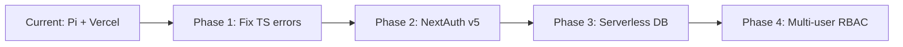

# sunny-stack Architecture

**Trinity Method v2.0.7**
**Technology Stack**: Next.js 15.5.9, React 19, TypeScript 5.5, PostgreSQL, Prisma, Discord.js
**Framework**: Next.js (App Router)
**Last Updated**: 2026-01-07

---

## SYSTEM OVERVIEW

### Technology Profile

```typescript
const sunnystackStack = {
  framework: "Next.js",
  version: "15.5.9",
  language: "TypeScript 5.5",
  runtime: "Node.js 22.x",
  frontend: "React 19.0",
  backend: "Next.js API Routes",
  database: "PostgreSQL (Neon + Raspberry Pi)",
  orm: "Prisma 6.18.0",
  authentication: "Google OAuth (NextAuth pattern)",
  styling: "Tailwind CSS 3.4",
  testing: "Jest 30.1.3 + Playwright 1.55.0",
  bundler: "Next.js (Webpack)",
  deployment: {
    frontend: "Vercel (Serverless)",
    database: "Raspberry Pi (Docker)",
    bot: "Raspberry Pi (Docker)",
  },
};
```

### Repository Structure

```
sunny-stack/
├── app/                    # Next.js 15 App Router (main application)
│   ├── api/               # API routes (Next.js serverless functions)
│   │   ├── admin/        # Admin dashboard APIs
│   │   ├── auth/         # Authentication endpoints
│   │   ├── discord/      # Discord bot integrations
│   │   └── send-quote/   # Quote submission
│   ├── admin/            # Admin dashboard pages
│   ├── about/            # Public about page
│   ├── contact/          # Contact form page
│   ├── portfolio/        # Portfolio showcase
│   ├── quote/            # Quote request page
│   ├── resume/           # Resume/CV page
│   ├── layout.tsx        # Root layout with providers
│   ├── page.tsx          # Home page
│   └── providers.tsx     # Client-side providers
├── bot/                    # Discord bot application (separate build)
│   ├── commands/         # Discord slash commands
│   ├── core/             # Bot core (client, logger, API client)
│   ├── events/           # Discord event handlers
│   ├── gateway/          # Gateway lifecycle management
│   ├── interactions/     # Interaction verification
│   ├── notifications/    # Notification senders
│   └── utils/            # Circuit breaker, rate limiter, retry
├── components/             # Reusable React components
│   ├── admin/            # Admin-specific components
│   ├── forms/            # Form components
│   └── quote/            # Quote form components
├── lib/                    # Core application utilities
│   ├── admin/            # Admin auth & quote conversion
│   ├── auth/             # Google OAuth implementation
│   ├── charts/           # Chart configuration
│   ├── db/               # Database (Prisma, caching, optimization)
│   ├── errors/           # Error handling (AppError, handlers)
│   ├── google/           # Google API services
│   ├── integrations/     # External APIs (Cloudflare, Fly.io, GitHub, Vercel)
│   ├── middleware/       # Auth middleware
│   ├── monitoring/       # Service health checks & Rollbar
│   ├── pdf/              # PDF generation (proposals)
│   ├── webhooks/         # Webhook verification
│   ├── logger.ts         # Winston logger
│   └── quote-*.ts        # Quote validation & templates
├── hooks/                  # Custom React hooks
├── prisma/                 # Database schema and migrations
├── e2e/                    # Playwright E2E tests
├── __tests__/             # Jest unit tests
├── trinity/                # Trinity Method implementation
│   ├── knowledge-base/   # Documentation + Best Practices (v2.0)
│   └── sessions/         # Archived sessions
├── docs/                   # Deployment & setup guides
│   └── deployment/       # Deployment documentation
├── .claude/                # Claude Code configuration
│   └── agents/           # Trinity Method agent definitions
└── scripts/                # Deployment & validation scripts
```

---

## COMPONENT ARCHITECTURE

### Core Components

| Component              | Responsibility                      | Dependencies                       | Status     |
| ---------------------- | ----------------------------------- | ---------------------------------- | ---------- |
| **Next.js App Router** | Page routing, SSR/SSG, layouts      | React 19, Next.js 15               | Production |
| **API Routes**         | Serverless functions for backend    | Prisma, Next.js                    | Production |
| **Discord Bot**        | Project notifications, monitoring   | discord.js 14.14                   | Production |
| **Prisma ORM**         | Database access layer               | PostgreSQL, @prisma/client         | Production |
| **Admin Dashboard**    | Project, quote, proposal management | Google OAuth                       | Production |
| **Quote System**       | Multi-mode quote requests           | Zod validation                     | Production |
| **PDF Generator**      | Proposal generation                 | jsPDF, html2canvas                 | Production |
| **Service Monitors**   | External service health checks      | Cloudflare, Vercel, Fly.io, GitHub | Production |
| **Winston Logger**     | Centralized logging with rotation   | winston, daily-rotate-file         | Production |
| **Error Boundary**     | React error handling                | React 19                           | Production |

### Next.js-Specific Architecture

- **Component Pattern**: Functional components with hooks (React 19)
- **State Management**: React Context API (`providers.tsx`)
- **Routing Strategy**: Next.js 15 App Router (file-based routing)
- **Data Flow Pattern**: Server Components → Client Components (hydration)
- **Rendering**: Hybrid SSR + SSG + CSR (per-route configuration)

### Integration Points

```yaml
Internal_Integrations:
  - Component: API Routes → Prisma
    Protocol: Direct function calls
    Data_Format: TypeScript types + Prisma models

  - Component: Discord Bot → Vercel API
    Protocol: HTTP REST
    Data_Format: JSON

  - Component: Admin Dashboard → API Routes
    Protocol: Fetch API
    Data_Format: JSON

External_Integrations:
  - Service: Google OAuth
    API_Type: OAuth 2.0
    Authentication: Client ID + Secret

  - Service: Resend (Email)
    API_Type: REST
    Authentication: API Key

  - Service: Rollbar (Error Tracking)
    API_Type: REST
    Authentication: Access Token

  - Service: PostgreSQL (Raspberry Pi)
    API_Type: Native PostgreSQL
    Authentication: Username + Password

  - Service: Discord Gateway
    API_Type: WebSocket
    Authentication: Bot Token

  - Service: Vercel Deployments
    API_Type: REST
    Authentication: Bearer Token

  - Service: GitHub API
    API_Type: REST
    Authentication: Personal Access Token

  - Service: Cloudflare API
    API_Type: REST
    Authentication: API Token

  - Service: Fly.io API
    API_Type: REST
    Authentication: API Token
```

---

## DATA ARCHITECTURE

### Data Models

```typescript
// Core Prisma models (schema.prisma)

// Admin users with Google OAuth
interface User {
  id: string; // cuid
  email: string; // unique
  name: string;
  googleId?: string; // unique
  avatar?: string;
  createdAt: Date;
  updatedAt: Date;
}

// Client projects
interface Project {
  id: string; // cuid
  title: string;
  description?: string;
  clientName: string;
  clientEmail: string;
  status: ProjectStatus; // PLANNING | IN_PROGRESS | REVIEW | COMPLETE | ARCHIVED
  budget?: Decimal;
  deadline?: Date;
  googleDriveFolderId?: string;
  deletedAt?: Date; // Soft delete
  createdAt: Date;
  updatedAt: Date;

  // Relations
  quotes: Quote[];
  timeEntries: TimeEntry[];
  discordMessages: DiscordMessage[];
}

// Quote requests from website
interface Quote {
  id: string;
  name: string;
  email: string;
  phone?: string;
  company?: string;
  projectType: string;
  budgetRange?: string;
  timeline?: string;
  description: string;
  requirements?: string;
  status: QuoteStatus; // PENDING | APPROVED | DECLINED | CONVERTED
  projectId?: string;
  deletedAt?: Date; // Soft delete
  createdAt: Date;
  updatedAt: Date;
  reviewedAt?: Date;

  // Relations
  project?: Project;
  proposals: Proposal[];
}

// Generated proposals (PDF)
interface Proposal {
  id: string;
  quoteId: string;
  projectId: string;
  pdfUrl: string; // Base64 data URL or cloud storage URL
  sentAt?: Date;
  createdAt: Date;
  updatedAt: Date;

  // Relations
  quote: Quote;
}

// Time tracking
interface TimeEntry {
  id: string;
  projectId: string;
  description?: string;
  startedAt: Date;
  endedAt?: Date;
  durationMinutes?: number;
  loggedVia: string; // 'discord' | 'admin' | 'manual'
  createdAt: Date;

  // Relations
  project: Project;
}

// Service monitoring
interface MonitoringEvent {
  id: string;
  type: EventType; // DEPLOYMENT | UPTIME_CHECK | ERROR | ALERT
  severity: Severity; // INFO | WARNING | ERROR | CRITICAL
  source: string; // 'Fly.io' | 'Cloudflare' | 'Vercel' | 'GitHub'
  message: string;
  metadata?: Json;
  timestamp: Date;
  createdAt: Date;
}

interface MonitoringAlert {
  id: string;
  type: AlertType;
  severity: Severity;
  source: string;
  message: string;
  timestamp: Date;
  acknowledged: boolean;
  acknowledgedAt?: Date;
  metadata?: Json;
  createdAt: Date;
}

interface ServiceHealthCheck {
  id: string;
  serviceName: string;
  endpoint: string;
  status: ServiceStatus; // operational | degraded | down
  responseTime?: number; // milliseconds
  statusCode?: number;
  lastChecked: Date;
  createdAt: Date;
}

// Discord integration
interface DiscordMessage {
  id: string;
  discordMessageId: string; // unique
  channelId: string;
  userId?: string;
  content: string;
  messageType: string; // 'COMMAND' | 'ALERT' | 'RESPONSE' | 'NOTIFICATION'
  projectId?: string;
  metadata?: Json;
  timestamp: Date;
  createdAt: Date;

  // Relations
  project?: Project;
}

// API authentication
interface ApiKey {
  id: string;
  name: string;
  key: string; // unique
  expiresAt?: Date;
  lastUsedAt?: Date;
  createdAt: Date;
}

// Webhook configurations
interface Webhook {
  id: string;
  name: string;
  url: string;
  secret?: string;
  events: string[];
  active: boolean;
  metadata?: Json;
  createdAt: Date;
  updatedAt: Date;
}

// System configuration
interface SystemConfig {
  id: string;
  key: string; // unique
  value: string;
  description?: string;
  createdAt: Date;
  updatedAt: Date;
}
```

### Database Schema

- **Primary Database**: PostgreSQL 15-alpine (Docker on Raspberry Pi)
- **ORM**: Prisma 6.18.0
- **Schema Version**: 2.2.0
- **Migration Strategy**: Prisma migrations (version controlled)
- **Connection Pooling**: `?connection_limit=20` (optimized for Raspberry Pi 4)
- **Soft Deletes**: `deletedAt` timestamp pattern on Projects and Quotes

### Data Flow

1. **Input Layer**: Next.js API routes receive HTTP requests, Discord bot receives gateway events
2. **Processing Layer**: Zod validation → Business logic → Prisma queries
3. **Storage Layer**: PostgreSQL via Prisma ORM (with caching for reads)
4. **Output Layer**: JSON responses, Discord embeds, PDF generation, email notifications

---

## API ARCHITECTURE

### API Design Pattern

- **Pattern**: REST (Next.js API Routes)
- **Version**: Implicit (route-based)
- **Documentation**: JSDoc/TSDoc in route files

### Endpoint Structure

```
https://sunny-stack.com/api/
├── /auth/                     # Authentication endpoints
│   ├── /signin                # Google OAuth initiation
│   ├── /callback/google       # OAuth callback
│   ├── /session               # Session validation
│   └── /signout               # Logout
├── /admin/                    # Administrative endpoints (auth required)
│   ├── /analytics             # Dashboard analytics
│   ├── /health                # System health
│   ├── /monitor/              # Service monitoring
│   │   ├── /alerts            # Monitoring alerts
│   │   ├── /github            # GitHub status
│   │   ├── /services          # Service health checks
│   │   └── /status            # Overall status
│   ├── /projects              # CRUD for projects
│   │   └── /[id]              # Single project operations
│   ├── /proposals             # Proposal management
│   ├── /quotes                # CRUD for quotes
│   │   └── /[id]/             # Single quote operations
│   │       ├── /convert       # Convert quote to project
│   │       └── (route)        # Quote details
│   ├── /reports/time          # Time tracking reports
│   ├── /sync                  # Data synchronization
│   ├── /test-notification     # Discord notification testing
│   └── /time-entries          # Time tracking CRUD
│       ├── /manual            # Manual time entry
│       ├── /report            # Time entry reports
│       └── /[id]/stop         # Stop time entry
├── /discord/                  # Discord bot integration
│   ├── /interactions          # Discord interaction verification
│   └── /webhooks              # Discord webhooks
├── /send-quote                # Public quote submission
└── /health                    # Public health check
```

### Authentication & Authorization

- **Auth Method**: Google OAuth 2.0 (custom NextAuth pattern)
- **Token Type**: HTTP-only session cookies
- **Session Management**: Cookie-based sessions with Google ID verification
- **Permission Model**: Admin-only access (single admin user via `ADMIN_EMAIL` env var)
- **Admin Middleware**: `lib/middleware/admin-auth.ts` wraps protected routes

---

## PERFORMANCE ARCHITECTURE

### Performance Baselines

```yaml
Performance_Targets:
  Initial_Load: <2000ms (First Contentful Paint)
  API_Response: <500ms (average)
  Database_Query: <100ms (with caching)
  Memory_Usage: <512MB (Vercel serverless limit)
  Bundle_Size: <500KB (first load JS)
```

### Optimization Strategies

1. **Caching**:
   - Database query result caching (`lib/db/cache.ts`)
   - CDN caching for static assets (Vercel)
   - Browser caching (30-day TTL for images)
2. **Bundle Optimization**:
   - Code splitting via Next.js dynamic imports
   - Optimized package imports (lucide-react)
   - Tree-shaking enabled
3. **Lazy Loading**:
   - Route-based code splitting (automatic via Next.js)
   - Dynamic imports for heavy components
4. **Database Indexing**:
   - Indexes on frequently queried fields (status, email, timestamps)
   - Compound indexes for multi-field queries

### Monitoring Points

- Winston logger with daily rotation (local/Pi)
- Rollbar for production error tracking
- Next.js built-in performance analytics (Vercel)
- Service health checks for external APIs
- Discord bot uptime monitoring

---

## SECURITY ARCHITECTURE

### Security Layers

1. **Network Security**:
   - HTTPS enforcement (Vercel)
   - Strict-Transport-Security headers
   - CORS configuration (API routes)
2. **Application Security**:
   - Content Security Policy headers
   - XSS protection (`X-XSS-Protection`)
   - Frame protection (`X-Frame-Options: DENY`)
   - Input validation (Zod schemas)
3. **Data Security**:
   - Environment variables for secrets
   - Google OAuth for authentication
   - Admin email allowlist
   - Soft deletes (no hard data deletion)
4. **Infrastructure Security**:
   - Discord interaction signature verification
   - API key authentication for bot endpoints
   - Webhook secret validation

### Security Measures

```yaml
Input_Validation:
  - Type: Zod schema validation
  - Library: zod@3.23.8
  - Coverage: All API inputs, form submissions

Encryption:
  - At_Rest: PostgreSQL native encryption (Pi)
  - In_Transit: HTTPS/TLS 1.3 (Vercel, Discord)

Access_Control:
  - Method: Email allowlist (ADMIN_EMAIL env var)
  - Granularity: Admin vs Public routes
  - Session: HTTP-only cookies

Security_Headers:
  - CSP: default-src 'self', script-src 'self' 'unsafe-eval' 'unsafe-inline'
  - X-Content-Type-Options: nosniff
  - Referrer-Policy: strict-origin-when-cross-origin
  - Permissions-Policy: camera=(), microphone=(), geolocation=()
```

---

## DEPLOYMENT ARCHITECTURE

### Deployment Environment

- **Development**: Local (localhost:3000) + Local PostgreSQL or Raspberry Pi DB
- **Staging**: Vercel preview deployments (per branch)
- **Production**:
  - Frontend: Vercel (sunny-stack.com)
  - Database: Raspberry Pi (Docker: postgres:15-alpine)
  - Bot: Raspberry Pi (Docker: node:22-alpine)

### CI/CD Pipeline

```yaml
Pipeline_Stages:
  1_Build:
    - npm install (Vercel)
    - npm run build (Next.js)
    - tsc --noEmit (type check - currently disabled with ignoreBuildErrors: true)

  2_Test:
    - npm test (Jest unit tests, passWithNoTests in CI)
    - npm run test:e2e (Playwright E2E tests)
    - npm run lint (ESLint)

  3_Deploy:
    - Vercel: Automatic on push to main
    - Pi Bot: Manual or GitHub Actions (via SSH)
    - Environment validation (validate-env.cjs)
    - Health checks (POST-deployment)
```

### Infrastructure

- **Hosting**: Vercel (serverless) + Raspberry Pi (Docker)
- **Container**: Docker Compose (Pi: postgres + bot)
- **Orchestration**: PM2 (ecosystem.config.js for process management)
- **Monitoring**:
  - Rollbar (production errors)
  - Winston logs (daily rotation on Pi)
  - Service health checks (Cloudflare, Fly.io, Vercel, GitHub)

---

## SCALABILITY ARCHITECTURE

### Current Capacity

- **Users**: Single admin user + unlimited public visitors
- **Requests/sec**: Vercel serverless auto-scaling (no hard limit)
- **Data Volume**: ~10MB database (small portfolio site)

### Scaling Strategy

1. **Horizontal Scaling**:
   - Vercel serverless functions auto-scale
   - Database: Single PostgreSQL instance (no horizontal scaling yet)
2. **Vertical Scaling**:
   - Raspberry Pi 4/5 for database (8GB RAM)
   - Vercel Pro plan if needed (increased limits)
3. **Database Scaling**:
   - Connection pooling (pgbouncer or Prisma Accelerate if needed)
   - Read replicas (if traffic increases)
   - Migrate to Neon/Supabase serverless PostgreSQL
4. **Caching Layer**:
   - In-memory caching for read queries (`lib/db/cache.ts`)
   - CDN caching for static assets (Vercel)

### Bottleneck Analysis

| Component                | Current Limit              | Scaling Solution                              | Priority |
| ------------------------ | -------------------------- | --------------------------------------------- | -------- |
| **PostgreSQL**           | Single instance on Pi      | Migrate to Neon/Supabase or add read replicas | Medium   |
| **Discord Bot**          | Single process             | Sharding (if >2500 guilds)                    | Low      |
| **Vercel Serverless**    | 10s timeout, 50MB response | Optimize or move heavy tasks to Pi            | Low      |
| **Database Connections** | 20-25 on Pi                | Connection pooling (pgbouncer)                | Medium   |

---

## TESTING ARCHITECTURE

### Test Strategy

```yaml
Test_Coverage_Targets:
  Unit_Tests: >80% (Jest)
  Integration_Tests: >60% (API routes)
  E2E_Tests: Critical user paths (Playwright)

Test_Execution:
  Pre_Commit: Unit tests (local)
  Pre_Merge: All tests (CI)
  Nightly: Full regression + E2E
```

### Testing Framework

- **Unit Testing**: Jest 30.1.3 + React Testing Library 16.3.0
- **Integration Testing**: Jest (API route tests)
- **E2E Testing**: Playwright 1.55.0
- **Accessibility Testing**: @axe-core/playwright 4.10.2
- **Coverage**: Jest coverage (lcov reports)

### Test Files

- **Unit**: `__tests__/` directory (299 test files found)
- **E2E**: `e2e/` directory (15 spec files including accessibility, admin, mobile, performance tests)
- **Test Config**: `jest.config.mjs`, `jest.setup.js`, `playwright.config.ts`

---

## MAINTENANCE ARCHITECTURE

### Logging Strategy

- **Log Levels**: error, warn, info, debug (Winston)
- **Log Aggregation**:
  - Local/Pi: Daily rotating files (`logs/` directory)
  - Vercel: Console output (captured by Vercel)
- **Log Retention**: 14 days (daily rotation)

### Error Handling

```typescript
// Error handling pattern (lib/errors/app-error.ts)
export class AppError extends Error {
  statusCode: number;
  isOperational: boolean;

  constructor(message: string, statusCode = 500, isOperational = true) {
    super(message);
    this.statusCode = statusCode;
    this.isOperational = isOperational;
    Error.captureStackTrace(this, this.constructor);
  }
}

// Specific error types
export class ValidationError extends AppError {
  statusCode = 400;
}
export class AuthError extends AppError {
  statusCode = 401;
}
export class NotFoundError extends AppError {
  statusCode = 404;
}
export class DatabaseError extends AppError {
  statusCode = 500;
}

// Async error handler (lib/errors/async-handler.ts)
export const asyncHandler = (fn) => async (req, res, next) => {
  try {
    await fn(req, res, next);
  } catch (error) {
    next(error);
  }
};

// Global error handler (lib/errors/handler.ts)
export const errorHandler = (err, req, res, next) => {
  logger.error(err.message, { error: err, stack: err.stack });

  if (err.isOperational) {
    return res.status(err.statusCode).json({ error: err.message });
  }

  // Programming errors: log and send generic message
  return res.status(500).json({ error: "Internal server error" });
};
```

### Debugging Architecture

- **Debug Points**: Winston logger in all critical functions
- **Debug Tools**:
  - React DevTools (browser extension)
  - Next.js built-in debugger
  - VS Code debugger (launch.json)
- **Profiling Tools**:
  - React Profiler API
  - Next.js bundle analyzer (`@next/bundle-analyzer`)

---

## TECHNICAL DECISIONS LOG

### Key Decisions Made

1. **Hybrid Cloud + Self-Hosted Architecture**: Vercel for frontend/API + Raspberry Pi for database/bot
   - **Rationale**: Cost optimization ($0/month for Pi after hardware) + Serverless scalability for web traffic

2. **Next.js 15 App Router (not Pages Router)**: Using latest App Router pattern
   - **Rationale**: Better performance, React 19 compatibility, modern patterns, server components

3. **Prisma ORM over Raw SQL**: Type-safe database access
   - **Rationale**: Type safety, migrations, reduced SQL injection risk, developer experience

4. **TypeScript Strict Mode Disabled**: `typescript.ignoreBuildErrors: true`
   - **Rationale**: NextAuth v5 compatibility issues with Next.js App Router (TODO: Fix when NextAuth v5 stable)

5. **Discord Bot Separate Build**: Separate tsconfig.bot.json
   - **Rationale**: Discord.js not compatible with Vercel serverless (WebSocket gateway)

6. **Soft Deletes**: `deletedAt` timestamp instead of hard deletes
   - **Rationale**: Data recovery, audit trails, compliance

7. **Google OAuth (not Magic Links or Email/Password)**: Single sign-on via Google
   - **Rationale**: Security, no password management, single admin user use case

### Technology Constraints

- Vercel serverless: 10-second timeout (long-running tasks must run on Pi)
- Raspberry Pi RAM: 8GB limit (connection pooling required)
- Next.js 15: Requires React 19 (breaking changes from React 18)
- Discord.js: Requires persistent WebSocket (cannot run on Vercel)

---

## ARCHITECTURE EVOLUTION

### Planned Improvements

1. **Short-term** (Next Sprint):
   - Fix TypeScript build errors (NextAuth v5 compatibility)
   - Add TODO/FIXME tracking (found 1 in next.config.js)
   - Implement comprehensive error boundary testing

2. **Medium-term** (Next Quarter):
   - Migrate to NextAuth v5 (when stable)
   - Implement Redis caching for database queries (if traffic increases)
   - Add Prometheus metrics for service monitoring

3. **Long-term** (Next Year):
   - Migrate database to Neon/Supabase (serverless PostgreSQL)
   - Implement multi-user admin dashboard (role-based access control)
   - Add real-time features (WebSocket for live updates)

### Migration Path



---

## TRINITY METHOD INTEGRATION

### Investigation Points

- Component boundaries: API routes, Discord bot, Admin dashboard
- Data flow checkpoints: Prisma queries, API responses, Discord events
- Integration test points: OAuth flow, Quote submission, Discord notifications
- Performance monitoring: Winston logs, Rollbar errors, Service health checks

### Knowledge Capture

- Architecture decisions recorded in this document
- Patterns documented in trinity/patterns/ (future)
- Issues tracked in trinity/knowledge-base/ISSUES.md
- Sessions archived in trinity/sessions/

---

## 📝 WHEN TO UPDATE THIS DOCUMENT

This is a **living document** that should be updated throughout development to maintain accuracy.

### Immediate Updates Required ⚠️

Update **within the same session** when:

- ✅ **New Components Added**: Add to Component Architecture table with dependencies and status
- ✅ **Technology Stack Changes**: Update Technology Profile (framework version, new libraries, tools)
- ✅ **API Changes**: Modify endpoint structure, add new APIs, change authentication method
- ✅ **New Integrations**: Add external service integrations to Integration Points
- ✅ **Architectural Refactoring**: Component reorganization, pattern changes, layer modifications
- ✅ **Major Architectural Decisions**: Add to Technical Decisions Log with rationale
- ✅ **Database Schema Changes**: Update Data Models, schema version, migration strategy
- ✅ **Performance Baseline Changes**: Update after optimization or when targets change

### Regular Updates (Weekly) ⏰

Review and update during sprint planning or `/trinity-end`:

- Component status changes (in development → testing → production)
- Deployment environment updates
- Monitoring and alerting configuration changes
- Scaling strategy adjustments based on usage data
- Security measures updates (new vulnerabilities addressed)

### Quarterly Reviews 📅

Deep architectural review and validation:

- Architecture evolution planning (next quarter roadmap)
- Technology constraint reassessment
- Bottleneck analysis update
- Migration path validation
- Long-term improvement planning

### Cross-Document Update Triggers 🔗

**When updating ARCHITECTURE.md, also check:**

- **[ISSUES.md](./ISSUES.md)**: Add known issues for new components, document architectural issues discovered
- **[Technical-Debt.md](./Technical-Debt.md)**: Document architectural debt from shortcuts or legacy decisions
- **[To-do.md](./To-do.md)**: Add tasks for incomplete architecture work (testing, documentation, monitoring)
- **[CODING-PRINCIPLES.md](./CODING-PRINCIPLES.md)**: Update if component patterns establish new coding standards
- **[TESTING-PRINCIPLES.md](./TESTING-PRINCIPLES.md)**: Update if new component types need new testing strategies

---

**Document Status**: Living Documentation
**Update Frequency**: As needed (session-based)
**Maintained By**: Development team using Trinity Method
**Referenced By**: `/trinity-end` command for session updates
**Last Updated**: 2026-01-07
