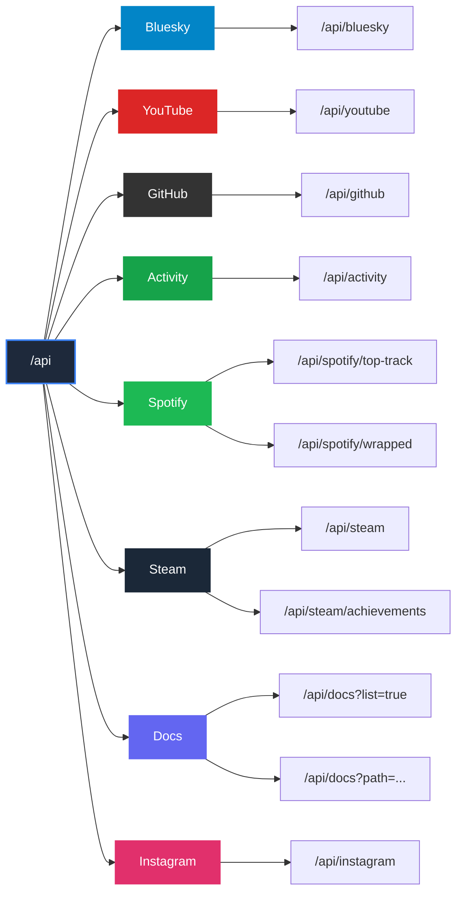

# API Endpoint Map

Visual map of all 10 API endpoints across 8 resource groups in the sunny-stack portfolio application. All endpoints are **GET-only** and return JSON responses. Rate-limited at **30 requests per minute per IP** via middleware.

## Endpoint Hierarchy

## Endpoint Details

### Bluesky (1 endpoint)

| Method | Endpoint | Description | Parameters | Response Type |
|---|---|---|---|---|
| GET | `/api/bluesky` | Latest Bluesky post | None | `BlueskyPost \| null` |

### YouTube (1 endpoint)

| Method | Endpoint | Description | Parameters | Response Type |
|---|---|---|---|---|
| GET | `/api/youtube` | 5 most recent videos with statistics | None | `YouTubeVideo[]` |

### GitHub (1 endpoint)

| Method | Endpoint | Description | Parameters | Response Type |
|---|---|---|---|---|
| GET | `/api/github` | Profile card data (avatar, name, bio, location) | None | `GitHubProfile \| null` |

### Activity (1 endpoint)

| Method | Endpoint | Description | Parameters | Response Type |
|---|---|---|---|---|
| GET | `/api/activity` | Cross-platform activity status | None | `ActivityStatus` |

### Spotify (2 endpoints)

| Method | Endpoint | Description | Parameters | Response Type |
|---|---|---|---|---|
| GET | `/api/spotify/top-track` | Current top track | None | `SpotifyTopTrack \| null` |
| GET | `/api/spotify/wrapped` | Top 5 tracks, top 5 artists, top genres | None | `SpotifyWrappedData \| null` |

### Steam (2 endpoints)

| Method | Endpoint | Description | Parameters | Response Type |
|---|---|---|---|---|
| GET | `/api/steam` | Top 8 most-played games with header images | None | `SteamGame[]` |
| GET | `/api/steam/achievements` | Achievement data for a specific game | `?appid={number}` (required, validated with `/^\d+$/`) | `SteamAchievementData \| null` |

### Docs (1 endpoint, 2 modes)

| Method | Endpoint | Description | Parameters | Response Type |
|---|---|---|---|---|
| GET | `/api/docs` | Documentation file tree | `?list=true` | `DocFile[]` |
| GET | `/api/docs` | Markdown file content with Mermaid preprocessing | `?path={filepath}` (validated against path traversal) | `string` |

### Instagram (1 endpoint)

| Method | Endpoint | Description | Parameters | Response Type |
|---|---|---|---|---|
| GET | `/api/instagram` | 5 most recent image posts | None | `InstagramPost[]` |

## Rate Limiting

All endpoints are protected by the rate limiter in `src/proxy.ts`:

- **Limit**: 30 requests per minute per IP address
- **Scope**: All routes matching `/api/*`
- **Exceeded response**: `429 Too Many Requests` with `Retry-After` header

## Error Responses

| Status Code | Meaning | When |
|---|---|---|
| 200 | Success | Data returned (or `null`/empty array as graceful fallback when credentials are missing) |
| 400 | Bad Request | Missing or invalid parameters (only from `/api/docs`, `/api/steam/achievements`) |
| 404 | Not Found | Requested file not found (only from `/api/docs`) |
| 429 | Too Many Requests | Rate limit exceeded (includes `Retry-After` header) |

## Authentication

No client-side authentication is required. API route handlers authenticate with external services using server-side environment variables (OAuth tokens and API keys stored in `process.env`).
