# Component Hierarchy

Visual map of all React 19.2.4 components in the sunny-stack portfolio application, organized by page (36 files in components/ including 5 utility modules; ~31 are .tsx React components). The component tree uses React Server Components with selective client components for interactivity.

## Full Component Tree

```mermaid
flowchart TD
    Root["RootLayout"]

    Root --> VoyageSail["VoyageSail<br/>(navigation sail)"]
    Root --> ShipWheel["ShipWheel<br/>(navigation wheel)"]
    Root --> Children["{children}<br/>(page content)"]

    Children --> Home["Home Page<br/>(/)"]
    Children --> About["About Page<br/>(/about)"]
    Children --> Portfolio["Portfolio Page<br/>(/portfolio)"]
    Children --> DocsPage["Docs Page<br/>(/docs)"]
    Children --> NotFound["NotFound Page<br/>(/not-found)"]

    %% Home Page Components (5)
    Home --> HeroSection["HeroSection"]
    Home --> ContributionHeatmap["ContributionHeatmap"]
    Home --> StatsDashboard["StatsDashboard"]
    Home --> TechArsenal["TechArsenal"]
    Home --> CurrentlyBuilding["CurrentlyBuilding"]

    %% About Page Components (15)
    About --> ProfileCard["ProfileCard"]
    About --> DetailsBox["DetailsBox"]
    About --> SectionHeader["SectionHeader"]
    About --> NetworkBanner["NetworkBanner"]
    About --> BioSections["BioSections"]
    About --> ContactTable["ContactTable"]
    About --> PhotoGallery["PhotoGallery"]
    PhotoGallery --> PostCard["PostCard"]
    About --> VideoGallery["VideoGallery"]
    VideoGallery --> VideoCard["VideoCard"]
    About --> BlogEntry["BlogEntry"]
    About --> MusicGallery["MusicGallery"]
    MusicGallery --> MusicPlayer["MusicPlayer"]
    About --> TopEight["TopEight"]
    About --> GameStats["GameStats"]
    About --> InterestsTable["InterestsTable"]

    %% Portfolio Page Components (2)
    Portfolio --> CategorySection["CategorySection"]
    CategorySection --> ProjectCard["ProjectCard"]

    %% Docs Page Components (2)
    DocsPage --> DocNav["DocNav"]
    DocsPage --> MarkdownRenderer["MarkdownRenderer"]

    %% NotFound Page Components (6)
    NotFound --> ZoroGame["ZoroGame"]
    NotFound --> StaticNotFound["StaticNotFound"]
    NotFound --> LetterReveal["LetterReveal"]
    ZoroGame --> GameBoard["GameBoard"]
    ZoroGame --> GameHUD["GameHUD"]
    ZoroGame --> DPad["DPad"]
    ZoroGame --> WinCelebration["WinCelebration"]
    GameBoard --> GameTile["GameTile"]

    %% Styling
    style Root fill:#1e293b,color:#f8fafc,stroke:#3b82f6,stroke-width:2px
    style Home fill:#059669,color:#fff,stroke:#059669
    style About fill:#7c3aed,color:#fff,stroke:#7c3aed
    style Portfolio fill:#d97706,color:#fff,stroke:#d97706
    style DocsPage fill:#6366f1,color:#fff,stroke:#6366f1
    style NotFound fill:#dc2626,color:#fff,stroke:#dc2626
    style VoyageSail fill:#0ea5e9,color:#fff,stroke:#0ea5e9
    style ShipWheel fill:#0ea5e9,color:#fff,stroke:#0ea5e9
    style Children fill:#475569,color:#f8fafc,stroke:#475569
```

## Component Inventory by Page

### RootLayout (wraps all pages)

| Component | Type | Description |
|---|---|---|
| **RootLayout** | Server | Root layout with metadata, fonts, and global styles |
| VoyageSail | Client | Animated navigation sail element |
| ShipWheel | Client | Interactive navigation wheel |

### Home Page `/` (5 components)

| Component | Type | Description |
|---|---|---|
| HeroSection | Server | Landing hero with introduction |
| ContributionHeatmap | Server | GitHub contribution calendar visualization |
| StatsDashboard | Server | Aggregate stats across platforms |
| TechArsenal | Server | Technology skills showcase |
| CurrentlyBuilding | Server | Active project highlights |

### About Page `/about` (15 components)

| Component | Type | Description |
|---|---|---|
| ProfileCard | Server | User profile card with avatar and bio |
| DetailsBox | Server | Detailed information display |
| SectionHeader | Server | Reusable section title component |
| NetworkBanner | Server | Social network links banner |
| BioSections | Server | Biography content sections |
| ContactTable | Server | Contact information table |
| PhotoGallery | Client | Instagram photo grid |
| PostCard | Client | Individual photo post card |
| VideoGallery | Client | YouTube video showcase |
| VideoCard | Client | Individual video card |
| BlogEntry | Server | Bluesky blog post entry |
| MusicGallery | Client | Spotify music showcase |
| MusicPlayer | Client | Audio player for tracks |
| TopEight | Server | Top 8 Steam games display |
| GameStats | Client | Steam game statistics |
| InterestsTable | Server | Personal interests table |

### Portfolio Page `/portfolio` (2 components)

| Component | Type | Description |
|---|---|---|
| CategorySection | Server | Project category grouping |
| ProjectCard | Server | Individual project showcase card |

### Docs Page `/docs` (2 components)

| Component | Type | Description |
|---|---|---|
| DocNav | Client | Documentation sidebar navigation |
| MarkdownRenderer | Client | Markdown content renderer with syntax highlighting |

### NotFound Page `/not-found` (6 components)

| Component | Type | Description |
|---|---|---|
| ZoroGame | Client | Interactive 404 maze game |
| StaticNotFound | Server | Static fallback 404 content |
| LetterReveal | Client | Animated letter reveal effect |
| GameBoard | Client | Game grid layout |
| GameTile | Client | Individual game tile |
| GameHUD | Client | Game heads-up display (score, moves) |
| DPad | Client | Directional pad controller |
| WinCelebration | Client | Victory animation |

## Summary

| Page Group | Component Count |
|---|---|
| RootLayout (global) | 3 (RootLayout, VoyageSail, ShipWheel) |
| Home | 5 |
| About | 15 |
| Portfolio | 2 |
| Docs | 2 |
| NotFound | 6 |
| **Total** | **~31 .tsx components + 5 utility modules** (36 files total in components/; includes RootLayout + 2 navigation components) |

## Architecture Notes

- **Server Components** are the default -- used for data fetching and static rendering
- **Client Components** are used only where interactivity is required (games, galleries, players, navigation)
- **No client-side state library** -- data flows via props from server components
- **ISR (1-hour revalidation)** for pages that fetch from external APIs
