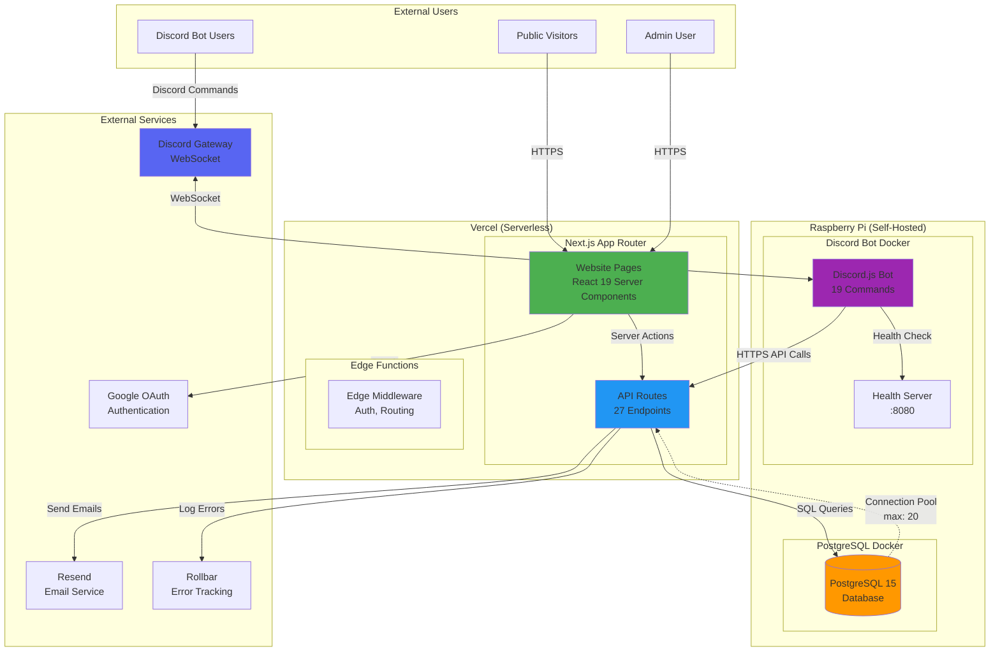
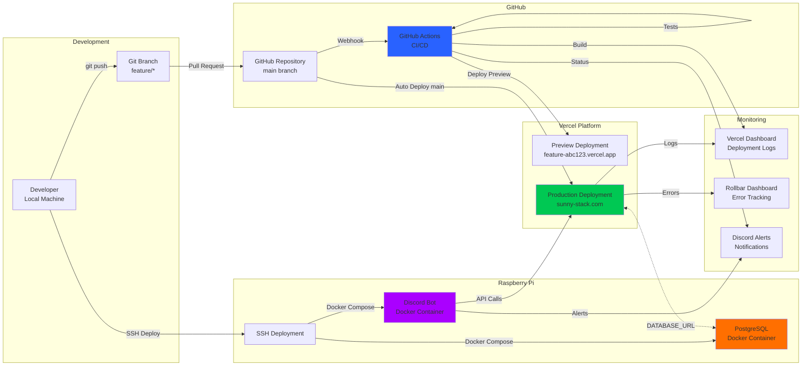
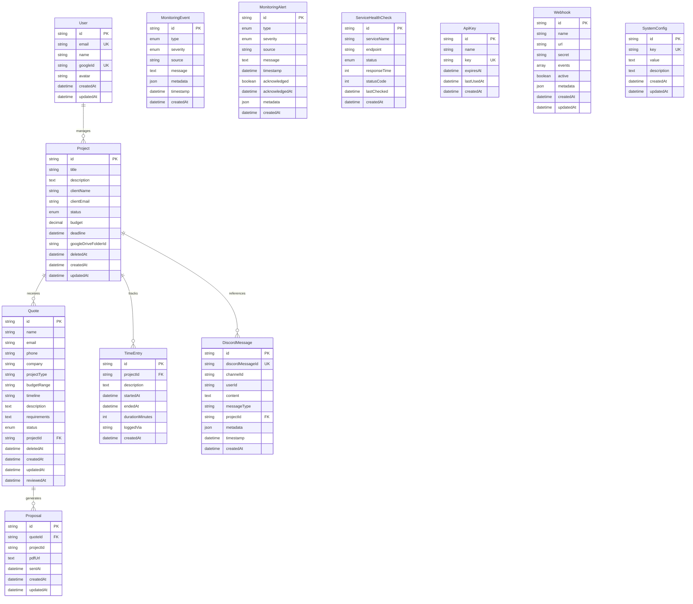
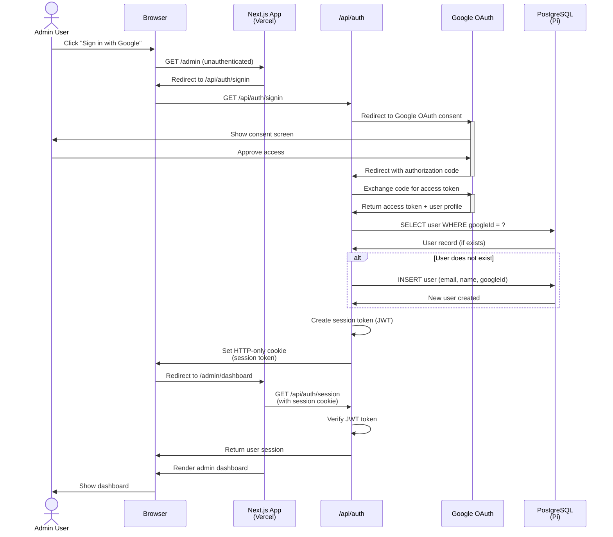
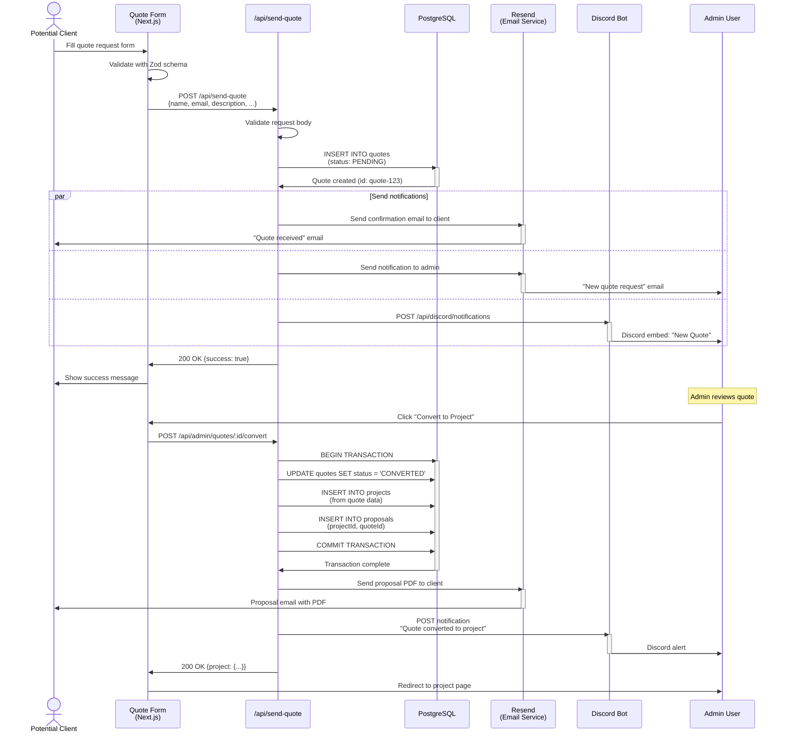
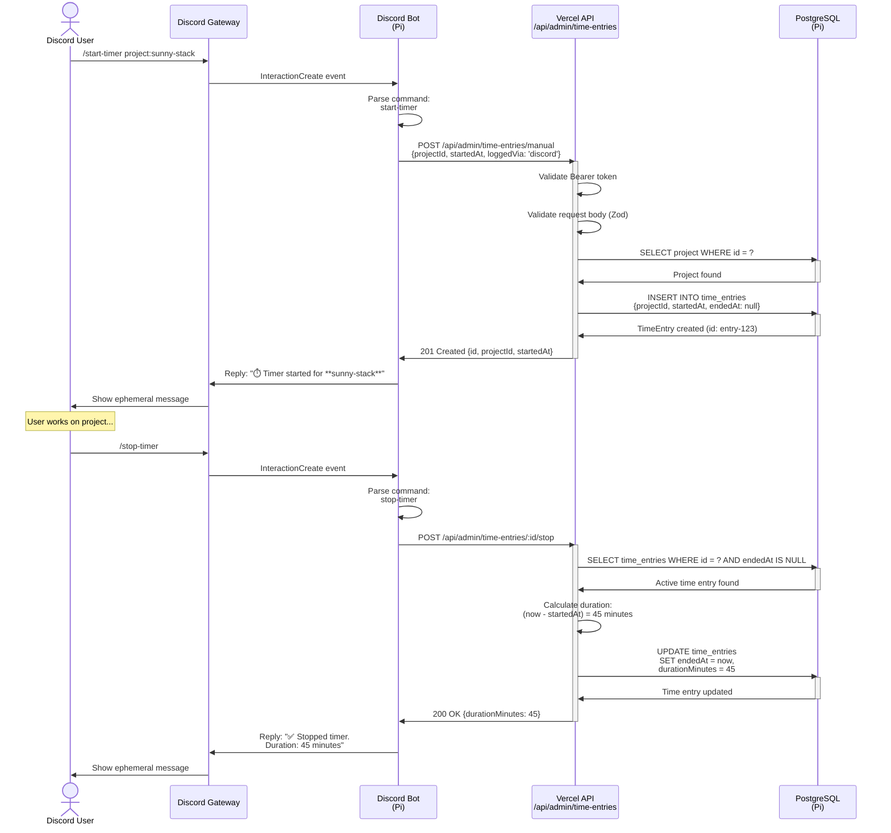
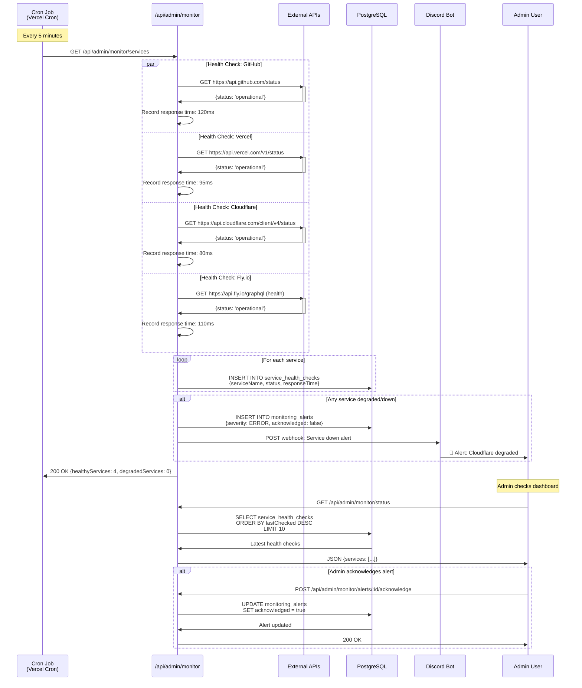
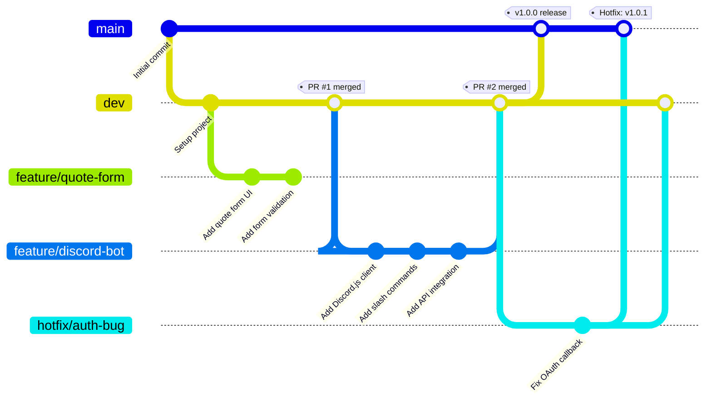
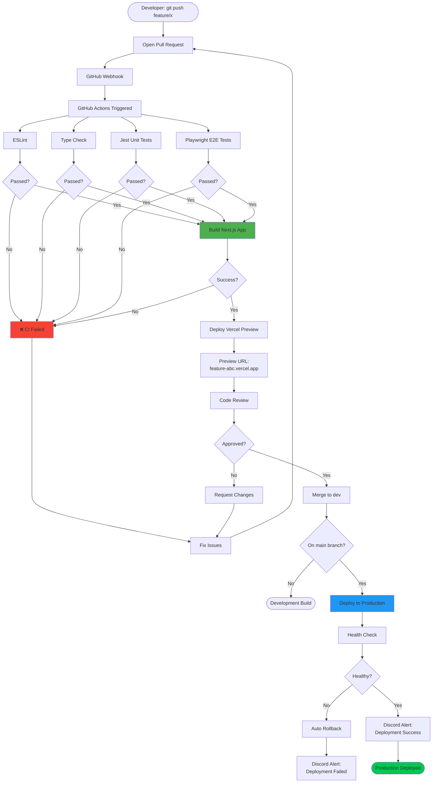
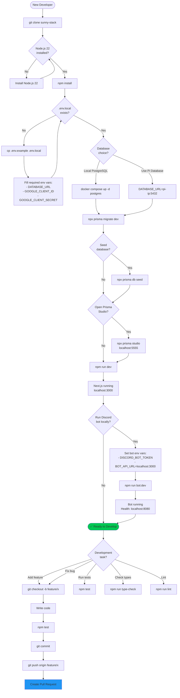

# sunny-stack Visual Documentation

Comprehensive visual documentation for sunny-stack architecture using Mermaid diagrams.

---

## Table of Contents

1. [System Architecture](#1-system-architecture-diagram)
2. [Deployment Architecture](#2-deployment-architecture-diagram)
3. [API Architecture](#3-api-architecture-diagram)
4. [Discord Bot Architecture](#4-discord-bot-architecture-diagram)
5. [Database Schema](#5-database-schema-diagram)
6. [API Flow: Google OAuth Authentication](#6-api-flow-google-oauth-authentication)
7. [API Flow: Quote Submission → Project Conversion](#7-api-flow-quote-submission--project-conversion)
8. [API Flow: Discord Time Logging](#8-api-flow-discord-time-logging)
9. [API Flow: Service Health Monitoring](#9-api-flow-service-health-monitoring)
10. [Development Workflow: Git Branching](#10-development-workflow-git-branching-strategy)
11. [Development Workflow: PR and CI/CD](#11-development-workflow-pr-and-cicd-pipeline)
12. [Development Workflow: Local Development Setup](#12-development-workflow-local-development-setup)

---

## 1. System Architecture Diagram

High-level overview of system components and data flow.



**Key Components:**

- **Vercel Layer**: Serverless Next.js application with auto-scaling
- **Raspberry Pi Layer**: Self-hosted database and Discord bot
- **External Services**: OAuth, email, error tracking, Discord

**Data Flow:**

1. Public visitors access website via Vercel edge network
2. API routes query PostgreSQL on Raspberry Pi
3. Discord bot maintains WebSocket connection to Discord Gateway
4. Bot calls Vercel API for database operations

---

## 2. Deployment Architecture Diagram

Deployment pipeline and environment configuration.



**Deployment Targets:**

1. **Vercel (Automatic)**: Push to `main` → auto-deploy
2. **Raspberry Pi (Manual)**: SSH deployment via Docker Compose

**Environments:**

- **Development**: Local (localhost:3000)
- **Preview**: Vercel preview deployments (per PR)
- **Production**: sunny-stack.com (Vercel) + Pi (DB/Bot)

---

## 3. API Architecture Diagram

API structure and middleware chain.

```mermaid
graph TB
    subgraph "Client Layer"
        BROWSER[Browser<br/>Fetch API]
        BOT_CLIENT[Discord Bot<br/>API Client]
    end

    subgraph "Next.js API Routes"
        subgraph "Public Endpoints"
            PUB_HEALTH[/api/health]
            PUB_QUOTE[/api/send-quote]
        end

        subgraph "Authentication"
            AUTH_SIGNIN[/api/auth/signin]
            AUTH_CALLBACK[/api/auth/callback/google]
            AUTH_SESSION[/api/auth/session]
            AUTH_SIGNOUT[/api/auth/signout]
        end

        subgraph "Admin Endpoints (Protected)"
            ADMIN_ANALYTICS[/api/admin/analytics]
            ADMIN_PROJECTS[/api/admin/projects]
            ADMIN_QUOTES[/api/admin/quotes]
            ADMIN_TIME[/api/admin/time-entries]
            ADMIN_MONITOR[/api/admin/monitor/*]
        end

        subgraph "Discord Integration"
            DISCORD_INT[/api/discord/interactions]
            DISCORD_WH[/api/discord/webhooks]
        end
    end

    subgraph "Middleware Chain"
        MW_AUTH[Admin Auth<br/>Middleware]
        MW_VALIDATE[Zod Validation]
        MW_ERROR[Error Handler]
    end

    subgraph "Business Logic Layer"
        BL_PROJECTS[Project Service]
        BL_QUOTES[Quote Service]
        BL_TIME[Time Tracking Service]
        BL_MONITOR[Monitoring Service]
    end

    subgraph "Data Access Layer"
        PRISMA[Prisma Client<br/>ORM]
        DB[(PostgreSQL<br/>Database)]
    end

    subgraph "External Services"
        GOOGLE[Google OAuth]
        RESEND[Resend Email]
        ROLLBAR[Rollbar Errors]
    end

    %% Client requests
    BROWSER -->|HTTPS| PUB_HEALTH
    BROWSER -->|HTTPS| PUB_QUOTE
    BROWSER -->|HTTPS| AUTH_SIGNIN
    BROWSER -->|HTTPS| ADMIN_PROJECTS
    BOT_CLIENT -->|HTTPS + Bearer Token| ADMIN_TIME

    %% Middleware flow (admin endpoints)
    ADMIN_PROJECTS --> MW_AUTH
    ADMIN_QUOTES --> MW_AUTH
    ADMIN_TIME --> MW_AUTH
    ADMIN_MONITOR --> MW_AUTH

    MW_AUTH --> MW_VALIDATE
    MW_VALIDATE --> BL_PROJECTS
    MW_VALIDATE --> BL_QUOTES
    MW_VALIDATE --> BL_TIME
    MW_VALIDATE --> BL_MONITOR

    %% Business logic to database
    BL_PROJECTS --> PRISMA
    BL_QUOTES --> PRISMA
    BL_TIME --> PRISMA
    BL_MONITOR --> PRISMA
    PRISMA --> DB

    %% Public endpoints
    PUB_QUOTE --> MW_VALIDATE
    MW_VALIDATE --> RESEND
    MW_VALIDATE --> PRISMA

    %% Auth flow
    AUTH_SIGNIN --> GOOGLE
    AUTH_CALLBACK --> GOOGLE
    AUTH_SESSION --> PRISMA

    %% Error handling
    BL_PROJECTS -.->|Errors| MW_ERROR
    BL_QUOTES -.->|Errors| MW_ERROR
    MW_ERROR --> ROLLBAR

    style MW_AUTH fill:#FF9800
    style MW_VALIDATE fill:#4CAF50
    style PRISMA fill:#2196F3
    style DB fill:#FF5722
```

**API Layers:**

1. **Client Layer**: Browser, Discord bot
2. **Middleware Chain**: Auth → Validation → Error Handling
3. **Business Logic**: Service classes for each domain
4. **Data Access**: Prisma ORM → PostgreSQL

**Authentication Flow:**

- Public endpoints: No authentication required
- Admin endpoints: `requireAdmin()` middleware validates session
- Discord endpoints: Bearer token authentication

---

## 4. Discord Bot Architecture Diagram

Discord bot structure and command handling.

```mermaid
graph TB
    subgraph "Discord Platform"
        GATEWAY[Discord Gateway<br/>WebSocket Connection]
        SLASH[Slash Command Interaction]
    end

    subgraph "Discord Bot (Raspberry Pi)"
        subgraph "Core"
            CLIENT[Discord.js Client<br/>Event Emitter]
            LOGGER[Winston Logger<br/>Daily Rotation]
        end

        subgraph "Event Handlers"
            E_READY[ready Event<br/>Bot Startup]
            E_INTERACT[interactionCreate Event<br/>Command Handler]
            E_ERROR[error Event<br/>Error Logging]
        end

        subgraph "Command Registry"
            CMD_REG[Command Collection<br/>19 Commands]
        end

        subgraph "Commands (19 Total)"
            subgraph "Time Tracking"
                CMD_START[/start-timer]
                CMD_STOP[/stop-timer]
                CMD_LOG[/log-time]
            end

            subgraph "Project Management"
                CMD_CREATE[/create-project]
                CMD_LIST[/list-projects]
                CMD_STATUS[/project-status]
            end

            subgraph "Monitoring"
                CMD_HEALTH[/health]
                CMD_MONITOR[/status]
                CMD_ALERTS[/monitor]
            end
        end

        subgraph "Utilities"
            API_CLIENT[API Client<br/>Vercel Integration]
            CIRCUIT[Circuit Breaker<br/>Retry Logic]
            RATE[Rate Limiter<br/>10 req/min]
        end

        subgraph "Health Check"
            HEALTH_SERVER[HTTP Server<br/>:8080/health]
        end
    end

    subgraph "Vercel API"
        API_PROJECTS[/api/admin/projects]
        API_TIME[/api/admin/time-entries]
        API_MONITOR[/api/admin/monitor/status]
    end

    subgraph "Database"
        DB[(PostgreSQL<br/>Raspberry Pi)]
    end

    %% Discord flow
    GATEWAY <-->|WebSocket| CLIENT
    SLASH -->|Interaction| CLIENT

    %% Event handling
    CLIENT -->|Emit| E_READY
    CLIENT -->|Emit| E_INTERACT
    CLIENT -->|Emit| E_ERROR

    E_INTERACT --> CMD_REG
    CMD_REG --> CMD_START
    CMD_REG --> CMD_STOP
    CMD_REG --> CMD_LOG
    CMD_REG --> CMD_CREATE
    CMD_REG --> CMD_LIST
    CMD_REG --> CMD_STATUS
    CMD_REG --> CMD_HEALTH
    CMD_REG --> CMD_MONITOR
    CMD_REG --> CMD_ALERTS

    %% Command execution
    CMD_START --> API_CLIENT
    CMD_STOP --> API_CLIENT
    CMD_LOG --> API_CLIENT
    CMD_CREATE --> API_CLIENT
    CMD_LIST --> API_CLIENT

    API_CLIENT --> CIRCUIT
    CIRCUIT --> RATE
    RATE -->|HTTPS| API_PROJECTS
    RATE -->|HTTPS| API_TIME
    RATE -->|HTTPS| API_MONITOR

    %% API to database
    API_PROJECTS --> DB
    API_TIME --> DB
    API_MONITOR --> DB

    %% Error logging
    E_ERROR --> LOGGER
    API_CLIENT -.->|Errors| LOGGER

    %% Health check
    HEALTH_SERVER -.->|Monitor| CLIENT

    style CLIENT fill:#5865F2
    style CMD_REG fill:#4CAF50
    style API_CLIENT fill:#2196F3
    style DB fill:#FF9800
```

**Bot Components:**

1. **Event Handlers**: ready, interactionCreate, error
2. **Command Registry**: 19 slash commands
3. **API Client**: HTTP client for Vercel API integration
4. **Utilities**: Circuit breaker, rate limiter, retry logic

**Command Flow:**

1. User invokes `/start-timer` in Discord
2. Discord sends interaction to bot via Gateway
3. Bot executes command → calls Vercel API
4. API stores data in PostgreSQL
5. Bot responds to user with confirmation

---

## 5. Database Schema Diagram

Entity-Relationship diagram for PostgreSQL database.



**Core Tables:**

- **User**: Admin users (Google OAuth)
- **Project**: Client projects with status tracking
- **Quote**: Quote requests from website
- **Proposal**: Generated PDF proposals
- **TimeEntry**: Time tracking entries

**Monitoring Tables:**

- **MonitoringEvent**: Service monitoring events
- **MonitoringAlert**: Alerts with acknowledgment tracking
- **ServiceHealthCheck**: External service health checks

**Integration Tables:**

- **DiscordMessage**: Audit log of Discord bot messages
- **ApiKey**: API authentication keys
- **Webhook**: Webhook configurations
- **SystemConfig**: System-wide configuration

**Indexes (not shown):**

- Status indexes (projects, quotes)
- Email indexes (users, projects)
- Timestamp indexes (all tables with createdAt)
- Compound indexes (monitoring alerts: source + timestamp)

---

## 6. API Flow: Google OAuth Authentication

Sequence diagram for Google OAuth flow.



**OAuth Flow Steps:**

1. User clicks "Sign in with Google"
2. Redirect to Google OAuth consent screen
3. User approves access
4. Google redirects back with authorization code
5. Exchange code for access token
6. Fetch user profile from Google
7. Create or update user in database
8. Create session token (JWT)
9. Set HTTP-only cookie
10. Redirect to admin dashboard

**Session Management:**

- JWT stored in HTTP-only cookie (XSS protection)
- Session validation on every admin route
- Automatic session refresh (15-day expiry)

---

## 7. API Flow: Quote Submission → Project Conversion

Complex workflow for quote processing.



**Quote Flow:**

1. Client submits quote via public form
2. Quote stored in database (status: PENDING)
3. Notifications sent (email + Discord)
4. Admin reviews quote in dashboard
5. Admin clicks "Convert to Project"
6. Transaction: Update quote + Create project + Create proposal
7. Proposal PDF emailed to client
8. Discord notification to admin

**Key Features:**

- **Atomic Transaction**: Quote conversion uses database transaction
- **Parallel Notifications**: Email and Discord sent concurrently
- **Soft Delete**: Quotes never hard-deleted (deletedAt timestamp)
- **Status Tracking**: PENDING → APPROVED/DECLINED → CONVERTED

---

## 8. API Flow: Discord Time Logging

Time tracking via Discord bot slash commands.



**Time Tracking Flow:**

1. User invokes `/start-timer` with project autocomplete
2. Bot calls Vercel API to create time entry (startedAt, endedAt: null)
3. Bot confirms timer started
4. User works on project
5. User invokes `/stop-timer`
6. Bot calls API to update time entry (endedAt: now)
7. API calculates duration in minutes
8. Bot confirms timer stopped with duration

**Features:**

- **Autocomplete**: Project list fetched from API for autocomplete
- **Active Timer Check**: Only one active timer per user
- **Manual Entry**: `/log-time` command for manual time entries
- **Reporting**: `/time-report` command for time summaries

---

## 9. API Flow: Service Health Monitoring

Automated health checks for external services.



**Monitoring Flow:**

1. Cron job triggers every 5 minutes
2. API performs health checks for 4 services in parallel
3. Results stored in database (service_health_checks table)
4. If any service is degraded/down, create monitoring alert
5. Send Discord webhook for critical alerts
6. Admin views monitoring dashboard
7. Admin acknowledges alerts to clear notifications

**Monitored Services:**

- **GitHub API**: Repository status, API availability
- **Vercel API**: Deployment status, build health
- **Cloudflare API**: DNS, CDN status
- **Fly.io API**: Container health (if used)

**Alert Severity:**

- **INFO**: Successful health checks
- **WARNING**: Slow response time (>500ms)
- **ERROR**: Service degraded
- **CRITICAL**: Service down

---

## 10. Development Workflow: Git Branching Strategy

Git flow for feature development.



**Branch Strategy:**

- **main**: Production-ready code (protected)
- **dev**: Development integration branch
- **feature/\***: Feature branches (merged to dev via PR)
- **hotfix/\***: Emergency fixes (merged to main + dev)

**Workflow:**

1. Create feature branch from `dev`
2. Develop feature with commits
3. Open PR: `feature/x` → `dev`
4. Code review + CI/CD tests
5. Merge to `dev` (squash or merge commit)
6. When ready for release: `dev` → `main`
7. Hotfixes: `hotfix/x` → `main` + `dev`

---

## 11. Development Workflow: PR and CI/CD Pipeline

Pull request workflow with GitHub Actions.



**CI/CD Stages:**

1. **Linting**: ESLint checks code quality
2. **Type Check**: TypeScript compilation (currently disabled)
3. **Unit Tests**: Jest unit tests (passWithNoTests)
4. **E2E Tests**: Playwright end-to-end tests
5. **Build**: Next.js production build
6. **Preview Deploy**: Vercel preview deployment (per PR)
7. **Code Review**: Manual review by team
8. **Merge**: Merge to dev (or main for hotfixes)
9. **Production Deploy**: Vercel auto-deploy on main push
10. **Health Check**: Verify deployment health
11. **Notifications**: Discord alerts for success/failure

**Rollback Strategy:**

- Vercel preserves last 10 deployments
- One-click rollback via Vercel dashboard
- Automatic rollback on health check failure (if configured)

---

## 12. Development Workflow: Local Development Setup

Local development environment setup flow.



**Setup Steps:**

1. Clone repository
2. Install Node.js 22
3. Run `npm install`
4. Create `.env.local` from `.env.example`
5. Start PostgreSQL (local Docker or connect to Pi)
6. Run Prisma migrations
7. Seed database (optional)
8. Start Next.js dev server (`npm run dev`)
9. Start Discord bot (optional, `npm run bot:dev`)
10. Ready to develop!

**Common Commands:**

```bash
# Development
npm run dev              # Start Next.js (localhost:3000)
npm run bot:dev          # Start Discord bot locally

# Database
npx prisma migrate dev   # Create and apply migration
npx prisma studio        # Open database GUI (localhost:5555)
npx prisma db seed       # Seed test data

# Testing
npm test                 # Run Jest unit tests
npm run test:e2e         # Run Playwright E2E tests
npm run test:coverage    # Generate coverage report

# Code Quality
npm run lint             # ESLint
npm run type-check       # TypeScript compilation check
npm run lint:fix         # Auto-fix linting issues
```

---

## Diagram Source Files

All diagrams are embedded in this document using Mermaid syntax. To edit:

1. **GitHub**: Markdown files with Mermaid blocks render automatically
2. **VS Code**: Install "Markdown Preview Mermaid Support" extension
3. **Mermaid Live Editor**: https://mermaid.live/ (paste Mermaid code)
4. **Export**: Use Mermaid CLI to export as PNG/SVG if needed

---

**Last Updated:** 2026-01-07
**Maintained By:** APO (Documentation Specialist)
**Diagram Count:** 12 comprehensive Mermaid diagrams
