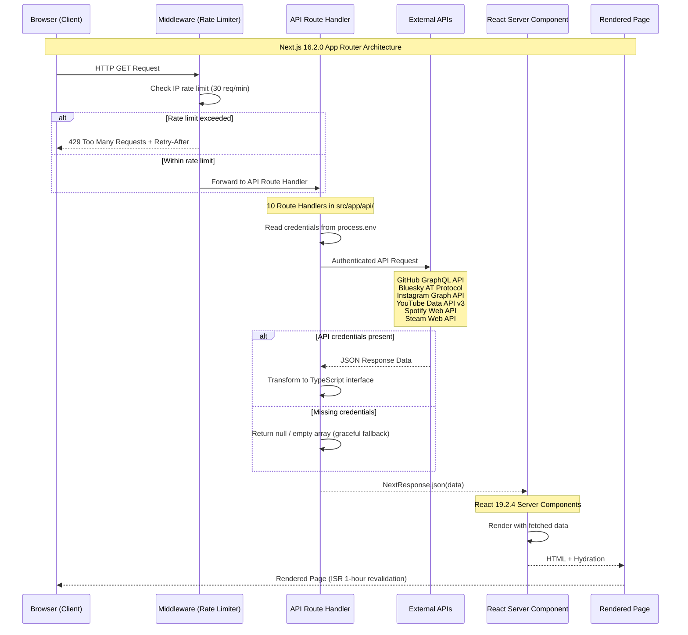

# Component-API Request Flow

This diagram illustrates the request flow in the sunny-stack portfolio application. Unlike traditional MVC, this project uses Next.js 16.2.0 App Router with React Server Components and API Route handlers that fetch data from external APIs.

## Request Flow Diagram

## API Route Handlers (Controllers)

All 10 route handlers follow the same pattern: export an async `GET` function from `route.ts`.

| Route File | External API | Response Type |
|---|---|---|
| `bluesky/route.ts` | Bluesky AT Protocol | BlueskyPost |
| `youtube/route.ts` | YouTube Data API v3 | YouTubeVideo[] |
| `github/route.ts` | GitHub GraphQL | GitHubProfile |
| `activity/route.ts` | Multiple APIs | ActivityStatus |
| `spotify/top-track/route.ts` | Spotify Web API | SpotifyTopTrack |
| `spotify/wrapped/route.ts` | Spotify Web API | SpotifyWrappedData |
| `steam/route.ts` | Steam Web API | SteamGame[] |
| `steam/achievements/route.ts` | Steam Web API | SteamAchievementData |
| `docs/route.ts` | Local filesystem | DocFile |
| `instagram/route.ts` | Instagram Graph API | InstagramPost[] |

## TypeScript Interfaces (Models)

Data flows through typed interfaces that enforce structure between the external API responses and the React components:

- **BlueskyPost** - Latest Bluesky post data
- **YouTubeVideo** - Video metadata with statistics
- **GitHubProfile** / **GitHubData** - Profile card and contribution data
- **ActivityStatus** - Cross-platform activity aggregation
- **SpotifyTopTrack** / **SpotifyWrappedData** - Music listening data
- **SteamGame** / **SteamAchievementData** - Gaming statistics
- **InstagramPost** - Social media content
- **DocFile** - Documentation file metadata
- **ProjectData** / **ProfileData** - Static data structures

## Pages (Views)

5 pages rendered by React Server Components:

| Page | Route | Description |
|---|---|---|
| Home | `/` | Hero section, contribution heatmap, stats dashboard, tech arsenal, currently building |
| About | `/about` | Profile card, social feeds, music gallery, game stats, interests |
| Portfolio | `/portfolio` | Project cards organized by category |
| Docs | `/docs` | Documentation viewer with navigation and Markdown rendering |
| NotFound | `/not-found` | 404 page with interactive ZoroGame |

## Key Architecture Notes

- **No database** -- all data sourced from external APIs at runtime or from static TypeScript data files
- **No ORM** -- direct `fetch` calls to external APIs with server-side authentication
- **ISR (Incremental Static Regeneration)** with 1-hour revalidation reduces external API load
- **Rate limiting** via `src/middleware.ts` protects all `/api/*` routes at 30 requests per minute per IP
- **Security headers** (CSP, HSTS, X-Frame-Options) applied via middleware
- **Graceful degradation** -- all API routes return `null` or empty arrays when credentials are missing
