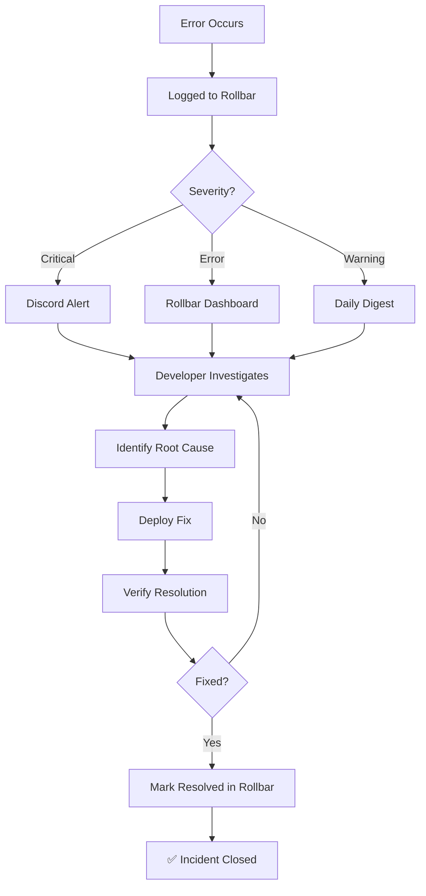

# Monitoring and Observability Guide

Comprehensive guide to monitoring sunny-stack in production, covering application health, infrastructure metrics, service monitoring, logging, and incident response.

---

## Table of Contents

1. [Monitoring Strategy](#monitoring-strategy)
2. [Application Monitoring](#application-monitoring)
3. [Infrastructure Monitoring](#infrastructure-monitoring)
4. [Service Health Monitoring](#service-health-monitoring)
5. [Performance Monitoring](#performance-monitoring)
6. [Logging Best Practices](#logging-best-practices)
7. [Dashboards and Reporting](#dashboards-and-reporting)
8. [Alerting and Incident Response](#alerting-and-incident-response)

---

## Monitoring Strategy

### Monitoring Philosophy

sunny-stack follows a **layered monitoring approach** with three primary layers:

```
┌─────────────────────────────────────────────────┐
│      Layer 1: Business Metrics                  │
│      - Quote submissions                        │
│      - Project conversions                      │
│      - Time tracking usage                      │
└─────────────────────────────────────────────────┘
                    ↓
┌─────────────────────────────────────────────────┐
│      Layer 2: Application Health                │
│      - Error rates (Rollbar)                    │
│      - API response times                       │
│      - Database query performance               │
│      - Discord bot uptime                       │
└─────────────────────────────────────────────────┘
                    ↓
┌─────────────────────────────────────────────────┐
│      Layer 3: Infrastructure Metrics            │
│      - Raspberry Pi CPU/RAM/Disk                │
│      - PostgreSQL connection pool               │
│      - Docker container health                  │
│      - External service status                  │
└─────────────────────────────────────────────────┘
```

### Observability Goals

1. **Early Detection**: Identify issues before users are impacted
2. **Fast Resolution**: Provide context to debug issues quickly
3. **Prevent Alert Fatigue**: Only alert on actionable issues
4. **Historical Analysis**: Track trends over time for capacity planning
5. **Cost Efficiency**: Use free-tier monitoring tools where possible

### SLIs and SLOs

**Service Level Indicators (SLIs):**

- **Availability**: Uptime percentage
- **Latency**: API response time (p50, p95, p99)
- **Error Rate**: Percentage of failed requests
- **Throughput**: Requests per second

**Service Level Objectives (SLOs):**

```yaml
Portfolio_Website:
  Availability: ≥99.9% (three nines)
  Latency_P95: <500ms
  Error_Rate: <1%

Admin_Dashboard:
  Availability: ≥99.5%
  Latency_P95: <1000ms
  Error_Rate: <2%

Discord_Bot:
  Availability: ≥99.5%
  Command_Response: <3s
  Error_Rate: <3%

Database:
  Availability: ≥99.5%
  Query_Latency_P95: <100ms
  Connection_Utilization: <80%
```

---

## Application Monitoring

### Rollbar Error Tracking

**Configuration:**

```typescript
// lib/monitoring/rollbar.ts
import Rollbar from "rollbar";

export const rollbar = new Rollbar({
  accessToken: process.env.ROLLBAR_ACCESS_TOKEN!,
  environment: process.env.NODE_ENV || "development",

  // Capture uncaught errors
  captureUncaught: true,
  captureUnhandledRejections: true,

  // Deployment tracking
  payload: {
    client: {
      javascript: {
        code_version: process.env.VERCEL_GIT_COMMIT_SHA || "local",
        source_map_enabled: true,
      },
    },
  },

  // Scrub sensitive data
  scrubFields: [
    "password",
    "token",
    "secret",
    "api_key",
    "access_token",
    "authorization",
    "cookie",
  ],

  // Rate limiting (prevent alert fatigue)
  checkIgnore: (isUncaught, args, payload) => {
    // Ignore 404 errors
    if (payload.message?.includes("404")) return true;
    // Ignore network errors (usually transient)
    if (payload.message?.includes("Network request failed")) return true;
    return false;
  },
});
```

### Error Grouping Strategy

**Rollbar Fingerprinting:**

Rollbar automatically groups errors by:

1. Exception class
2. File and line number
3. Error message pattern

**Custom Grouping:**

```typescript
// Custom error context for better grouping
rollbar.error(error, {
  fingerprint: `auth-error-${error.code}`, // Custom grouping
  context: "google-oauth",
  user: { id: userId, email: userEmail },
});
```

### Error Severity Levels

```typescript
// Critical: Requires immediate attention
rollbar.critical("Database connection lost", {
  database: process.env.DATABASE_URL,
  timestamp: new Date().toISOString(),
});

// Error: Normal error logging
rollbar.error(error, { context: "api-route" });

// Warning: Potential issues
rollbar.warning("High memory usage", {
  usage: process.memoryUsage().heapUsed,
});

// Info: Non-error events
rollbar.info("Deployment started", {
  version: process.env.VERCEL_GIT_COMMIT_SHA,
});

// Debug: Development debugging
rollbar.debug("Cache miss", { key: cacheKey });
```

### Alert Configuration

**Rollbar Notifications:**

1. **Discord Webhook** (critical errors only):
   - Severity: critical, error
   - Rate limit: Max 1 per 10 minutes per error group
   - Template: Error title + stack trace link

2. **Email Alerts** (daily digest):
   - New error occurrences
   - Error spike detection
   - Resolved errors

**Discord Webhook Setup:**

```json
// Rollbar → Settings → Notifications → Webhooks
{
  "content": "🚨 **{{item.title}}**",
  "embeds": [
    {
      "title": "{{item.title}}",
      "description": "{{item.message}}",
      "url": "{{item.url}}",
      "color": 16711680,
      "fields": [
        {
          "name": "Environment",
          "value": "{{item.environment}}",
          "inline": true
        },
        { "name": "Level", "value": "{{item.level}}", "inline": true },
        {
          "name": "Occurrences",
          "value": "{{item.occurrences}}",
          "inline": true
        }
      ]
    }
  ]
}
```

### Error Resolution Workflow



**Steps:**

1. **Detect**: Error logged to Rollbar
2. **Alert**: Discord/email notification (based on severity)
3. **Investigate**: Review stack trace, context, user impact
4. **Fix**: Deploy fix via Vercel or Pi deployment
5. **Verify**: Monitor error rate drops to zero
6. **Resolve**: Mark resolved in Rollbar dashboard

---

## Infrastructure Monitoring

### Raspberry Pi Monitoring

**System Metrics Collection:**

```bash
#!/bin/bash
# scripts/pi-monitor.sh

# CPU usage
CPU_USAGE=$(top -bn1 | grep "Cpu(s)" | sed "s/.*, *\([0-9.]*\)%* id.*/\1/" | awk '{print 100 - $1}')

# Memory usage
MEM_USAGE=$(free | grep Mem | awk '{print ($3/$2) * 100.0}')

# Disk usage
DISK_USAGE=$(df -h / | awk 'NR==2 {print $5}' | sed 's/%//')

# Docker container status
POSTGRES_STATUS=$(docker inspect -f '{{.State.Health.Status}}' sunny-stack-db 2>/dev/null || echo "not_running")
BOT_STATUS=$(docker inspect -f '{{.State.Health.Status}}' sunny-stack-bot 2>/dev/null || echo "not_running")

echo "CPU: ${CPU_USAGE}% | MEM: ${MEM_USAGE}% | DISK: ${DISK_USAGE}% | DB: ${POSTGRES_STATUS} | BOT: ${BOT_STATUS}"

# Alert if thresholds exceeded
if (( $(echo "$CPU_USAGE > 80" | bc -l) )); then
    echo "⚠️ High CPU usage: ${CPU_USAGE}%"
    curl -X POST "$DISCORD_WEBHOOK_URL" -H "Content-Type: application/json" \
      -d "{\"content\": \"⚠️ Pi Alert: High CPU usage ${CPU_USAGE}%\"}"
fi

if (( $(echo "$MEM_USAGE > 80" | bc -l) )); then
    echo "⚠️ High memory usage: ${MEM_USAGE}%"
    curl -X POST "$DISCORD_WEBHOOK_URL" -H "Content-Type: application/json" \
      -d "{\"content\": \"⚠️ Pi Alert: High memory usage ${MEM_USAGE}%\"}"
fi
```

**Cron Schedule:**

```cron
# /etc/crontab
# Monitor every 5 minutes
*/5 * * * * /home/pi/sunny-stack/scripts/pi-monitor.sh >> /var/log/pi-monitor.log 2>&1
```

### PostgreSQL Monitoring

**Connection Pool Monitoring:**

```sql
-- Query to check active connections
SELECT
  count(*) as total_connections,
  count(*) FILTER (WHERE state = 'active') as active,
  count(*) FILTER (WHERE state = 'idle') as idle,
  count(*) FILTER (WHERE state = 'idle in transaction') as idle_in_transaction
FROM pg_stat_activity
WHERE datname = 'sunnystack';

-- Long-running queries (> 5 seconds)
SELECT
  pid,
  now() - pg_stat_activity.query_start AS duration,
  query,
  state
FROM pg_stat_activity
WHERE (now() - pg_stat_activity.query_start) > interval '5 seconds'
  AND state = 'active';
```

**Database Size Monitoring:**

```sql
-- Database size
SELECT
  pg_database.datname,
  pg_size_pretty(pg_database_size(pg_database.datname)) AS size
FROM pg_database
WHERE datname = 'sunnystack';

-- Table sizes
SELECT
  schemaname,
  tablename,
  pg_size_pretty(pg_total_relation_size(schemaname||'.'||tablename)) AS size
FROM pg_tables
WHERE schemaname = 'public'
ORDER BY pg_total_relation_size(schemaname||'.'||tablename) DESC;
```

**Slow Query Logging:**

```sql
-- Enable slow query logging (postgresql.conf)
-- log_min_duration_statement = 1000  # Log queries > 1 second

-- View recent slow queries
SELECT
  calls,
  total_time,
  mean_time,
  stddev_time,
  query
FROM pg_stat_statements
ORDER BY mean_time DESC
LIMIT 10;
```

### Docker Container Health

**Health Check Configuration:**

```yaml
# docker-compose.yml
services:
  postgres:
    healthcheck:
      test: ["CMD-SHELL", "pg_isready -U sunnystack"]
      interval: 10s
      timeout: 5s
      retries: 5

  discord-bot:
    healthcheck:
      test:
        [
          "CMD",
          "node",
          "-e",
          "require('http').get('http://localhost:8080/health', (r) => r.statusCode === 200 ? process.exit(0) : process.exit(1))",
        ]
      interval: 30s
      timeout: 10s
      retries: 3
```

**Check Container Health:**

```bash
# Check all container health
docker compose ps

# Detailed health status
docker inspect --format='{{json .State.Health}}' sunny-stack-db | jq
docker inspect --format='{{json .State.Health}}' sunny-stack-bot | jq

# Health check logs
docker inspect --format='{{range .State.Health.Log}}{{.Output}}{{end}}' sunny-stack-db
```

### Vercel Deployment Monitoring

**Vercel Dashboard Metrics:**

- Deployment status (success/failure)
- Build duration
- Function execution count
- Function errors
- Bandwidth usage
- Edge requests (CDN)

**API Monitoring via Vercel Analytics:**

```typescript
// app/api/admin/projects/route.ts
import { NextResponse } from "next/server";

export async function GET(request: Request) {
  const start = performance.now();

  try {
    const projects = await prisma.project.findMany();

    const duration = performance.now() - start;
    console.log(`[PERF] GET /api/admin/projects: ${duration.toFixed(2)}ms`);

    return NextResponse.json(projects);
  } catch (error) {
    // Error logged to Rollbar automatically
    throw error;
  }
}
```

---

## Service Health Monitoring

### External Service Health Checks

**Monitored Services:**

1. **GitHub API** (repository status, API availability)
2. **Vercel API** (deployment status, build health)
3. **Cloudflare API** (DNS, CDN status)
4. **Fly.io API** (container health, if used)
5. **Discord API** (bot connection, Gateway status)

**Implementation:**

```typescript
// lib/integrations/health-checks.ts
import axios from "axios";

export async function checkGitHubStatus(): Promise<ServiceHealth> {
  try {
    const start = Date.now();
    const response = await axios.get("https://api.github.com/status", {
      timeout: 10000,
    });
    const responseTime = Date.now() - start;

    return {
      serviceName: "GitHub",
      status: response.data.status === "good" ? "operational" : "degraded",
      responseTime,
      statusCode: response.status,
    };
  } catch (error) {
    return {
      serviceName: "GitHub",
      status: "down",
      responseTime: null,
      statusCode: null,
      error: error.message,
    };
  }
}

export async function checkVercelStatus(): Promise<ServiceHealth> {
  // Similar implementation for Vercel API
}

export async function checkCloudflareStatus(): Promise<ServiceHealth> {
  // Similar implementation for Cloudflare API
}

export async function checkFlyIoStatus(): Promise<ServiceHealth> {
  // Similar implementation for Fly.io API (if used)
}
```

**Automated Health Checks:**

```typescript
// app/api/cron/health-checks/route.ts
// Vercel Cron: Every 5 minutes

export async function GET(request: Request) {
  const services = await Promise.all([
    checkGitHubStatus(),
    checkVercelStatus(),
    checkCloudflareStatus(),
    checkFlyIoStatus(),
  ]);

  // Store results in database
  await Promise.all(
    services.map((service) =>
      prisma.serviceHealthCheck.create({
        data: {
          serviceName: service.serviceName,
          endpoint: service.endpoint,
          status: service.status,
          responseTime: service.responseTime,
          statusCode: service.statusCode,
          lastChecked: new Date(),
        },
      }),
    ),
  );

  // Create alerts for degraded/down services
  const degradedServices = services.filter((s) => s.status !== "operational");

  for (const service of degradedServices) {
    await prisma.monitoringAlert.create({
      data: {
        type: "UPTIME_CHECK",
        severity: service.status === "down" ? "CRITICAL" : "WARNING",
        source: service.serviceName,
        message: `${service.serviceName} is ${service.status}`,
        timestamp: new Date(),
        acknowledged: false,
      },
    });

    // Send Discord alert for critical issues
    if (service.status === "down") {
      await sendDiscordAlert({
        title: `🚨 Service Down: ${service.serviceName}`,
        description: `${service.serviceName} is currently down.`,
        color: 0xff0000, // Red
      });
    }
  }

  return NextResponse.json({
    timestamp: new Date().toISOString(),
    healthyServices: services.filter((s) => s.status === "operational").length,
    degradedServices: degradedServices.length,
    services,
  });
}
```

**Vercel Cron Configuration:**

```json
// vercel.json
{
  "crons": [
    {
      "path": "/api/cron/health-checks",
      "schedule": "*/5 * * * *"
    }
  ]
}
```

---

## Performance Monitoring

### Vercel Analytics

**Enable Vercel Analytics:**

```typescript
// app/layout.tsx
import { Analytics } from '@vercel/analytics/react';

export default function RootLayout({ children }) {
  return (
    <html>
      <body>
        {children}
        <Analytics />
      </body>
    </html>
  );
}
```

**Metrics Collected:**

- **Web Vitals**: LCP, FID, CLS, FCP, TTFB
- **Page Views**: URL, referrer, user agent
- **Custom Events**: Quote submissions, project conversions

### Database Query Performance

**Prisma Query Logging:**

```typescript
// lib/db/prisma.ts
const prisma = new PrismaClient({
  log: [
    { emit: "event", level: "query" },
    { emit: "stdout", level: "error" },
    { emit: "stdout", level: "warn" },
  ],
});

// Log slow queries
prisma.$on("query", (e) => {
  if (e.duration > 100) {
    // Log queries > 100ms
    logger.warn("Slow query detected", {
      query: e.query,
      duration: e.duration,
      params: e.params,
    });
  }
});
```

**Query Performance Benchmarks:**

```typescript
// __tests__/performance/database-queries.test.ts
describe("Database Query Performance", () => {
  it("should load projects in <100ms", async () => {
    const start = performance.now();

    await prisma.project.findMany({
      where: { deletedAt: null },
      take: 50,
    });

    const duration = performance.now() - start;
    expect(duration).toBeLessThan(100);
  });

  it("should load project with relations in <150ms", async () => {
    const start = performance.now();

    await prisma.project.findUnique({
      where: { id: testProjectId },
      include: {
        quotes: true,
        timeEntries: true,
        discordMessages: true,
      },
    });

    const duration = performance.now() - start;
    expect(duration).toBeLessThan(150);
  });
});
```

### API Response Time Tracking

**Performance Middleware:**

```typescript
// lib/middleware/performance.ts
export function performanceMiddleware(handler: NextApiHandler) {
  return async (req: NextApiRequest, res: NextApiResponse) => {
    const start = performance.now();

    // Execute handler
    await handler(req, res);

    const duration = performance.now() - start;

    // Log slow API responses
    if (duration > 500) {
      logger.warn("Slow API response", {
        method: req.method,
        url: req.url,
        duration: duration.toFixed(2),
      });
    }

    // Add performance header
    res.setHeader("X-Response-Time", `${duration.toFixed(2)}ms`);
  };
}
```

### Discord Bot Performance

**Command Response Time Tracking:**

```typescript
// bot/commands/base-command.ts
export abstract class BaseCommand {
  async execute(interaction: CommandInteraction) {
    const start = Date.now();

    try {
      await this.run(interaction);

      const duration = Date.now() - start;

      // Log slow commands
      if (duration > 3000) {
        logger.warn("Slow command execution", {
          command: interaction.commandName,
          duration,
        });
      }
    } catch (error) {
      logger.error("Command execution failed", {
        command: interaction.commandName,
        error,
      });
      throw error;
    }
  }

  abstract run(interaction: CommandInteraction): Promise<void>;
}
```

---

## Logging Best Practices

### Winston Logger Configuration

**Logger Setup:**

```typescript
// lib/logger.ts
import winston from "winston";
import DailyRotateFile from "winston-daily-rotate-file";

const logger = winston.createLogger({
  level: process.env.LOG_LEVEL || "info",
  format: winston.format.combine(
    winston.format.timestamp(),
    winston.format.errors({ stack: true }),
    winston.format.splat(),
    winston.format.json(),
  ),
  transports: [
    // Console (development)
    new winston.transports.Console({
      format: winston.format.combine(
        winston.format.colorize(),
        winston.format.simple(),
      ),
    }),

    // Daily rotating files (production)
    new DailyRotateFile({
      filename: "logs/application-%DATE%.log",
      datePattern: "YYYY-MM-DD",
      maxSize: "20m",
      maxFiles: "14d",
      level: "info",
    }),

    // Error logs (separate file)
    new DailyRotateFile({
      filename: "logs/error-%DATE%.log",
      datePattern: "YYYY-MM-DD",
      maxSize: "20m",
      maxFiles: "30d",
      level: "error",
    }),
  ],
});

export default logger;
```

### Log Levels

```typescript
// Critical errors requiring immediate action
logger.error("Database connection failed", {
  error: error.message,
  stack: error.stack,
  database: process.env.DATABASE_URL,
});

// Warnings (potential issues)
logger.warn("High memory usage detected", {
  usage: process.memoryUsage(),
  threshold: "80%",
});

// Informational logs
logger.info("User logged in", {
  userId: user.id,
  email: user.email,
});

// Debug logs (development only)
logger.debug("Cache hit", {
  key: cacheKey,
  ttl: 3600,
});
```

### Structured Logging

**Always use structured logs (objects, not strings):**

```typescript
// ✅ Good: Structured logging
logger.info("Quote submitted", {
  quoteId: quote.id,
  email: quote.email,
  projectType: quote.projectType,
  timestamp: new Date().toISOString(),
});

// ❌ Bad: String concatenation
logger.info(`Quote ${quote.id} submitted by ${quote.email}`);
```

**Benefits:**

- Easy to query and filter logs
- Can be parsed by log aggregation tools
- Consistent format across application

### Log Aggregation

**For Production (Optional):**

If scaling beyond Raspberry Pi, consider log aggregation:

- **Logtail** (free tier: 1GB/month)
- **Papertrail** (free tier: 50MB/month)
- **Datadog Logs** (paid)

**Integration Example (Logtail):**

```typescript
// lib/logger.ts
import { Logtail } from "@logtail/node";
import { LogtailTransport } from "@logtail/winston";

const logtail = new Logtail(process.env.LOGTAIL_SOURCE_TOKEN!);

logger.add(new LogtailTransport(logtail));
```

### Debugging with Logs

**Useful Log Queries:**

```bash
# View recent errors
tail -f logs/error-$(date +%Y-%m-%D).log

# Search for specific user's logs
grep "userId: user-123" logs/application-*.log

# Count errors by type
grep "error" logs/error-*.log | awk '{print $5}' | sort | uniq -c

# View logs from last hour
find logs/ -name "*.log" -mmin -60 -exec cat {} \;
```

---

## Dashboards and Reporting

### Rollbar Dashboard

**URL:** https://rollbar.com/

**Key Metrics:**

- **Errors by Environment**: Production vs Development
- **Error Trends**: Error count over time (hourly, daily, weekly)
- **Top Errors**: Most frequent errors (grouped)
- **Error Distribution**: By file, function, user, URL
- **Resolved vs Unresolved**: Incident tracking

**Custom Dashboard (RQL):**

```sql
-- Rollbar Query Language (RQL)
SELECT count(*)
FROM item_occurrence
WHERE timestamp > UNIX_TIMESTAMP() - 86400
  AND environment = 'production'
  AND level IN ('error', 'critical')
GROUP BY item.title
ORDER BY count DESC
LIMIT 10
```

### Vercel Dashboard

**URL:** https://vercel.com/dashboard

**Key Metrics:**

- **Deployments**: Success rate, build duration, preview deployments
- **Functions**: Execution count, errors, duration (p50, p95, p99)
- **Bandwidth**: Total bandwidth, bandwidth by region
- **Edge Requests**: CDN cache hit rate
- **Analytics**: Web Vitals, page views, custom events

### Custom Monitoring Dashboard

**Admin Monitoring Page:**

```typescript
// app/admin/monitor/page.tsx
export default async function MonitorPage() {
  // Fetch recent service health checks
  const healthChecks = await prisma.serviceHealthCheck.findMany({
    orderBy: { lastChecked: 'desc' },
    take: 100
  });

  // Fetch unacknowledged alerts
  const alerts = await prisma.monitoringAlert.findMany({
    where: { acknowledged: false },
    orderBy: { timestamp: 'desc' }
  });

  // Calculate uptime percentage
  const uptime = calculateUptime(healthChecks);

  return (
    <div>
      <h1>System Monitoring</h1>

      {/* Service Status Cards */}
      <ServiceStatusGrid services={groupByService(healthChecks)} />

      {/* Alerts */}
      <AlertsList alerts={alerts} />

      {/* Uptime Chart */}
      <UptimeChart data={healthChecks} />
    </div>
  );
}
```

### Weekly/Monthly Reporting

**Automated Report Generation:**

```typescript
// scripts/generate-report.ts
import { prisma } from "@/lib/db/prisma";
import { sendEmail } from "@/lib/email";

async function generateWeeklyReport() {
  const startOfWeek = new Date();
  startOfWeek.setDate(startOfWeek.getDate() - 7);

  // Gather metrics
  const metrics = {
    quotes: await prisma.quote.count({
      where: { createdAt: { gte: startOfWeek } },
    }),
    projects: await prisma.project.count({
      where: { createdAt: { gte: startOfWeek } },
    }),
    errors: await prisma.monitoringAlert.count({
      where: {
        timestamp: { gte: startOfWeek },
        severity: { in: ["ERROR", "CRITICAL"] },
      },
    }),
    uptime: await calculateWeeklyUptime(startOfWeek),
  };

  // Send email report
  await sendEmail({
    to: "admin@sunny-stack.com",
    subject: "Weekly Report: sunny-stack",
    html: generateReportHTML(metrics),
  });
}

// Run weekly (via cron)
generateWeeklyReport();
```

---

## Alerting and Incident Response

### Alert Channels

1. **Discord** (real-time, critical alerts)
2. **Email** (daily digests, non-critical alerts)
3. **Rollbar Dashboard** (error aggregation)

### Alert Severity Matrix

| Severity     | Response Time            | Examples                                        | Channel           |
| ------------ | ------------------------ | ----------------------------------------------- | ----------------- |
| **CRITICAL** | Immediate (within 5 min) | Database down, bot offline, 100% error rate     | Discord + Email   |
| **ERROR**    | Within 1 hour            | API errors >10%, slow queries, service degraded | Discord           |
| **WARNING**  | Within 24 hours          | High memory usage, slow API responses           | Email             |
| **INFO**     | No action required       | Successful deployments, quota warnings          | Rollbar Dashboard |

### Incident Response Procedures

#### Procedure 1: Database Connection Lost

```mermaid
flowchart TD
    ALERT[🚨 Alert: Database Connection Lost] --> CHECK_PI[SSH to Raspberry Pi]
    CHECK_PI --> CONTAINER_STATUS{Container<br/>running?}

    CONTAINER_STATUS -->|No| RESTART_CONTAINER[docker compose up -d postgres]
    RESTART_CONTAINER --> VERIFY_HEALTH[Check health:<br/>docker compose ps]
    VERIFY_HEALTH --> HEALTH_OK{Healthy?}

    HEALTH_OK -->|No| CHECK_LOGS[docker compose logs postgres]
    CHECK_LOGS --> FIX_ISSUE[Fix issue<br/>(disk space, config, etc.)]
    FIX_ISSUE --> RESTART_CONTAINER

    HEALTH_OK -->|Yes| NOTIFY_RESOLVED[Discord: Database restored]

    CONTAINER_STATUS -->|Yes| CHECK_CONNECTIONS[Check connections:<br/>SELECT count(*) FROM pg_stat_activity]
    CHECK_CONNECTIONS --> CONNECTIONS_OK{<20<br/>connections?}

    CONNECTIONS_OK -->|No| KILL_IDLE[Kill idle connections]
    KILL_IDLE --> NOTIFY_RESOLVED

    CONNECTIONS_OK -->|Yes| CHECK_NETWORK[Check network:<br/>ping from Vercel]
    CHECK_NETWORK --> NETWORK_OK{Ping<br/>successful?}

    NETWORK_OK -->|No| RESTART_NETWORK[Restart network:<br/>sudo systemctl restart networking]
    RESTART_NETWORK --> NOTIFY_RESOLVED

    NETWORK_OK -->|Yes| ESCALATE[Escalate to senior engineer]
    ESCALATE --> NOTIFY_RESOLVED

    NOTIFY_RESOLVED --> UPDATE_ROLLBAR[Mark incident resolved in Rollbar]
    UPDATE_ROLLBAR --> DONE[✅ Incident Closed]
```

#### Procedure 2: High Error Rate

```bash
#!/bin/bash
# Incident Response: High Error Rate

echo "Step 1: Check Rollbar for error patterns"
# Navigate to Rollbar dashboard, review top errors

echo "Step 2: Identify deployment"
# Check if error spike correlates with recent deployment
# Vercel dashboard → Deployments → Recent activity

echo "Step 3: Rollback if needed"
# If error caused by recent deployment, rollback via Vercel
# Vercel dashboard → Click previous deployment → Promote

echo "Step 4: Investigate root cause"
# Review Rollbar stack traces
# Check Winston logs: tail -f logs/error-$(date +%Y-%m-%d).log

echo "Step 5: Deploy fix"
# Fix issue in code, create PR, deploy via Vercel

echo "Step 6: Verify resolution"
# Monitor error rate drops to baseline
# Mark errors as resolved in Rollbar

echo "Step 7: Post-mortem"
# Document incident in trinity/sessions/
# Update runbooks if new pattern discovered
```

#### Procedure 3: Discord Bot Offline

```bash
#!/bin/bash
# Incident Response: Discord Bot Offline

echo "Step 1: SSH to Raspberry Pi"
ssh pi@192.168.1.100

echo "Step 2: Check bot container status"
docker compose ps

echo "Step 3: Check container logs"
docker compose logs --tail=50 discord-bot

echo "Step 4: Restart bot container"
docker compose restart discord-bot

echo "Step 5: Verify health endpoint"
curl http://localhost:8080/health

echo "Step 6: Check Discord Gateway connection"
docker compose logs --tail=20 discord-bot | grep "ready"

echo "Step 7: If still offline, rebuild and restart"
docker compose down
docker build -t sunny-stack-bot:latest -f Dockerfile .
docker compose up -d

echo "Step 8: Notify resolution"
# Send Discord message: "Bot restored"
```

### Preventing Alert Fatigue

**Best Practices:**

1. **Rate Limiting**: Max 1 alert per 10 minutes per error group
2. **Error Deduplication**: Group similar errors in Rollbar
3. **Threshold-Based Alerts**: Alert only if >10 errors in 5 minutes
4. **Ignore Transient Errors**: Network errors, 404s, known issues
5. **Daily Digests**: Non-critical alerts sent once daily
6. **Actionable Alerts**: Every alert must have clear action

**Example: Threshold-Based Alerting:**

```typescript
// Check error rate before alerting
const recentErrors = await prisma.monitoringAlert.count({
  where: {
    source: "Vercel API",
    severity: "ERROR",
    timestamp: { gte: new Date(Date.now() - 5 * 60 * 1000) }, // Last 5 min
  },
});

if (recentErrors > 10) {
  // Send alert only if >10 errors in last 5 minutes
  await sendDiscordAlert({
    title: "🚨 High Error Rate",
    description: `${recentErrors} errors in last 5 minutes`,
  });
}
```

---

## Summary

### Monitoring Checklist

- [x] **Error Tracking**: Rollbar configured with Discord webhooks
- [x] **Infrastructure Monitoring**: Pi CPU/RAM/Disk monitoring script
- [x] **Service Health Checks**: Automated checks for GitHub, Vercel, Cloudflare, Fly.io
- [x] **Performance Monitoring**: Vercel Analytics, database query logging
- [x] **Logging**: Winston with daily rotation, structured logging
- [x] **Dashboards**: Rollbar, Vercel, custom admin monitoring page
- [x] **Alerting**: Discord (critical), Email (digests), severity-based routing
- [x] **Incident Response**: Documented procedures for common incidents

### Key Metrics to Track

| Metric               | Tool                  | Target |
| -------------------- | --------------------- | ------ |
| Error Rate           | Rollbar               | <1%    |
| API Latency (P95)    | Vercel Analytics      | <500ms |
| Database Query (P95) | Prisma Logs           | <100ms |
| Uptime               | Service Health Checks | >99.5% |
| Pi CPU Usage         | Monitoring Script     | <80%   |
| Pi Memory Usage      | Monitoring Script     | <80%   |
| Bot Response Time    | Winston Logs          | <3s    |

### Next Steps

1. **Set Up Alerts**: Configure Discord webhooks in Rollbar
2. **Deploy Monitoring Script**: Install `pi-monitor.sh` cron job
3. **Test Incident Response**: Run through procedures to verify effectiveness
4. **Document Runbooks**: Create runbooks for additional incident types
5. **Review Weekly**: Check monitoring dashboards every Monday

---

**Last Updated:** 2026-01-07
**Maintained By:** APO (Documentation Specialist)
**Related:** [Architecture Overview](../architecture/overview.md) | [Deployment Guide](../deployment/DEPLOYMENT-OVERVIEW.md)
