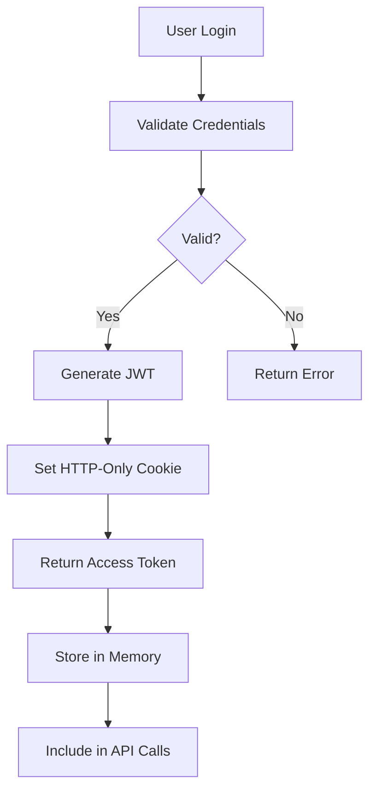

# CLAUDE.md - Sunny Stack AI Platform Technical Context

## 🚀 PROJECT IDENTIFICATION

**Project Name**: Sunny Stack AI Platform  
**Domain**: sunny-stack.com  
**Version**: 2.0.0  
**Status**: Production Live  
**Primary Developer**: Luke (luka@sunny-stack.com)  
**AI Assistant**: Claude Code  

---

## 🏗️ TECHNICAL ARCHITECTURE

### FRONTEND STACK (Port 3000)
```typescript
const frontendStack = {
    framework: "Next.js 15.0.0",
    language: "TypeScript 5.0",
    react: "19.0.0",
    styling: {
        primary: "Tailwind CSS 3.4.0",
        animations: "Framer Motion 11.0.0"
    },
    stateManagement: {
        global: "Zustand 5.0.0",
        server: "@tanstack/react-query 5.0.0"
    },
    realtime: "socket.io-client 4.7.0",
    ui: {
        icons: "lucide-react 0.400.0",
        charts: "recharts 2.8.0"
    },
    auth: "next-auth 5.0.0-beta.22",
    routing: "Next.js App Router"
};
```

### BACKEND STACK (Port 8000)
```python
backend_stack = {
    "framework": "FastAPI 0.104.1",
    "server": "Uvicorn 0.24.0",
    "language": "Python 3.11+",
    "authentication": {
        "passwords": "passlib[bcrypt] 1.7.4",
        "tokens": "python-jose[cryptography] 3.3.0",
        "jwt": "PyJWT 2.10.1"
    },
    "database": {
        "orm": "SQLAlchemy 2.0.23",
        "migrations": "Alembic (planned)"
    },
    "ai_integration": {
        "anthropic": "anthropic>=0.40.0",
        "openai": "openai>=1.0.0"
    },
    "realtime": {
        "websocket": "python-socketio[asyncio] 5.10.0",
        "async": "websockets 12.0"
    },
    "utilities": {
        "env": "python-dotenv 1.0.0",
        "yaml": "pyyaml>=6.0",
        "http": "requests>=2.31.0",
        "files": "aiofiles>=23.0.0",
        "monitoring": "psutil>=5.9.0",
        "logging": "rich>=13.0.0"
    }
}
```

### INFRASTRUCTURE STACK
```yaml
infrastructure:
  edge:
    provider: "Cloudflare"
    services:
      - "Workers"
      - "D1 Database"
      - "R2 Storage"
      - "Tunnel"
  
  deployment:
    tool: "Wrangler 3.0.0"
    environment: "production"
  
  routing:
    tunnel: "trinity"
    config: "~/.cloudflared/trinity-config.yml"
    ingress:
      - service: "http://localhost:3000"
        hostname: "sunny-stack.com"
      - service: "http://localhost:8000"
        path: "/api/*"
      - service: "http://localhost:8000"
        path: "/ws/*"
  
  database:
    edge: "Cloudflare D1 (SQLite)"
    local: "SQLAlchemy + SQLite"
    production: "PostgreSQL (planned)"
```

---

## 📁 PROJECT STRUCTURE

```
sunny-stack/
├── frontend/                    # Next.js application
│   ├── app/                    # App router pages
│   │   ├── api/               # API routes
│   │   ├── auth/              # Authentication pages
│   │   └── (dashboard)/       # Dashboard routes
│   ├── components/            
│   │   ├── trinity/           # Trinity-specific components
│   │   ├── ui/               # Reusable UI components
│   │   └── layouts/          # Layout components
│   ├── lib/                   # Utilities and helpers
│   │   ├── api.ts            # API client
│   │   ├── auth.ts           # Auth utilities
│   │   └── utils.ts          # Helper functions
│   ├── hooks/                 # Custom React hooks
│   ├── stores/                # Zustand stores
│   └── styles/                # Global styles
│
├── backend/                    # FastAPI application
│   ├── app/                   # Main application
│   │   ├── routes/           # API endpoints
│   │   ├── models/           # SQLAlchemy models
│   │   ├── schemas/          # Pydantic schemas
│   │   ├── services/         # Business logic
│   │   ├── auth/             # Authentication
│   │   └── websocket/        # WebSocket handlers
│   ├── data/                  # Data storage
│   ├── tests/                 # Test files
│   └── main.py               # Application entry
│
├── infrastructure/            # Infrastructure config
│   ├── cloudflare/           # CF Workers & config
│   ├── docker/               # Docker configs
│   └── scripts/              # Deployment scripts
│
├── trinity/                   # Trinity Method docs
│   ├── Knowledge Base/       # Core documentation
│   └── investigations/       # Investigation logs
│
└── projects/                  # Multi-project workspace
    ├── navigators-helm/      # Industrial platform
    ├── rinoa/                # Equipment platform
    └── cola-records/         # Management HUD
```

---

## 🔧 DEVELOPMENT ENVIRONMENT

### LOCAL DEVELOPMENT SETUP
```bash
# Frontend Development (Git Bash)
cd frontend
npm install
# DO NOT RUN: npm run dev (Luke manages servers)

# Backend Development (Git Bash)
cd backend
pip install -r requirements.txt
# DO NOT RUN: uvicorn main:app (Luke manages servers)

# Infrastructure (Git Bash)
npm install -g wrangler
# Configuration managed by Luke
```

### SERVICE MANAGEMENT (LUKE'S RESPONSIBILITY)
```bash
# Start all services
./startup-sunny.sh

# Check status
./status-sunny.sh

# Stop all services
./stop-sunny.sh

# Development utilities
./dev-sunny.sh restart    # Restart all
./dev-sunny.sh backend    # Restart backend only
./dev-sunny.sh frontend   # Restart frontend only
```

### ENVIRONMENT VARIABLES
```env
# Frontend (.env.local)
NEXT_PUBLIC_API_URL=http://localhost:8000
NEXT_PUBLIC_WS_URL=ws://localhost:8000
NEXTAUTH_URL=http://localhost:3000
NEXTAUTH_SECRET=[secret]

# Backend (.env)
DATABASE_URL=sqlite:///./data/sunny.db
JWT_SECRET=[secret]
JWT_ALGORITHM=HS256
JWT_EXPIRATION_MINUTES=1440
ANTHROPIC_API_KEY=[key]
OPENAI_API_KEY=[key]
MASTER_PASSWORD=[password]

# Cloudflare (wrangler.toml)
name = "sunny-ai-platform"
compatibility_date = "2024-01-01"
main = "src/worker.js"
```

---

## 🚨 CRITICAL OPERATIONAL RULES

### CLAUDE CODE RESTRICTIONS
```markdown
## NEVER DO THESE (Session Killers):
❌ Starting ANY servers (npm run dev, uvicorn, etc.)
❌ Running long-lived processes
❌ Executing deployment commands
❌ Managing service lifecycle
❌ Monitoring running processes

## ALWAYS DO THESE:
✅ File creation and modification
✅ Code implementation and updates
✅ Git operations (add, commit, push)
✅ Documentation updates
✅ Static analysis and linting
✅ Configuration file updates
```

### SERVER MANAGEMENT PROTOCOL
```markdown
## Division of Responsibilities:

### Claude Code Handles:
- Writing code and components
- Updating configurations
- Creating test files
- Modifying documentation
- Git version control
- Static code analysis

### Luke Handles:
- Starting/stopping servers
- Restarting services
- Monitoring processes
- Deployment operations
- Infrastructure management
- Live debugging sessions
```

### WORKFLOW INTEGRATION
```markdown
## Typical Development Flow:
1. Luke requests feature/fix
2. Claude Code investigates (Trinity Method)
3. Claude Code implements changes
4. Claude Code commits to git
5. Luke restarts affected services
6. Both verify functionality
7. Claude Code documents session
```

---

## 🎯 CURRENT PROJECT STATUS

### ACTIVE FEATURES
```markdown
## Completed:
✅ Authentication system (JWT + sessions)
✅ Frontend layout (TrinityLayout)
✅ API structure (FastAPI routes)
✅ Cloudflare tunnel configuration
✅ Multi-project architecture
✅ WebSocket integration

## In Progress:
🔄 Password reset functionality
🔄 Navigator's Helm integration
🔄 Cola Records HUD interface
🔄 Real-time collaboration features
🔄 AI model integration

## Planned:
📋 Email notifications
📋 File upload system
📋 Advanced analytics
📋 Team collaboration
📋 API rate limiting
```

### KNOWN ISSUES
```markdown
## Current Bugs:
1. Password reset email not sending
   - Location: /backend/app/routes/auth.py
   - Status: Under investigation

2. WebSocket reconnection issues
   - Location: /frontend/lib/websocket.ts
   - Status: Intermittent, monitoring

3. Cloudflare tunnel occasional timeout
   - Location: Infrastructure layer
   - Status: Config optimization needed

## Performance Concerns:
- Initial page load: ~3.2s (target: <3s)
- API average response: ~180ms (target: <150ms)
- Bundle size: 520KB (target: <500KB)
```

### RECENT CHANGES
```markdown
## Last 48 Hours:
- 2025-08-13 03:30: Multi-project architecture implemented
- 2025-08-13 02:00: Proactive QA methodology added
- 2025-08-13 01:57: Auth middleware health endpoint fixed
- 2025-08-12 23:30: MCP removal + auth restoration
- 2025-08-12 09:15: Landing page rebrand completed
```

---

## 🔍 DEBUGGING CONFIGURATION

### FRONTEND DEBUGGING
```typescript
// Debug configuration for Next.js
export const DEBUG_CONFIG = {
    enableLogging: process.env.NODE_ENV === 'development',
    logLevel: 'verbose',
    components: {
        auth: true,
        api: true,
        websocket: true,
        state: true
    },
    performance: {
        measureRenders: true,
        reportWebVitals: true
    }
};

// Debug utilities
export const debugLog = (component: string, action: string, data?: any) => {
    if (DEBUG_CONFIG.enableLogging && DEBUG_CONFIG.components[component]) {
        console.log(`🔧 [${component.toUpperCase()}] ${action}`, data);
    }
};
```

### BACKEND DEBUGGING
```python
# Debug configuration for FastAPI
DEBUG_CONFIG = {
    "enable_logging": True,
    "log_level": "DEBUG",
    "components": {
        "auth": True,
        "api": True,
        "database": True,
        "websocket": True
    },
    "performance": {
        "track_requests": True,
        "measure_queries": True
    }
}

# Debug decorator
def debug_endpoint(func):
    """Decorator for comprehensive endpoint debugging"""
    @wraps(func)
    async def wrapper(*args, **kwargs):
        if DEBUG_CONFIG["enable_logging"]:
            logger.debug(f"⚡ [ENTRY] {func.__name__}", extra={
                "args": args,
                "kwargs": kwargs,
                "timestamp": datetime.utcnow()
            })
        
        start = time.time()
        result = await func(*args, **kwargs)
        
        if DEBUG_CONFIG["performance"]["track_requests"]:
            logger.debug(f"✅ [EXIT] {func.__name__}", extra={
                "duration_ms": (time.time() - start) * 1000,
                "result_size": len(str(result))
            })
        
        return result
    return wrapper
```

---

## 🌐 API DOCUMENTATION

### AUTHENTICATION ENDPOINTS
```yaml
POST /api/auth/register:
  description: Register new user
  body:
    email: string
    password: string
    full_name: string
  response:
    user: User
    access_token: string

POST /api/auth/login:
  description: User login
  body:
    email: string
    password: string
  response:
    user: User
    access_token: string

POST /api/auth/refresh:
  description: Refresh access token
  headers:
    Authorization: Bearer [refresh_token]
  response:
    access_token: string

POST /api/auth/forgot-password:
  description: Request password reset
  body:
    email: string
  response:
    message: string

POST /api/auth/reset-password:
  description: Reset password with token
  body:
    token: string
    new_password: string
  response:
    message: string
```

### CORE API ENDPOINTS
```yaml
GET /api/health:
  description: Health check
  response:
    status: "healthy"
    timestamp: datetime
    version: string

GET /api/user/profile:
  description: Get user profile
  auth: required
  response:
    user: User

PUT /api/user/profile:
  description: Update user profile
  auth: required
  body:
    full_name?: string
    bio?: string
  response:
    user: User

GET /api/projects:
  description: List user projects
  auth: required
  response:
    projects: Project[]

POST /api/projects:
  description: Create new project
  auth: required
  body:
    name: string
    description: string
  response:
    project: Project
```

### WEBSOCKET EVENTS
```yaml
connection:
  description: Client connects
  data:
    user_id: string
    timestamp: datetime

message:
  description: Chat message
  data:
    content: string
    project_id: string
    user_id: string

update:
  description: Real-time update
  data:
    type: string
    payload: any

disconnect:
  description: Client disconnects
  data:
    reason: string
```

---

## 📊 PERFORMANCE BASELINES

### FRONTEND METRICS
```javascript
const performanceBaselines = {
    // Core Web Vitals
    LCP: 2500,  // Largest Contentful Paint (ms)
    FID: 100,   // First Input Delay (ms)
    CLS: 0.1,   // Cumulative Layout Shift
    
    // Custom Metrics
    apiCallTimeout: 5000,
    renderBudget: 16,  // ms for 60fps
    bundleSizeLimit: 500000,  // 500KB
    
    // Thresholds
    acceptable: {
        pageLoad: 3000,
        interaction: 100,
        apiResponse: 200
    },
    critical: {
        pageLoad: 5000,
        interaction: 300,
        apiResponse: 1000
    }
};
```

### BACKEND METRICS
```python
PERFORMANCE_BASELINES = {
    # Response times (ms)
    "endpoints": {
        "auth": 100,
        "crud": 50,
        "complex_query": 200,
        "ai_integration": 5000
    },
    
    # Database operations (ms)
    "database": {
        "simple_query": 10,
        "complex_query": 50,
        "write_operation": 30,
        "transaction": 100
    },
    
    # System resources
    "resources": {
        "cpu_threshold": 80,  # percentage
        "memory_threshold": 1024,  # MB
        "connection_pool": 100
    }
}
```

---

## 🔐 SECURITY CONFIGURATION

### AUTHENTICATION FLOW


### SECURITY HEADERS
```python
# FastAPI Security Middleware
from fastapi.middleware.cors import CORSMiddleware
from fastapi.middleware.trustedhost import TrustedHostMiddleware

app.add_middleware(
    CORSMiddleware,
    allow_origins=["http://localhost:3000", "https://sunny-stack.com"],
    allow_credentials=True,
    allow_methods=["*"],
    allow_headers=["*"],
)

app.add_middleware(
    TrustedHostMiddleware,
    allowed_hosts=["localhost", "sunny-stack.com", "*.sunny-stack.com"]
)

# Security headers
@app.middleware("http")
async def add_security_headers(request: Request, call_next):
    response = await call_next(request)
    response.headers["X-Content-Type-Options"] = "nosniff"
    response.headers["X-Frame-Options"] = "DENY"
    response.headers["X-XSS-Protection"] = "1; mode=block"
    response.headers["Strict-Transport-Security"] = "max-age=31536000"
    return response
```

---

## 🚀 DEPLOYMENT CONFIGURATION

### CLOUDFLARE DEPLOYMENT
```toml
# wrangler.toml
name = "sunny-ai-platform"
type = "javascript"
account_id = "[ACCOUNT_ID]"
workers_dev = false
route = "sunny-stack.com/*"
zone_id = "[ZONE_ID]"

[env.production]
name = "sunny-production"
vars = { ENVIRONMENT = "production" }

[[d1_databases]]
binding = "DB"
database_name = "sunny-production"
database_id = "[DATABASE_ID]"

[[r2_buckets]]
binding = "STORAGE"
bucket_name = "sunny-storage"
```

### DOCKER CONFIGURATION
```dockerfile
# Frontend Dockerfile
FROM node:20-alpine AS builder
WORKDIR /app
COPY package*.json ./
RUN npm ci
COPY . .
RUN npm run build

FROM node:20-alpine
WORKDIR /app
COPY --from=builder /app/.next ./.next
COPY --from=builder /app/public ./public
COPY --from=builder /app/package*.json ./
RUN npm ci --production
EXPOSE 3000
CMD ["npm", "start"]

# Backend Dockerfile
FROM python:3.11-slim
WORKDIR /app
COPY requirements.txt .
RUN pip install --no-cache-dir -r requirements.txt
COPY . .
EXPOSE 8000
CMD ["uvicorn", "app.main:app", "--host", "0.0.0.0", "--port", "8000"]
```

---

## 📝 SESSION REQUIREMENTS

### PRE-SESSION CHECKLIST
```markdown
Before starting any development session:
- [ ] Read current CLAUDE.md for context
- [ ] Review recent Chat-Log.md entries
- [ ] Check To-do.md for priorities
- [ ] Load project-specific context
- [ ] Verify no servers are running
- [ ] Confirm Git branch is correct
```

### DURING SESSION PROTOCOL
```markdown
During active development:
- [ ] Follow Trinity Method investigation process
- [ ] Add comprehensive debugging to all code
- [ ] Test complete user workflows
- [ ] Document all decisions
- [ ] Update relevant documentation
- [ ] Commit changes with descriptive messages
```

### POST-SESSION REQUIREMENTS
```markdown
After completing development:
- [ ] Update Chat-Log.md with session summary
- [ ] Document patterns in ISSUES.md
- [ ] Update To-do.md with completed/new tasks
- [ ] Commit all changes to Git
- [ ] Provide session summary to Luke
- [ ] Note any server restart requirements
```

---

## 🎯 SUCCESS METRICS

### CODE QUALITY METRICS
```yaml
Coverage:
  Unit Tests: ">80%"
  Integration Tests: ">70%"
  E2E Tests: ">60%"

Performance:
  Frontend Build: "<30s"
  Backend Startup: "<5s"
  Test Suite: "<60s"

Quality:
  TypeScript Strict: true
  Python Type Hints: "100%"
  Linting Errors: 0
  Security Vulnerabilities: 0
```

### OPERATIONAL METRICS
```yaml
Availability:
  Uptime Target: "99.9%"
  Recovery Time: "<5min"
  Deployment Time: "<10min"

Performance:
  P50 Response: "<100ms"
  P95 Response: "<500ms"
  P99 Response: "<1000ms"

User Experience:
  Error Rate: "<0.1%"
  Success Rate: ">99.9%"
  Satisfaction: ">4.5/5"
```

---

## 🔄 CONTINUOUS IMPROVEMENT

### WEEKLY REVIEW CHECKLIST
```markdown
## Technical Debt Review:
- [ ] Identify code that needs refactoring
- [ ] Document technical debt items
- [ ] Prioritize improvements
- [ ] Plan migration strategies

## Performance Review:
- [ ] Analyze performance metrics
- [ ] Identify bottlenecks
- [ ] Plan optimizations
- [ ] Implement improvements

## Security Review:
- [ ] Check for vulnerabilities
- [ ] Update dependencies
- [ ] Review access controls
- [ ] Audit API endpoints
```

### PATTERN DOCUMENTATION
```markdown
## Successful Patterns to Replicate:
1. Component composition for reusability
2. API response caching strategy
3. Optimistic UI updates
4. Error boundary implementation
5. WebSocket reconnection logic

## Anti-Patterns to Avoid:
1. Prop drilling beyond 2 levels
2. Synchronous database calls
3. Unhandled promise rejections
4. Memory leaks in subscriptions
5. Hardcoded configuration values
```

---

**Sunny Stack AI Platform - Technical Context Document**
**Last Updated**: 2025-09-09
**Maintained By**: Claude Code + Luke
**Trinity Method**: v7.0 Implementation