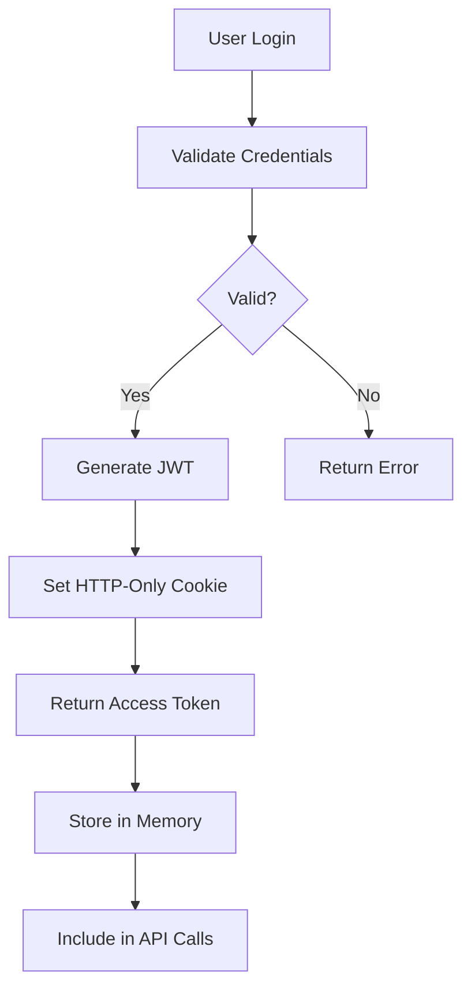

<<<<<<< HEAD
<<<<<<< HEAD
# Claude Code Technical Context - Sunny Stack Platform

## 🚀 PROJECT STATUS AND CONFIGURATION

### Live Environment
- **Production URL**: https://sunny-stack.com
- **Authentication**: luka@sunny-stack.com / S@m3fweak
- **Status**: ✅ Production Live
- **Uptime Target**: 99.9%
- **Last Deployment**: Current session

### Technology Stack
- **Frontend**: Next.js 15.0 + React 19.0 + TypeScript 5.0
- **Backend**: FastAPI 0.104.1 + Python 3.11+
- **State Management**: Zustand 5.0
- **Authentication**: NextAuth.js 5.0 Beta + JWT
- **Infrastructure**: Cloudflare Tunnel
- **Database**: JSON (migrating to PostgreSQL)
- **Real-time**: Socket.io
- **Styling**: Tailwind CSS 3.4

### Development Environment
- **Platform**: Windows 10 (MINGW64)
- **Working Directory**: C:\Users\lukaf\Documents\ColaRecords\repositories\sunny-stack
- **Git Branch**: main
- **Node Version**: Latest LTS
- **Python Version**: 3.11+
- **Shell**: Git Bash

---

## 🛡️ CRITICAL OPERATIONAL RULES

### ⚠️ NEVER START SERVERS IN CLAUDE CODE
**ABSOLUTE PROHIBITION**: Claude Code must NEVER execute server startup commands.

**PROHIBITED COMMANDS**:
```bash
# NEVER RUN THESE:
./startup-sunny.sh      # ❌ Kills Claude session
npm run dev             # ❌ Kills Claude session
npm start               # ❌ Kills Claude session
uvicorn main:app        # ❌ Kills Claude session
python -m uvicorn       # ❌ Kills Claude session
next dev                # ❌ Kills Claude session
```

**WHY**: Starting servers terminates Claude Code sessions immediately, causing data loss and session failure.

### ✅ CLAUDE CODE RESPONSIBILITIES

**ALLOWED OPERATIONS**:
```bash
# File Operations
- Create, edit, delete files
- Write components and functions
- Update configurations
- Generate documentation

# Git Operations
- git add, commit, push
- git status, diff, log
- Branch management
- Merge operations

# Analysis Operations
- grep, find, ls
- Read and analyze code
- Test logic (without running servers)
- Syntax validation
```

**WORKFLOW SEPARATION**:
1. **Claude Code**: Implements changes, commits code
2. **Luke (Human)**: Manages servers, restarts services
3. **Both**: Collaborate on debugging via file modifications

---

## 🔧 DEVELOPMENT PROTOCOLS

### Proactive Quality Assurance (MANDATORY)

**Before Marking ANY Task Complete**:

#### ☑️ SYNTAX VALIDATION
```javascript
// All files must compile without errors
- TypeScript: No type errors
- JSX: Properly structured components
- Python: Valid syntax
- Imports: All dependencies resolved
```

#### ☑️ DEBUG INTEGRATION
```javascript
// Emoji-prefixed logging required
console.log('🔧 [COMPONENT] Initializing:', { props })
console.log('✅ [SUCCESS] Operation completed')
console.error('🚨 [ERROR] Failed to process:', error)
console.log('📊 [PERF] Execution time:', duration)
```

#### ☑️ INTEGRATION TESTING
```javascript
// Verify complete workflows
- Component renders without errors
- API endpoints respond correctly
- State management works
- Error boundaries catch failures
```

### Debug Methodology Standards

#### Emoji Prefix Standards
```
🔐 AUTH     - Authentication operations
📊 PERF     - Performance metrics
🛡️ SEC      - Security operations
⚡ API      - API requests/responses
🚨 ERR      - Error conditions
✅ SUCCESS  - Successful operations
🎯 FEAT     - Feature implementations
🌐 TUNNEL   - Cloudflare tunnel operations
🔧 DEBUG    - Debug information
💾 DATA     - Data operations
🔄 SYNC     - Synchronization events
📡 WS       - WebSocket events
```

#### 7-Step Debug Process
1. **🔍 IDENTIFY** - Precise issue identification with reproduction steps
2. **📊 DIAGNOSE** - Multi-service analysis across stack
3. **📁 ANALYZE** - Deep code examination with context
4. **🎯 ROOT CAUSE** - Evidence-based determination
5. **🛠️ SOLUTION** - Design with impact assessment
6. **⚡ IMPLEMENT** - Apply with comprehensive monitoring
7. **✅ VERIFY** - Test across entire affected workflow

---

## 📋 PROJECT-SPECIFIC CONFIGURATION

### Authentication Configuration
```typescript
// NextAuth.js configuration
export const authOptions = {
  providers: [
    CredentialsProvider({
      name: 'credentials',
      credentials: {
        email: { label: "Email", type: "email" },
        password: { label: "Password", type: "password" }
      },
      async authorize(credentials) {
        // Validate against FastAPI backend
        const response = await fetch(`${API_URL}/auth/login`, {
          method: 'POST',
          body: JSON.stringify(credentials),
          headers: { 'Content-Type': 'application/json' }
        })
        
        if (response.ok) {
          const user = await response.json()
          return user
        }
        return null
      }
    })
  ],
  session: { strategy: 'jwt' },
  jwt: { 
    secret: process.env.NEXTAUTH_SECRET,
    maxAge: 30 * 24 * 60 * 60 // 30 days
  },
  pages: {
    signIn: '/login',
    error: '/auth/error'
  }
}
```

### API Client Configuration
```typescript
// Centralized API client
class APIClient {
  private baseURL = process.env.NEXT_PUBLIC_API_URL || 'http://localhost:8000'
  
  async request<T>(endpoint: string, options?: RequestInit): Promise<T> {
    console.log(`⚡ [API] Request: ${endpoint}`)
    const startTime = performance.now()
    
    try {
      const response = await fetch(`${this.baseURL}${endpoint}`, {
        ...options,
        headers: {
          'Content-Type': 'application/json',
          'Authorization': `Bearer ${await getToken()}`,
          ...options?.headers
        }
      })
      
      const duration = performance.now() - startTime
      console.log(`✅ [API] Response: ${endpoint} (${duration.toFixed(2)}ms)`)
      
      if (!response.ok) {
        throw new APIError(response.status, await response.text())
      }
      
      return response.json()
    } catch (error) {
      console.error(`🚨 [API] Error: ${endpoint}`, error)
      throw error
    }
  }
}

export const api = new APIClient()
```

### Cloudflare Tunnel Configuration
```yaml
# ~/.cloudflared/trinity-config.yml
tunnel: sunny-stack
credentials-file: /home/user/.cloudflared/sunny-stack.json

ingress:
  # API routes to backend
  - hostname: sunny-stack.com
    path: /api/*
    service: http://localhost:8000
    originRequest:
      noTLSVerify: true
      
  # WebSocket routes
  - hostname: sunny-stack.com
    path: /ws/*
    service: ws://localhost:8000
    originRequest:
      noTLSVerify: true
      
  # Everything else to frontend
  - hostname: sunny-stack.com
    service: http://localhost:3000
    originRequest:
      noTLSVerify: true
      
  # Catch-all
  - service: http_status:404
=======
# CLAUDE.md - Sunny Stack AI Platform Technical Context
=======
# CLAUDE.md - Sunny Stack Portfolio Technical Context
>>>>>>> dev

## 🎯 PROJECT OVERVIEW

**Project Name**: Sunny Stack Portfolio
**Purpose**: Professional web development portfolio showcasing projects, skills, and services
**Status**: Active Development
**Version**: 1.0.0
**Repository**: sunny-stack
**Live URL**: [To be deployed]

### Project Mission
Create a high-performance, visually stunning portfolio website that demonstrates advanced web development capabilities while maintaining perfect accessibility, SEO, and user experience standards using the Trinity Method v7.0 methodology.

---

## 🏗️ TECHNICAL ARCHITECTURE

### Core Technology Stack

#### Frontend Framework
- **Next.js 15.0.0**: Latest App Router architecture for optimal performance
- **React 19.0.0**: Cutting-edge React with concurrent features
- **TypeScript 5.5.0**: Type-safe development with latest features

<<<<<<< HEAD
### INFRASTRUCTURE STACK
```yaml
infrastructure:
  edge:
    provider: "Cloudflare"
    services:
      - "Workers"
      - "D1 Database"
      - "R2 Storage"
      - "Tunnel"
  
  deployment:
    tool: "Wrangler 3.0.0"
    environment: "production"
  
  routing:
    tunnel: "trinity"
    config: "~/.cloudflared/trinity-config.yml"
    ingress:
      - service: "http://localhost:3000"
        hostname: "sunny-stack.com"
      - service: "http://localhost:8000"
        path: "/api/*"
      - service: "http://localhost:8000"
        path: "/ws/*"
  
  database:
    edge: "Cloudflare D1 (SQLite)"
    local: "SQLAlchemy + SQLite"
    production: "PostgreSQL (planned)"
>>>>>>> dev
```
=======
#### Styling & Animation
- **Tailwind CSS 3.4.0**: Utility-first CSS framework
- **Framer Motion 11.0.0**: Professional animations and transitions
- **PostCSS 8.4.0**: CSS processing with Autoprefixer 10.4.0
>>>>>>> dev

#### Development Tools
- **ESLint 9.0.0**: Code quality enforcement
- **Next.js ESLint Config 15.0.0**: Framework-specific linting rules
- **TypeScript Compiler**: Strict type checking enabled

<<<<<<< HEAD
<<<<<<< HEAD
## 🚀 OPERATIONAL MODES

### Development Mode
```bash
# Frontend development (Luke manages)
cd frontend && npm run dev

# Backend development (Luke manages)
cd backend && uvicorn app.main:app --reload --port 8000

# Tunnel (Luke manages)
cloudflared tunnel run sunny-stack
```

### Production Mode
```bash
# Startup script (Luke manages)
./startup-sunny.sh

# Status check (Claude can run)
./status-sunny.sh

# Logs monitoring (Claude can run)
tail -f logs/*.log
```

### Debug Mode
```javascript
// Enable verbose logging
export DEBUG_MODE=true
export LOG_LEVEL=debug

// Component debug mode
const DEBUG = process.env.NODE_ENV === 'development'

if (DEBUG) {
  console.log('🔧 [DEBUG] Component state:', state)
  console.log('🔧 [DEBUG] Props received:', props)
  console.log('🔧 [DEBUG] Render cycle:', renderCount++)
}
=======
## 📁 PROJECT STRUCTURE
=======
#### Third-Party Integrations
- **Resend 6.0.3**: Transactional email service for contact forms
- **jsPDF 3.0.2**: Client-side PDF generation for resume downloads
- **html2canvas 1.4.1**: HTML to canvas conversion for PDF generation
- **Lucide React 0.400.0**: Modern icon library

### Project Structure
>>>>>>> dev

```
sunny-stack/
├── app/                        # Next.js App Router
│   ├── layout.tsx             # Root layout with providers
│   ├── page.tsx               # Homepage
│   ├── not-found.tsx          # 404 error page
│   ├── about/                 # About section
│   │   └── page.tsx
│   ├── portfolio/             # Portfolio showcase
│   │   └── page.tsx
│   ├── resume/                # Resume section
│   │   └── page.tsx
│   ├── quote/                 # Quote calculator
│   │   └── page.tsx
│   ├── contact/               # Contact form
│   │   └── page.tsx
│   └── api/                   # API routes
│       ├── contact/           # Contact form handler
│       │   └── route.ts
│       └── send/              # Email sending endpoint
│           └── route.ts
├── components/                 # React components
│   ├── layout/               # Layout components
│   ├── ui/                   # UI components
│   ├── sections/             # Page sections
│   └── shared/               # Shared components
├── lib/                       # Utility functions
│   ├── utils.ts              # Helper functions
│   ├── constants.ts          # App constants
│   └── types.ts              # TypeScript types
├── styles/                    # Global styles
│   └── globals.css           # Global CSS with Tailwind
├── public/                    # Static assets
│   ├── images/               # Image assets
│   ├── fonts/                # Custom fonts
│   └── icons/                # Icon assets
├── content/                   # Content data
│   ├── projects.json         # Portfolio projects
│   ├── skills.json           # Skills data
│   └── experience.json       # Work experience
└── trinity/                   # Trinity Method documentation
    ├── Co-Pilot-Instructions.md
    ├── CLAUDE.md (this file)
    ├── Session-Start.md
    ├── Session-End.md
    ├── knowledge-base/
    │   ├── ARCHITECTURE.md
    │   ├── Trinity.md
    │   ├── ISSUES.md
    │   ├── To-do.md
    │   ├── Chat-Log.md
    │   └── Session-Knowledge-Retention.md
    └── investigations/
        └── prior-investigations/
```

### Architecture Patterns

#### Component Architecture
- **Server Components**: Default for static content and data fetching
- **Client Components**: Used for interactivity and browser APIs
- **Hybrid Approach**: Optimal balance between SSR and client-side features

#### State Management
- **React Hooks**: useState, useEffect, useContext for local state
- **Context API**: Global state for theme, user preferences
- **URL State**: Search params for filters and navigation state

#### Data Flow
- **Server-Side**: Initial data fetching in server components
- **Client-Side**: Dynamic updates and user interactions
- **API Routes**: Backend logic for forms and external services

#### Performance Optimizations
- **Static Generation**: Pre-rendered pages for optimal performance
- **Dynamic Imports**: Code splitting for faster initial loads
- **Image Optimization**: Next.js Image component with lazy loading
- **Font Optimization**: Next.js font optimization with variable fonts

---

## 🔧 OPERATIONAL MODES

### Development Mode
```bash
npm run dev
# Runs on http://localhost:3000
# Hot Module Replacement enabled
# Error overlay active
# Source maps enabled
```

### Production Mode
```bash
npm run build && npm start
# Optimized production build
# Minified and compressed
# Static optimization applied
# Error boundaries active
```

### Testing Mode
```bash
npm run test
# Unit tests with Jest
# Component testing with React Testing Library
# E2E tests with Playwright
# Coverage reports generated
```

### Type Checking Mode
```bash
npm run type-check
# TypeScript strict mode
# No implicit any
# Strict null checks
# Unused variables check
```

---

## 📊 CURRENT DEVELOPMENT STATUS

### Completed Features
- ✅ Project structure setup with Next.js 15
- ✅ TypeScript configuration with strict mode
- ✅ Tailwind CSS integration with custom config
- ✅ Basic routing structure with App Router
- ✅ Component architecture foundation
- ✅ API routes setup for contact and email
- ✅ Trinity Method v7.0 documentation structure

### In Progress
- 🔄 Portfolio section implementation
- 🔄 Contact form with Resend integration
- 🔄 Resume PDF generation feature
- 🔄 Quote calculator functionality
- 🔄 Responsive design optimization
- 🔄 Animation implementations with Framer Motion

### Pending Features
- ⏳ Blog section with MDX support
- ⏳ Dark mode toggle with system preference
- ⏳ Analytics integration
- ⏳ SEO optimization with metadata
- ⏳ PWA capabilities
- ⏳ Internationalization (i18n)
- ⏳ Admin dashboard for content management

<<<<<<< HEAD
### Claude Code Handles:
- Writing code and components
- Updating configurations
- Creating test files
- Modifying documentation
- Git version control
- Static code analysis

### Luke Handles:
- Starting/stopping servers
- Restarting services
- Monitoring processes
- Deployment operations
- Infrastructure management
- Live debugging sessions
```

### WORKFLOW INTEGRATION
```markdown
## Typical Development Flow:
1. Luke requests feature/fix
2. Claude Code investigates (Trinity Method)
3. Claude Code implements changes
4. Claude Code commits to git
5. Luke restarts affected services
6. Both verify functionality
7. Claude Code documents session
```

---

## 🎯 CURRENT PROJECT STATUS

### ACTIVE FEATURES
```markdown
## Completed:
✅ Authentication system (JWT + sessions)
✅ Frontend layout (TrinityLayout)
✅ API structure (FastAPI routes)
✅ Cloudflare tunnel configuration
✅ Multi-project architecture
✅ WebSocket integration

## In Progress:
🔄 Password reset functionality
🔄 Navigator's Helm integration
🔄 Cola Records HUD interface
🔄 Real-time collaboration features
🔄 AI model integration

## Planned:
📋 Email notifications
📋 File upload system
📋 Advanced analytics
📋 Team collaboration
📋 API rate limiting
```

### KNOWN ISSUES
```markdown
## Current Bugs:
1. Password reset email not sending
   - Location: /backend/app/routes/auth.py
   - Status: Under investigation

2. WebSocket reconnection issues
   - Location: /frontend/lib/websocket.ts
   - Status: Intermittent, monitoring

3. Cloudflare tunnel occasional timeout
   - Location: Infrastructure layer
   - Status: Config optimization needed

## Performance Concerns:
- Initial page load: ~3.2s (target: <3s)
- API average response: ~180ms (target: <150ms)
- Bundle size: 520KB (target: <500KB)
```

### RECENT CHANGES
```markdown
## Last 48 Hours:
- 2025-08-13 03:30: Multi-project architecture implemented
- 2025-08-13 02:00: Proactive QA methodology added
- 2025-08-13 01:57: Auth middleware health endpoint fixed
- 2025-08-12 23:30: MCP removal + auth restoration
- 2025-08-12 09:15: Landing page rebrand completed
```

---

## 🔍 DEBUGGING CONFIGURATION

### FRONTEND DEBUGGING
```typescript
// Debug configuration for Next.js
export const DEBUG_CONFIG = {
    enableLogging: process.env.NODE_ENV === 'development',
    logLevel: 'verbose',
    components: {
        auth: true,
        api: true,
        websocket: true,
        state: true
    },
    performance: {
        measureRenders: true,
        reportWebVitals: true
    }
};

// Debug utilities
export const debugLog = (component: string, action: string, data?: any) => {
    if (DEBUG_CONFIG.enableLogging && DEBUG_CONFIG.components[component]) {
        console.log(`🔧 [${component.toUpperCase()}] ${action}`, data);
    }
};
```

### BACKEND DEBUGGING
```python
# Debug configuration for FastAPI
DEBUG_CONFIG = {
    "enable_logging": True,
    "log_level": "DEBUG",
    "components": {
        "auth": True,
        "api": True,
        "database": True,
        "websocket": True
    },
    "performance": {
        "track_requests": True,
        "measure_queries": True
    }
}

# Debug decorator
def debug_endpoint(func):
    """Decorator for comprehensive endpoint debugging"""
    @wraps(func)
    async def wrapper(*args, **kwargs):
        if DEBUG_CONFIG["enable_logging"]:
            logger.debug(f"⚡ [ENTRY] {func.__name__}", extra={
                "args": args,
                "kwargs": kwargs,
                "timestamp": datetime.utcnow()
            })
        
        start = time.time()
        result = await func(*args, **kwargs)
        
        if DEBUG_CONFIG["performance"]["track_requests"]:
            logger.debug(f"✅ [EXIT] {func.__name__}", extra={
                "duration_ms": (time.time() - start) * 1000,
                "result_size": len(str(result))
            })
        
        return result
    return wrapper
>>>>>>> dev
```

---

<<<<<<< HEAD
## 🎯 CURRENT DEVELOPMENT CONTEXT

### Active Features
1. **Trinity Layout System** - Component-based layout architecture
2. **Authentication System** - NextAuth + FastAPI JWT integration
3. **Dashboard Interface** - Real-time metrics and monitoring
4. **Project Management** - Multi-project support system
5. **WebSocket Integration** - Real-time updates via Socket.io

### Known Issues
```markdown
## Current Issues

### High Priority
- [ ] Password reset flow incomplete
- [ ] WebSocket reconnection logic needs improvement
- [ ] Dashboard metrics not updating in real-time

### Medium Priority
- [ ] Session timeout handling
- [ ] Error boundary improvements needed
- [ ] Performance optimization for large datasets

### Low Priority
- [ ] UI polish for mobile devices
- [ ] Accessibility improvements
- [ ] Documentation updates
```

### Recent Changes
```markdown
## Recent Modifications

### 2025-08-13
- Removed MCP integration completely
- Fixed authentication middleware
- Implemented multi-project architecture
- Added proactive QA methodology

### 2025-08-12
- Complete landing page rebrand
- Fixed TrinityLayout syntax errors
- Restored authentication functionality
- Added debug methodology

### Current Session
- Implementing Trinity Method v7.0
- Creating comprehensive documentation
- Establishing development protocols
```

---

## 🔒 SECURITY CONTEXT

### Authentication Security
```python
# Password hashing configuration
from passlib.context import CryptContext

pwd_context = CryptContext(
    schemes=["bcrypt"],
    deprecated="auto",
    bcrypt__rounds=12  # High security
)

# JWT configuration
SECRET_KEY = os.getenv("SECRET_KEY")  # Never hardcode
ALGORITHM = "HS256"
ACCESS_TOKEN_EXPIRE_MINUTES = 30
```

### API Security
```python
# CORS configuration
from fastapi.middleware.cors import CORSMiddleware

app.add_middleware(
    CORSMiddleware,
    allow_origins=["https://sunny-stack.com"],
    allow_credentials=True,
    allow_methods=["GET", "POST", "PUT", "DELETE"],
    allow_headers=["*"],
    max_age=3600
)

# Rate limiting
from slowapi import Limiter
limiter = Limiter(key_func=get_remote_address)
app.state.limiter = limiter

@app.post("/api/login")
@limiter.limit("5/minute")
async def login(request: Request, credentials: LoginSchema):
    # Login logic with rate limiting
```

### Environment Security
```bash
# Required environment variables
NEXTAUTH_URL=https://sunny-stack.com
NEXTAUTH_SECRET=[32+ character secret]
JWT_SECRET_KEY=[32+ character secret]
DATABASE_URL=json://./data/users.json
ANTHROPIC_API_KEY=[api-key]
OPENAI_API_KEY=[api-key]
=======
## 🌐 API DOCUMENTATION

### AUTHENTICATION ENDPOINTS
```yaml
POST /api/auth/register:
  description: Register new user
  body:
    email: string
    password: string
    full_name: string
  response:
    user: User
    access_token: string

POST /api/auth/login:
  description: User login
  body:
    email: string
    password: string
  response:
    user: User
    access_token: string

POST /api/auth/refresh:
  description: Refresh access token
  headers:
    Authorization: Bearer [refresh_token]
  response:
    access_token: string

POST /api/auth/forgot-password:
  description: Request password reset
  body:
    email: string
  response:
    message: string

POST /api/auth/reset-password:
  description: Reset password with token
  body:
    token: string
    new_password: string
  response:
    message: string
```

### CORE API ENDPOINTS
```yaml
GET /api/health:
  description: Health check
  response:
    status: "healthy"
    timestamp: datetime
    version: string

GET /api/user/profile:
  description: Get user profile
  auth: required
  response:
    user: User

PUT /api/user/profile:
  description: Update user profile
  auth: required
  body:
    full_name?: string
    bio?: string
  response:
    user: User

GET /api/projects:
  description: List user projects
  auth: required
  response:
    projects: Project[]

POST /api/projects:
  description: Create new project
  auth: required
  body:
    name: string
    description: string
  response:
    project: Project
```

### WEBSOCKET EVENTS
```yaml
connection:
  description: Client connects
  data:
    user_id: string
    timestamp: datetime

message:
  description: Chat message
  data:
    content: string
    project_id: string
    user_id: string

update:
  description: Real-time update
  data:
    type: string
    payload: any

disconnect:
  description: Client disconnects
  data:
    reason: string
>>>>>>> dev
```

---

## 📊 PERFORMANCE BASELINES

<<<<<<< HEAD
### Frontend Performance Targets
```javascript
const performanceTargets = {
  // Core Web Vitals
  FCP: 1500,    // First Contentful Paint < 1.5s
  LCP: 2500,    // Largest Contentful Paint < 2.5s
  FID: 100,     // First Input Delay < 100ms
  CLS: 0.1,     // Cumulative Layout Shift < 0.1
  
  // Custom Metrics
  apiResponse: 200,      // API calls < 200ms
  componentRender: 16,   // Re-render < 16ms (60fps)
  bundleSize: 500000,    // Bundle < 500KB
  memoryUsage: 50        // Memory < 50MB
}
```

### Backend Performance Targets
```python
performance_targets = {
    "api_response": 0.2,      # < 200ms average
    "db_query": 0.03,         # < 30ms per query
    "cpu_usage": 70,          # < 70% CPU
    "memory_usage": 512,      # < 512MB RAM
    "concurrent_users": 100,  # Support 100+ concurrent
    "requests_per_second": 1000  # Handle 1000+ RPS
}
```

---

## 🛠️ DEVELOPMENT PATTERNS

### Component Development Pattern
```typescript
// Standard React component structure
import React, { useState, useEffect } from 'react'
import { useStore } from '@/lib/store'

interface ComponentProps {
  // Type-safe props
}

export const Component: React.FC<ComponentProps> = ({ props }) => {
  // Debug logging
  console.log('🔧 [Component] Rendering with props:', props)
  
  // State management
  const [localState, setLocalState] = useState()
  const globalState = useStore(state => state.someValue)
  
  // Effects with cleanup
  useEffect(() => {
    console.log('🔧 [Component] Mounted')
    
    // Setup logic
    
    return () => {
      console.log('🔧 [Component] Unmounted')
      // Cleanup logic
    }
  }, [])
  
  // Event handlers with logging
  const handleEvent = (event: Event) => {
    console.log('⚡ [Component] Event triggered:', event)
    // Handle event
  }
  
  return (
    <div className="component-class">
      {/* Component JSX */}
    </div>
  )
}
```

### API Route Pattern
```python
from fastapi import APIRouter, Depends, HTTPException
from typing import List

router = APIRouter(prefix="/api/resource", tags=["resource"])

@router.get("/", response_model=List[ResourceSchema])
async def get_resources(
    skip: int = 0,
    limit: int = 100,
    current_user: User = Depends(get_current_user)
):
    """Get all resources with pagination"""
    print(f"⚡ [API] GET /resources - User: {current_user.email}")
    
    try:
        resources = await resource_service.get_all(skip, limit)
        print(f"✅ [API] Retrieved {len(resources)} resources")
        return resources
    except Exception as e:
        print(f"🚨 [API] Error retrieving resources: {e}")
        raise HTTPException(status_code=500, detail=str(e))

@router.post("/", response_model=ResourceSchema)
async def create_resource(
    resource: CreateResourceSchema,
    current_user: User = Depends(get_current_user)
):
    """Create new resource"""
    print(f"⚡ [API] POST /resources - User: {current_user.email}")
    
    try:
        new_resource = await resource_service.create(resource, current_user)
        print(f"✅ [API] Created resource: {new_resource.id}")
        return new_resource
    except Exception as e:
        print(f"🚨 [API] Error creating resource: {e}")
        raise HTTPException(status_code=400, detail=str(e))
=======
### FRONTEND METRICS
```javascript
const performanceBaselines = {
    // Core Web Vitals
    LCP: 2500,  // Largest Contentful Paint (ms)
    FID: 100,   // First Input Delay (ms)
    CLS: 0.1,   // Cumulative Layout Shift
    
    // Custom Metrics
    apiCallTimeout: 5000,
    renderBudget: 16,  // ms for 60fps
    bundleSizeLimit: 500000,  // 500KB
    
    // Thresholds
    acceptable: {
        pageLoad: 3000,
        interaction: 100,
        apiResponse: 200
    },
    critical: {
        pageLoad: 5000,
        interaction: 300,
        apiResponse: 1000
    }
};
```

### BACKEND METRICS
```python
PERFORMANCE_BASELINES = {
    # Response times (ms)
    "endpoints": {
        "auth": 100,
        "crud": 50,
        "complex_query": 200,
        "ai_integration": 5000
    },
    
    # Database operations (ms)
    "database": {
        "simple_query": 10,
        "complex_query": 50,
        "write_operation": 30,
        "transaction": 100
    },
    
    # System resources
    "resources": {
        "cpu_threshold": 80,  # percentage
        "memory_threshold": 1024,  # MB
        "connection_pool": 100
    }
}
>>>>>>> dev
```

---

<<<<<<< HEAD
## 🔄 STATE MANAGEMENT PATTERNS

### Zustand Store Pattern
```typescript
// store.ts
import { create } from 'zustand'
import { devtools, persist } from 'zustand/middleware'

interface AppState {
  // State
  user: User | null
  projects: Project[]
  isLoading: boolean
  error: string | null
  
  // Actions
  setUser: (user: User | null) => void
  loadProjects: () => Promise<void>
  createProject: (project: CreateProjectDto) => Promise<void>
  updateProject: (id: string, updates: Partial<Project>) => Promise<void>
  deleteProject: (id: string) => Promise<void>
  clearError: () => void
}

export const useStore = create<AppState>()(
  devtools(
    persist(
      (set, get) => ({
        // Initial state
        user: null,
        projects: [],
        isLoading: false,
        error: null,
        
        // Actions with debug logging
        setUser: (user) => {
          console.log('🔧 [Store] Setting user:', user?.email)
          set({ user })
        },
        
        loadProjects: async () => {
          console.log('⚡ [Store] Loading projects')
          set({ isLoading: true, error: null })
          
          try {
            const projects = await api.get<Project[]>('/projects')
            console.log(`✅ [Store] Loaded ${projects.length} projects`)
            set({ projects, isLoading: false })
          } catch (error) {
            console.error('🚨 [Store] Failed to load projects:', error)
            set({ error: error.message, isLoading: false })
          }
        },
        
        createProject: async (projectData) => {
          console.log('⚡ [Store] Creating project:', projectData.name)
          set({ isLoading: true, error: null })
          
          try {
            const newProject = await api.post<Project>('/projects', projectData)
            console.log('✅ [Store] Project created:', newProject.id)
            set(state => ({
              projects: [...state.projects, newProject],
              isLoading: false
            }))
          } catch (error) {
            console.error('🚨 [Store] Failed to create project:', error)
            set({ error: error.message, isLoading: false })
            throw error
          }
        },
        
        clearError: () => set({ error: null })
      }),
      {
        name: 'sunny-stack-storage',
        partialize: (state) => ({ user: state.user })
      }
    )
  )
)
```

---

## 🚦 MONITORING AND LOGGING

### Structured Logging Pattern
```typescript
class Logger {
  private context: string
  
  constructor(context: string) {
    this.context = context
  }
  
  info(message: string, data?: any) {
    console.log(`ℹ️ [${this.context}] ${message}`, data || '')
  }
  
  success(message: string, data?: any) {
    console.log(`✅ [${this.context}] ${message}`, data || '')
  }
  
  warning(message: string, data?: any) {
    console.warn(`⚠️ [${this.context}] ${message}`, data || '')
  }
  
  error(message: string, error?: any) {
    console.error(`🚨 [${this.context}] ${message}`, error || '')
  }
  
  debug(message: string, data?: any) {
    if (process.env.NODE_ENV === 'development') {
      console.log(`🔧 [${this.context}] ${message}`, data || '')
    }
  }
  
  performance(operation: string, duration: number) {
    console.log(`📊 [${this.context}] ${operation}: ${duration.toFixed(2)}ms`)
  }
}

// Usage
const logger = new Logger('AuthService')
logger.info('User login attempt', { email: user.email })
logger.success('Login successful', { userId: user.id })
logger.error('Login failed', error)
```

---

## 📝 DOCUMENTATION STANDARDS

### Code Documentation Pattern
```typescript
/**
 * Authenticates a user with email and password
 * 
 * @param credentials - User login credentials
 * @param credentials.email - User's email address
 * @param credentials.password - User's password
 * @returns Promise<User> - Authenticated user object
 * @throws {AuthenticationError} When credentials are invalid
 * @throws {RateLimitError} When too many attempts
 * 
 * @example
 * ```typescript
 * const user = await authenticate({
 *   email: 'user@example.com',
 *   password: 'secure-password'
 * })
 * ```
 */
export async function authenticate(
  credentials: LoginCredentials
): Promise<User> {
  console.log('🔐 [Auth] Authentication attempt:', credentials.email)
  // Implementation
}
```

### API Documentation Pattern
```python
@router.post(
    "/login",
    response_model=TokenResponse,
    summary="Authenticate user",
    description="Authenticate user with email and password, returns JWT token",
    responses={
        200: {"description": "Successfully authenticated"},
        401: {"description": "Invalid credentials"},
        429: {"description": "Too many requests"}
    }
)
async def login(
    credentials: LoginSchema,
    request: Request,
    response: Response
) -> TokenResponse:
    """
    Authenticate user and return JWT token.
    
    - **email**: User's email address
    - **password**: User's password
    
    Returns JWT token for authenticated requests.
    """
    # Implementation
=======
## 🔐 SECURITY CONFIGURATION

### AUTHENTICATION FLOW


### SECURITY HEADERS
```python
# FastAPI Security Middleware
from fastapi.middleware.cors import CORSMiddleware
from fastapi.middleware.trustedhost import TrustedHostMiddleware

app.add_middleware(
    CORSMiddleware,
    allow_origins=["http://localhost:3000", "https://sunny-stack.com"],
    allow_credentials=True,
    allow_methods=["*"],
    allow_headers=["*"],
)

app.add_middleware(
    TrustedHostMiddleware,
    allowed_hosts=["localhost", "sunny-stack.com", "*.sunny-stack.com"]
)

# Security headers
@app.middleware("http")
async def add_security_headers(request: Request, call_next):
    response = await call_next(request)
    response.headers["X-Content-Type-Options"] = "nosniff"
    response.headers["X-Frame-Options"] = "DENY"
    response.headers["X-XSS-Protection"] = "1; mode=block"
    response.headers["Strict-Transport-Security"] = "max-age=31536000"
    return response
>>>>>>> dev
```
=======
### Known Issues
- 🐛 Console warnings from development mode
- 🐛 Hydration warnings in certain components
- 🐛 Performance optimization needed for images
- 🐛 Form validation edge cases
- 🐛 Mobile menu animation glitches
>>>>>>> dev

---

<<<<<<< HEAD
## 🎯 QUALITY GATES

### Pre-Commit Checklist
```markdown
## Before Committing Code

### Code Quality
- [ ] No TypeScript errors
- [ ] No ESLint warnings
- [ ] No console.log in production code (except debug logs)
- [ ] All imports used
- [ ] No commented-out code

### Testing
- [ ] Component renders without errors
- [ ] API endpoints tested
- [ ] Error cases handled
- [ ] Loading states implemented
- [ ] Edge cases considered

### Security
- [ ] No hardcoded secrets
- [ ] Input validation implemented
- [ ] SQL injection prevented
- [ ] XSS prevention in place
- [ ] CSRF protection enabled

### Performance
- [ ] No unnecessary re-renders
- [ ] API calls optimized
- [ ] Images optimized
- [ ] Bundle size checked
- [ ] Memory leaks prevented

### Documentation
- [ ] Functions documented
- [ ] Complex logic explained
- [ ] API changes documented
- [ ] README updated if needed
```

---

## 🚀 DEPLOYMENT CHECKLIST

### Production Deployment
```markdown
## Deployment Verification

### Pre-Deployment
- [ ] All tests passing
- [ ] No console errors
- [ ] Performance metrics met
- [ ] Security scan passed
- [ ] Documentation updated

### Deployment Steps
- [ ] Build frontend: `npm run build`
- [ ] Test build locally
- [ ] Commit all changes
- [ ] Push to main branch
- [ ] Verify tunnel configuration
- [ ] Restart services
- [ ] Monitor logs

### Post-Deployment
- [ ] Verify site accessible
- [ ] Test critical user flows
- [ ] Check error monitoring
- [ ] Verify API responses
- [ ] Monitor performance
- [ ] Check WebSocket connections
- [ ] Test authentication flow
=======
## 🚀 DEPLOYMENT CONFIGURATION

### Environment Variables
```env
# Email Service
RESEND_API_KEY=            # Resend API key for email
FROM_EMAIL=                 # Sender email address
TO_EMAIL=                   # Recipient email address

# Analytics (Future)
NEXT_PUBLIC_GA_ID=          # Google Analytics ID
NEXT_PUBLIC_GTM_ID=         # Google Tag Manager ID

# API Configuration
NEXT_PUBLIC_API_URL=        # API endpoint URL
API_RATE_LIMIT=             # Rate limiting configuration

# Feature Flags
ENABLE_BLOG=                # Enable blog section
ENABLE_ANALYTICS=           # Enable analytics tracking
ENABLE_PWA=                 # Enable PWA features
```

### Build Configuration
```javascript
// next.config.js
module.exports = {
  reactStrictMode: true,
  swcMinify: true,
  images: {
    domains: ['localhost'],
    formats: ['image/avif', 'image/webp'],
  },
  experimental: {
    appDir: true,
  },
};
```

### Deployment Targets
- **Vercel**: Primary deployment platform (recommended)
- **Netlify**: Alternative static hosting
- **AWS Amplify**: Enterprise deployment option
- **Docker**: Containerized deployment

---

## 🔒 SECURITY PROTOCOLS

### Input Validation
- All form inputs sanitized before processing
- SQL injection prevention in data handling
- XSS protection through React's default escaping
- CSRF tokens for form submissions

### API Security
- Rate limiting on all endpoints
- CORS configuration for API routes
- Environment variable protection
- API key rotation schedule

### Content Security Policy
```typescript
// Recommended CSP headers
const securityHeaders = [
  {
    key: 'Content-Security-Policy',
    value: `
      default-src 'self';
      script-src 'self' 'unsafe-eval' 'unsafe-inline';
      style-src 'self' 'unsafe-inline';
      img-src 'self' data: https:;
      font-src 'self' data:;
    `.replace(/\n/g, ''),
  },
  {
    key: 'X-Frame-Options',
    value: 'DENY',
  },
  {
    key: 'X-Content-Type-Options',
    value: 'nosniff',
  },
];
```

---

## 🎨 DESIGN SYSTEM

### Color Palette
```css
/* Primary Colors */
--primary-50: #eff6ff;
--primary-500: #3b82f6;
--primary-900: #1e3a8a;

/* Neutral Colors */
--gray-50: #f9fafb;
--gray-500: #6b7280;
--gray-900: #111827;

/* Semantic Colors */
--success: #10b981;
--warning: #f59e0b;
--error: #ef4444;
--info: #3b82f6;
```

### Typography Scale
```css
/* Font Sizes */
--text-xs: 0.75rem;     /* 12px */
--text-sm: 0.875rem;    /* 14px */
--text-base: 1rem;      /* 16px */
--text-lg: 1.125rem;    /* 18px */
--text-xl: 1.25rem;     /* 20px */
--text-2xl: 1.5rem;     /* 24px */
--text-3xl: 1.875rem;   /* 30px */
--text-4xl: 2.25rem;    /* 36px */
--text-5xl: 3rem;       /* 48px */
```

<<<<<<< HEAD
### POST-SESSION REQUIREMENTS
```markdown
After completing development:
- [ ] Update Chat-Log.md with session summary
- [ ] Document patterns in ISSUES.md
- [ ] Update To-do.md with completed/new tasks
- [ ] Commit all changes to Git
- [ ] Provide session summary to Luke
- [ ] Note any server restart requirements
>>>>>>> dev
=======
### Spacing System
```css
/* Spacing Scale (rem) */
--space-0: 0;          /* 0px */
--space-1: 0.25rem;    /* 4px */
--space-2: 0.5rem;     /* 8px */
--space-4: 1rem;       /* 16px */
--space-6: 1.5rem;     /* 24px */
--space-8: 2rem;       /* 32px */
--space-12: 3rem;      /* 48px */
--space-16: 4rem;      /* 64px */
--space-20: 5rem;      /* 80px */
```

### Breakpoints
```css
/* Responsive Breakpoints */
--screen-sm: 640px;   /* Mobile landscape */
--screen-md: 768px;   /* Tablet */
--screen-lg: 1024px;  /* Desktop */
--screen-xl: 1280px;  /* Large desktop */
--screen-2xl: 1536px; /* Extra large */
>>>>>>> dev
```

---

<<<<<<< HEAD
<<<<<<< HEAD
## 📚 REFERENCE COMMANDS

### Frequently Used Commands
```bash
# Project navigation
cd /c/Users/lukaf/Documents/ColaRecords/repositories/sunny-stack

# Status checks (Claude can run)
./status-sunny.sh
git status
npm ls

# File operations (Claude primary responsibility)
grep -r "pattern" --include="*.tsx"
find . -name "*.ts" -type f
ls -la frontend/components/

# Git operations (Claude can run)
git add -A
git commit -m "feat: implement feature"
git push origin main
git log --oneline -10

# Logs monitoring (Claude can run)
tail -f logs/frontend.log
tail -f logs/backend.log
grep "ERROR" logs/*.log
=======
## 🎯 SUCCESS METRICS
=======
## 📈 PERFORMANCE TARGETS
>>>>>>> dev

### Core Web Vitals
- **LCP (Largest Contentful Paint)**: < 2.5s
- **FID (First Input Delay)**: < 100ms
- **CLS (Cumulative Layout Shift)**: < 0.1
- **FCP (First Contentful Paint)**: < 1.8s
- **TTI (Time to Interactive)**: < 3.8s

### Bundle Size Targets
- **Initial JS**: < 100KB (gzipped)
- **Initial CSS**: < 20KB (gzipped)
- **Total Page Weight**: < 500KB
- **Image Optimization**: 85% compression
- **Font Loading**: < 100ms

<<<<<<< HEAD
Quality:
  TypeScript Strict: true
  Python Type Hints: "100%"
  Linting Errors: 0
  Security Vulnerabilities: 0
```

### OPERATIONAL METRICS
```yaml
Availability:
  Uptime Target: "99.9%"
  Recovery Time: "<5min"
  Deployment Time: "<10min"

Performance:
  P50 Response: "<100ms"
  P95 Response: "<500ms"
  P99 Response: "<1000ms"

User Experience:
  Error Rate: "<0.1%"
  Success Rate: ">99.9%"
  Satisfaction: ">4.5/5"
>>>>>>> dev
=======
### Performance Monitoring
```typescript
// Performance monitoring setup
export function monitorPerformance() {
  // Core Web Vitals
  if (typeof window !== 'undefined') {
    // LCP
    new PerformanceObserver((entryList) => {
      const entries = entryList.getEntries();
      const lastEntry = entries[entries.length - 1];
      console.log('[PERFORMANCE] LCP:', lastEntry.renderTime || lastEntry.loadTime);
    }).observe({ type: 'largest-contentful-paint', buffered: true });
    
    // FID
    new PerformanceObserver((entryList) => {
      const entries = entryList.getEntries();
      entries.forEach((entry) => {
        console.log('[PERFORMANCE] FID:', entry.processingStart - entry.startTime);
      });
    }).observe({ type: 'first-input', buffered: true });
    
    // CLS
    let clsValue = 0;
    new PerformanceObserver((entryList) => {
      const entries = entryList.getEntries();
      entries.forEach((entry) => {
        if (!entry.hadRecentInput) {
          clsValue += entry.value;
          console.log('[PERFORMANCE] CLS:', clsValue);
        }
      });
    }).observe({ type: 'layout-shift', buffered: true });
  }
}
>>>>>>> dev
```

---

<<<<<<< HEAD
<<<<<<< HEAD
**Claude Code Technical Context - Sunny Stack Platform**
**Trinity Method v7.0 Implementation**
**Last Updated: Current Session**
=======
## 🔄 CONTINUOUS IMPROVEMENT
=======
## 🧪 TESTING STRATEGY
>>>>>>> dev

### Unit Testing
```typescript
// Component testing example
import { render, screen, fireEvent } from '@testing-library/react';
import { ContactForm } from '@/components/ContactForm';

describe('ContactForm', () => {
  it('should validate email format', () => {
    render(<ContactForm />);
    const emailInput = screen.getByLabelText('Email');
    fireEvent.change(emailInput, { target: { value: 'invalid-email' } });
    expect(screen.getByText('Invalid email format')).toBeInTheDocument();
  });
});
```

### Integration Testing
```typescript
// API route testing
import { POST } from '@/app/api/contact/route';

describe('Contact API', () => {
  it('should send email successfully', async () => {
    const request = new Request('http://localhost:3000/api/contact', {
      method: 'POST',
      body: JSON.stringify({
        name: 'Test User',
        email: 'test@example.com',
        message: 'Test message',
      }),
    });
    
    const response = await POST(request);
    expect(response.status).toBe(200);
  });
});
```

### E2E Testing
```typescript
// Playwright E2E test
import { test, expect } from '@playwright/test';

test('complete user journey', async ({ page }) => {
  await page.goto('/');
  await expect(page).toHaveTitle(/Sunny Stack Portfolio/);
  
  // Navigate to portfolio
  await page.click('text=Portfolio');
  await expect(page).toHaveURL('/portfolio');
  
  // Test contact form
  await page.click('text=Contact');
  await page.fill('[name="name"]', 'Test User');
  await page.fill('[name="email"]', 'test@example.com');
  await page.fill('[name="message"]', 'Test message');
  await page.click('button[type="submit"]');
  await expect(page.locator('.success-message')).toBeVisible();
});
```

---

<<<<<<< HEAD
**Sunny Stack AI Platform - Technical Context Document**
**Last Updated**: 2025-09-09
**Maintained By**: Claude Code + Luke
**Trinity Method**: v7.0 Implementation
>>>>>>> dev
=======
## 🔄 DEVELOPMENT WORKFLOW

### Git Workflow
```bash
# Branch naming convention
feature/[feature-name]     # New features
fix/[bug-description]       # Bug fixes
refactor/[component-name]   # Code refactoring
docs/[doc-update]          # Documentation
test/[test-description]     # Testing updates

# Commit message format
feat: Add new feature
fix: Resolve bug issue
refactor: Improve code structure
docs: Update documentation
test: Add test coverage
style: Format code
perf: Optimize performance
```

### Code Review Checklist
- [ ] Investigation documented
- [ ] Tests written and passing
- [ ] TypeScript types proper
- [ ] Performance verified
- [ ] Accessibility checked
- [ ] Mobile responsive
- [ ] Documentation updated
- [ ] No console errors

### Release Process
1. **Development**: Feature branch development
2. **Testing**: Comprehensive testing suite
3. **Review**: Code review and approval
4. **Staging**: Deploy to staging environment
5. **QA**: Quality assurance testing
6. **Production**: Deploy to production
7. **Monitor**: Performance and error monitoring

---

## 🎯 OPERATIONAL INTELLIGENCE

### Quick Commands
```bash
# Development
npm run dev              # Start development server
npm run build           # Build production bundle
npm run start           # Start production server
npm run lint            # Run ESLint
npm run type-check      # Run TypeScript check

# Testing
npm run test            # Run test suite
npm run test:watch      # Run tests in watch mode
npm run test:coverage   # Generate coverage report
npm run test:e2e        # Run E2E tests

# Analysis
npm run analyze         # Analyze bundle size
npm run lighthouse      # Run Lighthouse audit
```

### Debugging Tips
```typescript
// Enable verbose logging
if (process.env.NODE_ENV === 'development') {
  console.log('[DEBUG] Verbose logging enabled');
  
  // Log all API requests
  if (typeof window !== 'undefined') {
    const originalFetch = window.fetch;
    window.fetch = async (...args) => {
      console.log('[API] Request:', args);
      const response = await originalFetch(...args);
      console.log('[API] Response:', response.status);
      return response;
    };
  }
}

// Component render tracking
export function useRenderTracking(componentName: string) {
  const renderCount = useRef(0);
  useEffect(() => {
    renderCount.current += 1;
    console.log(`[RENDER] ${componentName} rendered ${renderCount.current} times`);
  });
}
```

### Performance Profiling
```typescript
// Profile component performance
export function ProfiledComponent({ children }: { children: React.ReactNode }) {
  useEffect(() => {
    const startTime = performance.now();
    
    return () => {
      const endTime = performance.now();
      console.log(`[PROFILE] Component lifecycle: ${endTime - startTime}ms`);
    };
  }, []);
  
  return <>{children}</>;
}
```

---

## 📚 KNOWLEDGE BASE REFERENCES

### Internal Documentation
- `/trinity/Co-Pilot-Instructions.md` - Development protocols
- `/trinity/knowledge-base/ARCHITECTURE.md` - System architecture
- `/trinity/knowledge-base/Trinity.md` - Trinity Method implementation
- `/trinity/knowledge-base/ISSUES.md` - Known issues and resolutions
- `/trinity/knowledge-base/To-do.md` - Development roadmap

### External Resources
- [Next.js Documentation](https://nextjs.org/docs)
- [React Documentation](https://react.dev)
- [TypeScript Documentation](https://www.typescriptlang.org/docs)
- [Tailwind CSS Documentation](https://tailwindcss.com/docs)
- [Framer Motion Documentation](https://www.framer.com/motion)

### API Documentation
- [Resend API](https://resend.com/docs)
- [Next.js API Routes](https://nextjs.org/docs/app/building-your-application/routing/route-handlers)

---

## 🚨 CRITICAL OPERATIONAL NOTES

### Current Priorities
1. **Performance Optimization**: Achieve 95+ Lighthouse score
2. **Mobile Experience**: Perfect responsive design
3. **SEO Implementation**: Meta tags and structured data
4. **Accessibility**: WCAG AAA compliance
5. **Testing Coverage**: >80% code coverage

### Active Investigations
- Performance bottlenecks in portfolio section
- Hydration mismatch in client components
- Bundle size optimization strategies
- Image loading performance
- Animation performance on mobile

### Session Requirements
- Always start with `/trinity/Session-Start.md`
- Document all changes in chat log
- Update knowledge retention after significant discoveries
- End with `/trinity/Session-End.md`

### Emergency Protocols
- Console error crisis: Stop, assess, fix systematically
- Performance degradation: Profile, identify, optimize
- Build failure: Check types, lint, dependencies
- Deployment failure: Verify env vars, check logs

---

**CLAUDE.md - Sunny Stack Portfolio Technical Context**
**Last Updated**: [Session Date]
**Trinity Method Version**: v7.0
**Project Phase**: Active Development

**This document serves as the primary technical reference for Claude Code operations on the Sunny Stack Portfolio project.**
>>>>>>> dev
