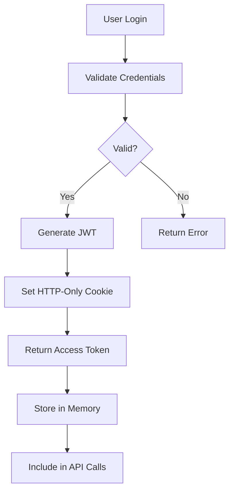

<<<<<<< HEAD
# Claude Code Technical Context - Sunny Stack Platform

## 🚀 PROJECT STATUS AND CONFIGURATION

### Live Environment
- **Production URL**: https://sunny-stack.com
- **Authentication**: luka@sunny-stack.com / S@m3fweak
- **Status**: ✅ Production Live
- **Uptime Target**: 99.9%
- **Last Deployment**: Current session

### Technology Stack
- **Frontend**: Next.js 15.0 + React 19.0 + TypeScript 5.0
- **Backend**: FastAPI 0.104.1 + Python 3.11+
- **State Management**: Zustand 5.0
- **Authentication**: NextAuth.js 5.0 Beta + JWT
- **Infrastructure**: Cloudflare Tunnel
- **Database**: JSON (migrating to PostgreSQL)
- **Real-time**: Socket.io
- **Styling**: Tailwind CSS 3.4

### Development Environment
- **Platform**: Windows 10 (MINGW64)
- **Working Directory**: C:\Users\lukaf\Documents\ColaRecords\repositories\sunny-stack
- **Git Branch**: main
- **Node Version**: Latest LTS
- **Python Version**: 3.11+
- **Shell**: Git Bash

---

## 🛡️ CRITICAL OPERATIONAL RULES

### ⚠️ NEVER START SERVERS IN CLAUDE CODE
**ABSOLUTE PROHIBITION**: Claude Code must NEVER execute server startup commands.

**PROHIBITED COMMANDS**:
```bash
# NEVER RUN THESE:
./startup-sunny.sh      # ❌ Kills Claude session
npm run dev             # ❌ Kills Claude session
npm start               # ❌ Kills Claude session
uvicorn main:app        # ❌ Kills Claude session
python -m uvicorn       # ❌ Kills Claude session
next dev                # ❌ Kills Claude session
```

**WHY**: Starting servers terminates Claude Code sessions immediately, causing data loss and session failure.

### ✅ CLAUDE CODE RESPONSIBILITIES

**ALLOWED OPERATIONS**:
```bash
# File Operations
- Create, edit, delete files
- Write components and functions
- Update configurations
- Generate documentation

# Git Operations
- git add, commit, push
- git status, diff, log
- Branch management
- Merge operations

# Analysis Operations
- grep, find, ls
- Read and analyze code
- Test logic (without running servers)
- Syntax validation
```

**WORKFLOW SEPARATION**:
1. **Claude Code**: Implements changes, commits code
2. **Luke (Human)**: Manages servers, restarts services
3. **Both**: Collaborate on debugging via file modifications

---

## 🔧 DEVELOPMENT PROTOCOLS

### Proactive Quality Assurance (MANDATORY)

**Before Marking ANY Task Complete**:

#### ☑️ SYNTAX VALIDATION
```javascript
// All files must compile without errors
- TypeScript: No type errors
- JSX: Properly structured components
- Python: Valid syntax
- Imports: All dependencies resolved
```

#### ☑️ DEBUG INTEGRATION
```javascript
// Emoji-prefixed logging required
console.log('🔧 [COMPONENT] Initializing:', { props })
console.log('✅ [SUCCESS] Operation completed')
console.error('🚨 [ERROR] Failed to process:', error)
console.log('📊 [PERF] Execution time:', duration)
```

#### ☑️ INTEGRATION TESTING
```javascript
// Verify complete workflows
- Component renders without errors
- API endpoints respond correctly
- State management works
- Error boundaries catch failures
```

### Debug Methodology Standards

#### Emoji Prefix Standards
```
🔐 AUTH     - Authentication operations
📊 PERF     - Performance metrics
🛡️ SEC      - Security operations
⚡ API      - API requests/responses
🚨 ERR      - Error conditions
✅ SUCCESS  - Successful operations
🎯 FEAT     - Feature implementations
🌐 TUNNEL   - Cloudflare tunnel operations
🔧 DEBUG    - Debug information
💾 DATA     - Data operations
🔄 SYNC     - Synchronization events
📡 WS       - WebSocket events
```

#### 7-Step Debug Process
1. **🔍 IDENTIFY** - Precise issue identification with reproduction steps
2. **📊 DIAGNOSE** - Multi-service analysis across stack
3. **📁 ANALYZE** - Deep code examination with context
4. **🎯 ROOT CAUSE** - Evidence-based determination
5. **🛠️ SOLUTION** - Design with impact assessment
6. **⚡ IMPLEMENT** - Apply with comprehensive monitoring
7. **✅ VERIFY** - Test across entire affected workflow

---

## 📋 PROJECT-SPECIFIC CONFIGURATION

### Authentication Configuration
```typescript
// NextAuth.js configuration
export const authOptions = {
  providers: [
    CredentialsProvider({
      name: 'credentials',
      credentials: {
        email: { label: "Email", type: "email" },
        password: { label: "Password", type: "password" }
      },
      async authorize(credentials) {
        // Validate against FastAPI backend
        const response = await fetch(`${API_URL}/auth/login`, {
          method: 'POST',
          body: JSON.stringify(credentials),
          headers: { 'Content-Type': 'application/json' }
        })
        
        if (response.ok) {
          const user = await response.json()
          return user
        }
        return null
      }
    })
  ],
  session: { strategy: 'jwt' },
  jwt: { 
    secret: process.env.NEXTAUTH_SECRET,
    maxAge: 30 * 24 * 60 * 60 // 30 days
  },
  pages: {
    signIn: '/login',
    error: '/auth/error'
  }
}
```

### API Client Configuration
```typescript
// Centralized API client
class APIClient {
  private baseURL = process.env.NEXT_PUBLIC_API_URL || 'http://localhost:8000'
  
  async request<T>(endpoint: string, options?: RequestInit): Promise<T> {
    console.log(`⚡ [API] Request: ${endpoint}`)
    const startTime = performance.now()
    
    try {
      const response = await fetch(`${this.baseURL}${endpoint}`, {
        ...options,
        headers: {
          'Content-Type': 'application/json',
          'Authorization': `Bearer ${await getToken()}`,
          ...options?.headers
        }
      })
      
      const duration = performance.now() - startTime
      console.log(`✅ [API] Response: ${endpoint} (${duration.toFixed(2)}ms)`)
      
      if (!response.ok) {
        throw new APIError(response.status, await response.text())
      }
      
      return response.json()
    } catch (error) {
      console.error(`🚨 [API] Error: ${endpoint}`, error)
      throw error
    }
  }
}

export const api = new APIClient()
```

### Cloudflare Tunnel Configuration
```yaml
# ~/.cloudflared/trinity-config.yml
tunnel: sunny-stack
credentials-file: /home/user/.cloudflared/sunny-stack.json

ingress:
  # API routes to backend
  - hostname: sunny-stack.com
    path: /api/*
    service: http://localhost:8000
    originRequest:
      noTLSVerify: true
      
  # WebSocket routes
  - hostname: sunny-stack.com
    path: /ws/*
    service: ws://localhost:8000
    originRequest:
      noTLSVerify: true
      
  # Everything else to frontend
  - hostname: sunny-stack.com
    service: http://localhost:3000
    originRequest:
      noTLSVerify: true
      
  # Catch-all
  - service: http_status:404
=======
# CLAUDE.md - Sunny Stack AI Platform Technical Context

## 🚀 PROJECT IDENTIFICATION

**Project Name**: Sunny Stack AI Platform  
**Domain**: sunny-stack.com  
**Version**: 2.0.0  
**Status**: Production Live  
**Primary Developer**: Luke (luka@sunny-stack.com)  
**AI Assistant**: Claude Code  

---

## 🏗️ TECHNICAL ARCHITECTURE

### FRONTEND STACK (Port 3000)
```typescript
const frontendStack = {
    framework: "Next.js 15.0.0",
    language: "TypeScript 5.0",
    react: "19.0.0",
    styling: {
        primary: "Tailwind CSS 3.4.0",
        animations: "Framer Motion 11.0.0"
    },
    stateManagement: {
        global: "Zustand 5.0.0",
        server: "@tanstack/react-query 5.0.0"
    },
    realtime: "socket.io-client 4.7.0",
    ui: {
        icons: "lucide-react 0.400.0",
        charts: "recharts 2.8.0"
    },
    auth: "next-auth 5.0.0-beta.22",
    routing: "Next.js App Router"
};
```

### BACKEND STACK (Port 8000)
```python
backend_stack = {
    "framework": "FastAPI 0.104.1",
    "server": "Uvicorn 0.24.0",
    "language": "Python 3.11+",
    "authentication": {
        "passwords": "passlib[bcrypt] 1.7.4",
        "tokens": "python-jose[cryptography] 3.3.0",
        "jwt": "PyJWT 2.10.1"
    },
    "database": {
        "orm": "SQLAlchemy 2.0.23",
        "migrations": "Alembic (planned)"
    },
    "ai_integration": {
        "anthropic": "anthropic>=0.40.0",
        "openai": "openai>=1.0.0"
    },
    "realtime": {
        "websocket": "python-socketio[asyncio] 5.10.0",
        "async": "websockets 12.0"
    },
    "utilities": {
        "env": "python-dotenv 1.0.0",
        "yaml": "pyyaml>=6.0",
        "http": "requests>=2.31.0",
        "files": "aiofiles>=23.0.0",
        "monitoring": "psutil>=5.9.0",
        "logging": "rich>=13.0.0"
    }
}
```

### INFRASTRUCTURE STACK
```yaml
infrastructure:
  edge:
    provider: "Cloudflare"
    services:
      - "Workers"
      - "D1 Database"
      - "R2 Storage"
      - "Tunnel"
  
  deployment:
    tool: "Wrangler 3.0.0"
    environment: "production"
  
  routing:
    tunnel: "trinity"
    config: "~/.cloudflared/trinity-config.yml"
    ingress:
      - service: "http://localhost:3000"
        hostname: "sunny-stack.com"
      - service: "http://localhost:8000"
        path: "/api/*"
      - service: "http://localhost:8000"
        path: "/ws/*"
  
  database:
    edge: "Cloudflare D1 (SQLite)"
    local: "SQLAlchemy + SQLite"
    production: "PostgreSQL (planned)"
>>>>>>> dev
```

---

<<<<<<< HEAD
## 🚀 OPERATIONAL MODES

### Development Mode
```bash
# Frontend development (Luke manages)
cd frontend && npm run dev

# Backend development (Luke manages)
cd backend && uvicorn app.main:app --reload --port 8000

# Tunnel (Luke manages)
cloudflared tunnel run sunny-stack
```

### Production Mode
```bash
# Startup script (Luke manages)
./startup-sunny.sh

# Status check (Claude can run)
./status-sunny.sh

# Logs monitoring (Claude can run)
tail -f logs/*.log
```

### Debug Mode
```javascript
// Enable verbose logging
export DEBUG_MODE=true
export LOG_LEVEL=debug

// Component debug mode
const DEBUG = process.env.NODE_ENV === 'development'

if (DEBUG) {
  console.log('🔧 [DEBUG] Component state:', state)
  console.log('🔧 [DEBUG] Props received:', props)
  console.log('🔧 [DEBUG] Render cycle:', renderCount++)
}
=======
## 📁 PROJECT STRUCTURE

```
sunny-stack/
├── frontend/                    # Next.js application
│   ├── app/                    # App router pages
│   │   ├── api/               # API routes
│   │   ├── auth/              # Authentication pages
│   │   └── (dashboard)/       # Dashboard routes
│   ├── components/            
│   │   ├── trinity/           # Trinity-specific components
│   │   ├── ui/               # Reusable UI components
│   │   └── layouts/          # Layout components
│   ├── lib/                   # Utilities and helpers
│   │   ├── api.ts            # API client
│   │   ├── auth.ts           # Auth utilities
│   │   └── utils.ts          # Helper functions
│   ├── hooks/                 # Custom React hooks
│   ├── stores/                # Zustand stores
│   └── styles/                # Global styles
│
├── backend/                    # FastAPI application
│   ├── app/                   # Main application
│   │   ├── routes/           # API endpoints
│   │   ├── models/           # SQLAlchemy models
│   │   ├── schemas/          # Pydantic schemas
│   │   ├── services/         # Business logic
│   │   ├── auth/             # Authentication
│   │   └── websocket/        # WebSocket handlers
│   ├── data/                  # Data storage
│   ├── tests/                 # Test files
│   └── main.py               # Application entry
│
├── infrastructure/            # Infrastructure config
│   ├── cloudflare/           # CF Workers & config
│   ├── docker/               # Docker configs
│   └── scripts/              # Deployment scripts
│
├── trinity/                   # Trinity Method docs
│   ├── Knowledge Base/       # Core documentation
│   └── investigations/       # Investigation logs
│
└── projects/                  # Multi-project workspace
    ├── navigators-helm/      # Industrial platform
    ├── rinoa/                # Equipment platform
    └── cola-records/         # Management HUD
```

---

## 🔧 DEVELOPMENT ENVIRONMENT

### LOCAL DEVELOPMENT SETUP
```bash
# Frontend Development (Git Bash)
cd frontend
npm install
# DO NOT RUN: npm run dev (Luke manages servers)

# Backend Development (Git Bash)
cd backend
pip install -r requirements.txt
# DO NOT RUN: uvicorn main:app (Luke manages servers)

# Infrastructure (Git Bash)
npm install -g wrangler
# Configuration managed by Luke
```

### SERVICE MANAGEMENT (LUKE'S RESPONSIBILITY)
```bash
# Start all services
./startup-sunny.sh

# Check status
./status-sunny.sh

# Stop all services
./stop-sunny.sh

# Development utilities
./dev-sunny.sh restart    # Restart all
./dev-sunny.sh backend    # Restart backend only
./dev-sunny.sh frontend   # Restart frontend only
```

### ENVIRONMENT VARIABLES
```env
# Frontend (.env.local)
NEXT_PUBLIC_API_URL=http://localhost:8000
NEXT_PUBLIC_WS_URL=ws://localhost:8000
NEXTAUTH_URL=http://localhost:3000
NEXTAUTH_SECRET=[secret]

# Backend (.env)
DATABASE_URL=sqlite:///./data/sunny.db
JWT_SECRET=[secret]
JWT_ALGORITHM=HS256
JWT_EXPIRATION_MINUTES=1440
ANTHROPIC_API_KEY=[key]
OPENAI_API_KEY=[key]
MASTER_PASSWORD=[password]

# Cloudflare (wrangler.toml)
name = "sunny-ai-platform"
compatibility_date = "2024-01-01"
main = "src/worker.js"
```

---

## 🚨 CRITICAL OPERATIONAL RULES

### CLAUDE CODE RESTRICTIONS
```markdown
## NEVER DO THESE (Session Killers):
❌ Starting ANY servers (npm run dev, uvicorn, etc.)
❌ Running long-lived processes
❌ Executing deployment commands
❌ Managing service lifecycle
❌ Monitoring running processes

## ALWAYS DO THESE:
✅ File creation and modification
✅ Code implementation and updates
✅ Git operations (add, commit, push)
✅ Documentation updates
✅ Static analysis and linting
✅ Configuration file updates
```

### SERVER MANAGEMENT PROTOCOL
```markdown
## Division of Responsibilities:

### Claude Code Handles:
- Writing code and components
- Updating configurations
- Creating test files
- Modifying documentation
- Git version control
- Static code analysis

### Luke Handles:
- Starting/stopping servers
- Restarting services
- Monitoring processes
- Deployment operations
- Infrastructure management
- Live debugging sessions
```

### WORKFLOW INTEGRATION
```markdown
## Typical Development Flow:
1. Luke requests feature/fix
2. Claude Code investigates (Trinity Method)
3. Claude Code implements changes
4. Claude Code commits to git
5. Luke restarts affected services
6. Both verify functionality
7. Claude Code documents session
```

---

## 🎯 CURRENT PROJECT STATUS

### ACTIVE FEATURES
```markdown
## Completed:
✅ Authentication system (JWT + sessions)
✅ Frontend layout (TrinityLayout)
✅ API structure (FastAPI routes)
✅ Cloudflare tunnel configuration
✅ Multi-project architecture
✅ WebSocket integration

## In Progress:
🔄 Password reset functionality
🔄 Navigator's Helm integration
🔄 Cola Records HUD interface
🔄 Real-time collaboration features
🔄 AI model integration

## Planned:
📋 Email notifications
📋 File upload system
📋 Advanced analytics
📋 Team collaboration
📋 API rate limiting
```

### KNOWN ISSUES
```markdown
## Current Bugs:
1. Password reset email not sending
   - Location: /backend/app/routes/auth.py
   - Status: Under investigation

2. WebSocket reconnection issues
   - Location: /frontend/lib/websocket.ts
   - Status: Intermittent, monitoring

3. Cloudflare tunnel occasional timeout
   - Location: Infrastructure layer
   - Status: Config optimization needed

## Performance Concerns:
- Initial page load: ~3.2s (target: <3s)
- API average response: ~180ms (target: <150ms)
- Bundle size: 520KB (target: <500KB)
```

### RECENT CHANGES
```markdown
## Last 48 Hours:
- 2025-08-13 03:30: Multi-project architecture implemented
- 2025-08-13 02:00: Proactive QA methodology added
- 2025-08-13 01:57: Auth middleware health endpoint fixed
- 2025-08-12 23:30: MCP removal + auth restoration
- 2025-08-12 09:15: Landing page rebrand completed
```

---

## 🔍 DEBUGGING CONFIGURATION

### FRONTEND DEBUGGING
```typescript
// Debug configuration for Next.js
export const DEBUG_CONFIG = {
    enableLogging: process.env.NODE_ENV === 'development',
    logLevel: 'verbose',
    components: {
        auth: true,
        api: true,
        websocket: true,
        state: true
    },
    performance: {
        measureRenders: true,
        reportWebVitals: true
    }
};

// Debug utilities
export const debugLog = (component: string, action: string, data?: any) => {
    if (DEBUG_CONFIG.enableLogging && DEBUG_CONFIG.components[component]) {
        console.log(`🔧 [${component.toUpperCase()}] ${action}`, data);
    }
};
```

### BACKEND DEBUGGING
```python
# Debug configuration for FastAPI
DEBUG_CONFIG = {
    "enable_logging": True,
    "log_level": "DEBUG",
    "components": {
        "auth": True,
        "api": True,
        "database": True,
        "websocket": True
    },
    "performance": {
        "track_requests": True,
        "measure_queries": True
    }
}

# Debug decorator
def debug_endpoint(func):
    """Decorator for comprehensive endpoint debugging"""
    @wraps(func)
    async def wrapper(*args, **kwargs):
        if DEBUG_CONFIG["enable_logging"]:
            logger.debug(f"⚡ [ENTRY] {func.__name__}", extra={
                "args": args,
                "kwargs": kwargs,
                "timestamp": datetime.utcnow()
            })
        
        start = time.time()
        result = await func(*args, **kwargs)
        
        if DEBUG_CONFIG["performance"]["track_requests"]:
            logger.debug(f"✅ [EXIT] {func.__name__}", extra={
                "duration_ms": (time.time() - start) * 1000,
                "result_size": len(str(result))
            })
        
        return result
    return wrapper
>>>>>>> dev
```

---

<<<<<<< HEAD
## 🎯 CURRENT DEVELOPMENT CONTEXT

### Active Features
1. **Trinity Layout System** - Component-based layout architecture
2. **Authentication System** - NextAuth + FastAPI JWT integration
3. **Dashboard Interface** - Real-time metrics and monitoring
4. **Project Management** - Multi-project support system
5. **WebSocket Integration** - Real-time updates via Socket.io

### Known Issues
```markdown
## Current Issues

### High Priority
- [ ] Password reset flow incomplete
- [ ] WebSocket reconnection logic needs improvement
- [ ] Dashboard metrics not updating in real-time

### Medium Priority
- [ ] Session timeout handling
- [ ] Error boundary improvements needed
- [ ] Performance optimization for large datasets

### Low Priority
- [ ] UI polish for mobile devices
- [ ] Accessibility improvements
- [ ] Documentation updates
```

### Recent Changes
```markdown
## Recent Modifications

### 2025-08-13
- Removed MCP integration completely
- Fixed authentication middleware
- Implemented multi-project architecture
- Added proactive QA methodology

### 2025-08-12
- Complete landing page rebrand
- Fixed TrinityLayout syntax errors
- Restored authentication functionality
- Added debug methodology

### Current Session
- Implementing Trinity Method v7.0
- Creating comprehensive documentation
- Establishing development protocols
```

---

## 🔒 SECURITY CONTEXT

### Authentication Security
```python
# Password hashing configuration
from passlib.context import CryptContext

pwd_context = CryptContext(
    schemes=["bcrypt"],
    deprecated="auto",
    bcrypt__rounds=12  # High security
)

# JWT configuration
SECRET_KEY = os.getenv("SECRET_KEY")  # Never hardcode
ALGORITHM = "HS256"
ACCESS_TOKEN_EXPIRE_MINUTES = 30
```

### API Security
```python
# CORS configuration
from fastapi.middleware.cors import CORSMiddleware

app.add_middleware(
    CORSMiddleware,
    allow_origins=["https://sunny-stack.com"],
    allow_credentials=True,
    allow_methods=["GET", "POST", "PUT", "DELETE"],
    allow_headers=["*"],
    max_age=3600
)

# Rate limiting
from slowapi import Limiter
limiter = Limiter(key_func=get_remote_address)
app.state.limiter = limiter

@app.post("/api/login")
@limiter.limit("5/minute")
async def login(request: Request, credentials: LoginSchema):
    # Login logic with rate limiting
```

### Environment Security
```bash
# Required environment variables
NEXTAUTH_URL=https://sunny-stack.com
NEXTAUTH_SECRET=[32+ character secret]
JWT_SECRET_KEY=[32+ character secret]
DATABASE_URL=json://./data/users.json
ANTHROPIC_API_KEY=[api-key]
OPENAI_API_KEY=[api-key]
=======
## 🌐 API DOCUMENTATION

### AUTHENTICATION ENDPOINTS
```yaml
POST /api/auth/register:
  description: Register new user
  body:
    email: string
    password: string
    full_name: string
  response:
    user: User
    access_token: string

POST /api/auth/login:
  description: User login
  body:
    email: string
    password: string
  response:
    user: User
    access_token: string

POST /api/auth/refresh:
  description: Refresh access token
  headers:
    Authorization: Bearer [refresh_token]
  response:
    access_token: string

POST /api/auth/forgot-password:
  description: Request password reset
  body:
    email: string
  response:
    message: string

POST /api/auth/reset-password:
  description: Reset password with token
  body:
    token: string
    new_password: string
  response:
    message: string
```

### CORE API ENDPOINTS
```yaml
GET /api/health:
  description: Health check
  response:
    status: "healthy"
    timestamp: datetime
    version: string

GET /api/user/profile:
  description: Get user profile
  auth: required
  response:
    user: User

PUT /api/user/profile:
  description: Update user profile
  auth: required
  body:
    full_name?: string
    bio?: string
  response:
    user: User

GET /api/projects:
  description: List user projects
  auth: required
  response:
    projects: Project[]

POST /api/projects:
  description: Create new project
  auth: required
  body:
    name: string
    description: string
  response:
    project: Project
```

### WEBSOCKET EVENTS
```yaml
connection:
  description: Client connects
  data:
    user_id: string
    timestamp: datetime

message:
  description: Chat message
  data:
    content: string
    project_id: string
    user_id: string

update:
  description: Real-time update
  data:
    type: string
    payload: any

disconnect:
  description: Client disconnects
  data:
    reason: string
>>>>>>> dev
```

---

## 📊 PERFORMANCE BASELINES

<<<<<<< HEAD
### Frontend Performance Targets
```javascript
const performanceTargets = {
  // Core Web Vitals
  FCP: 1500,    // First Contentful Paint < 1.5s
  LCP: 2500,    // Largest Contentful Paint < 2.5s
  FID: 100,     // First Input Delay < 100ms
  CLS: 0.1,     // Cumulative Layout Shift < 0.1
  
  // Custom Metrics
  apiResponse: 200,      // API calls < 200ms
  componentRender: 16,   // Re-render < 16ms (60fps)
  bundleSize: 500000,    // Bundle < 500KB
  memoryUsage: 50        // Memory < 50MB
}
```

### Backend Performance Targets
```python
performance_targets = {
    "api_response": 0.2,      # < 200ms average
    "db_query": 0.03,         # < 30ms per query
    "cpu_usage": 70,          # < 70% CPU
    "memory_usage": 512,      # < 512MB RAM
    "concurrent_users": 100,  # Support 100+ concurrent
    "requests_per_second": 1000  # Handle 1000+ RPS
}
```

---

## 🛠️ DEVELOPMENT PATTERNS

### Component Development Pattern
```typescript
// Standard React component structure
import React, { useState, useEffect } from 'react'
import { useStore } from '@/lib/store'

interface ComponentProps {
  // Type-safe props
}

export const Component: React.FC<ComponentProps> = ({ props }) => {
  // Debug logging
  console.log('🔧 [Component] Rendering with props:', props)
  
  // State management
  const [localState, setLocalState] = useState()
  const globalState = useStore(state => state.someValue)
  
  // Effects with cleanup
  useEffect(() => {
    console.log('🔧 [Component] Mounted')
    
    // Setup logic
    
    return () => {
      console.log('🔧 [Component] Unmounted')
      // Cleanup logic
    }
  }, [])
  
  // Event handlers with logging
  const handleEvent = (event: Event) => {
    console.log('⚡ [Component] Event triggered:', event)
    // Handle event
  }
  
  return (
    <div className="component-class">
      {/* Component JSX */}
    </div>
  )
}
```

### API Route Pattern
```python
from fastapi import APIRouter, Depends, HTTPException
from typing import List

router = APIRouter(prefix="/api/resource", tags=["resource"])

@router.get("/", response_model=List[ResourceSchema])
async def get_resources(
    skip: int = 0,
    limit: int = 100,
    current_user: User = Depends(get_current_user)
):
    """Get all resources with pagination"""
    print(f"⚡ [API] GET /resources - User: {current_user.email}")
    
    try:
        resources = await resource_service.get_all(skip, limit)
        print(f"✅ [API] Retrieved {len(resources)} resources")
        return resources
    except Exception as e:
        print(f"🚨 [API] Error retrieving resources: {e}")
        raise HTTPException(status_code=500, detail=str(e))

@router.post("/", response_model=ResourceSchema)
async def create_resource(
    resource: CreateResourceSchema,
    current_user: User = Depends(get_current_user)
):
    """Create new resource"""
    print(f"⚡ [API] POST /resources - User: {current_user.email}")
    
    try:
        new_resource = await resource_service.create(resource, current_user)
        print(f"✅ [API] Created resource: {new_resource.id}")
        return new_resource
    except Exception as e:
        print(f"🚨 [API] Error creating resource: {e}")
        raise HTTPException(status_code=400, detail=str(e))
=======
### FRONTEND METRICS
```javascript
const performanceBaselines = {
    // Core Web Vitals
    LCP: 2500,  // Largest Contentful Paint (ms)
    FID: 100,   // First Input Delay (ms)
    CLS: 0.1,   // Cumulative Layout Shift
    
    // Custom Metrics
    apiCallTimeout: 5000,
    renderBudget: 16,  // ms for 60fps
    bundleSizeLimit: 500000,  // 500KB
    
    // Thresholds
    acceptable: {
        pageLoad: 3000,
        interaction: 100,
        apiResponse: 200
    },
    critical: {
        pageLoad: 5000,
        interaction: 300,
        apiResponse: 1000
    }
};
```

### BACKEND METRICS
```python
PERFORMANCE_BASELINES = {
    # Response times (ms)
    "endpoints": {
        "auth": 100,
        "crud": 50,
        "complex_query": 200,
        "ai_integration": 5000
    },
    
    # Database operations (ms)
    "database": {
        "simple_query": 10,
        "complex_query": 50,
        "write_operation": 30,
        "transaction": 100
    },
    
    # System resources
    "resources": {
        "cpu_threshold": 80,  # percentage
        "memory_threshold": 1024,  # MB
        "connection_pool": 100
    }
}
>>>>>>> dev
```

---

<<<<<<< HEAD
## 🔄 STATE MANAGEMENT PATTERNS

### Zustand Store Pattern
```typescript
// store.ts
import { create } from 'zustand'
import { devtools, persist } from 'zustand/middleware'

interface AppState {
  // State
  user: User | null
  projects: Project[]
  isLoading: boolean
  error: string | null
  
  // Actions
  setUser: (user: User | null) => void
  loadProjects: () => Promise<void>
  createProject: (project: CreateProjectDto) => Promise<void>
  updateProject: (id: string, updates: Partial<Project>) => Promise<void>
  deleteProject: (id: string) => Promise<void>
  clearError: () => void
}

export const useStore = create<AppState>()(
  devtools(
    persist(
      (set, get) => ({
        // Initial state
        user: null,
        projects: [],
        isLoading: false,
        error: null,
        
        // Actions with debug logging
        setUser: (user) => {
          console.log('🔧 [Store] Setting user:', user?.email)
          set({ user })
        },
        
        loadProjects: async () => {
          console.log('⚡ [Store] Loading projects')
          set({ isLoading: true, error: null })
          
          try {
            const projects = await api.get<Project[]>('/projects')
            console.log(`✅ [Store] Loaded ${projects.length} projects`)
            set({ projects, isLoading: false })
          } catch (error) {
            console.error('🚨 [Store] Failed to load projects:', error)
            set({ error: error.message, isLoading: false })
          }
        },
        
        createProject: async (projectData) => {
          console.log('⚡ [Store] Creating project:', projectData.name)
          set({ isLoading: true, error: null })
          
          try {
            const newProject = await api.post<Project>('/projects', projectData)
            console.log('✅ [Store] Project created:', newProject.id)
            set(state => ({
              projects: [...state.projects, newProject],
              isLoading: false
            }))
          } catch (error) {
            console.error('🚨 [Store] Failed to create project:', error)
            set({ error: error.message, isLoading: false })
            throw error
          }
        },
        
        clearError: () => set({ error: null })
      }),
      {
        name: 'sunny-stack-storage',
        partialize: (state) => ({ user: state.user })
      }
    )
  )
)
```

---

## 🚦 MONITORING AND LOGGING

### Structured Logging Pattern
```typescript
class Logger {
  private context: string
  
  constructor(context: string) {
    this.context = context
  }
  
  info(message: string, data?: any) {
    console.log(`ℹ️ [${this.context}] ${message}`, data || '')
  }
  
  success(message: string, data?: any) {
    console.log(`✅ [${this.context}] ${message}`, data || '')
  }
  
  warning(message: string, data?: any) {
    console.warn(`⚠️ [${this.context}] ${message}`, data || '')
  }
  
  error(message: string, error?: any) {
    console.error(`🚨 [${this.context}] ${message}`, error || '')
  }
  
  debug(message: string, data?: any) {
    if (process.env.NODE_ENV === 'development') {
      console.log(`🔧 [${this.context}] ${message}`, data || '')
    }
  }
  
  performance(operation: string, duration: number) {
    console.log(`📊 [${this.context}] ${operation}: ${duration.toFixed(2)}ms`)
  }
}

// Usage
const logger = new Logger('AuthService')
logger.info('User login attempt', { email: user.email })
logger.success('Login successful', { userId: user.id })
logger.error('Login failed', error)
```

---

## 📝 DOCUMENTATION STANDARDS

### Code Documentation Pattern
```typescript
/**
 * Authenticates a user with email and password
 * 
 * @param credentials - User login credentials
 * @param credentials.email - User's email address
 * @param credentials.password - User's password
 * @returns Promise<User> - Authenticated user object
 * @throws {AuthenticationError} When credentials are invalid
 * @throws {RateLimitError} When too many attempts
 * 
 * @example
 * ```typescript
 * const user = await authenticate({
 *   email: 'user@example.com',
 *   password: 'secure-password'
 * })
 * ```
 */
export async function authenticate(
  credentials: LoginCredentials
): Promise<User> {
  console.log('🔐 [Auth] Authentication attempt:', credentials.email)
  // Implementation
}
```

### API Documentation Pattern
```python
@router.post(
    "/login",
    response_model=TokenResponse,
    summary="Authenticate user",
    description="Authenticate user with email and password, returns JWT token",
    responses={
        200: {"description": "Successfully authenticated"},
        401: {"description": "Invalid credentials"},
        429: {"description": "Too many requests"}
    }
)
async def login(
    credentials: LoginSchema,
    request: Request,
    response: Response
) -> TokenResponse:
    """
    Authenticate user and return JWT token.
    
    - **email**: User's email address
    - **password**: User's password
    
    Returns JWT token for authenticated requests.
    """
    # Implementation
=======
## 🔐 SECURITY CONFIGURATION

### AUTHENTICATION FLOW


### SECURITY HEADERS
```python
# FastAPI Security Middleware
from fastapi.middleware.cors import CORSMiddleware
from fastapi.middleware.trustedhost import TrustedHostMiddleware

app.add_middleware(
    CORSMiddleware,
    allow_origins=["http://localhost:3000", "https://sunny-stack.com"],
    allow_credentials=True,
    allow_methods=["*"],
    allow_headers=["*"],
)

app.add_middleware(
    TrustedHostMiddleware,
    allowed_hosts=["localhost", "sunny-stack.com", "*.sunny-stack.com"]
)

# Security headers
@app.middleware("http")
async def add_security_headers(request: Request, call_next):
    response = await call_next(request)
    response.headers["X-Content-Type-Options"] = "nosniff"
    response.headers["X-Frame-Options"] = "DENY"
    response.headers["X-XSS-Protection"] = "1; mode=block"
    response.headers["Strict-Transport-Security"] = "max-age=31536000"
    return response
>>>>>>> dev
```

---

<<<<<<< HEAD
## 🎯 QUALITY GATES

### Pre-Commit Checklist
```markdown
## Before Committing Code

### Code Quality
- [ ] No TypeScript errors
- [ ] No ESLint warnings
- [ ] No console.log in production code (except debug logs)
- [ ] All imports used
- [ ] No commented-out code

### Testing
- [ ] Component renders without errors
- [ ] API endpoints tested
- [ ] Error cases handled
- [ ] Loading states implemented
- [ ] Edge cases considered

### Security
- [ ] No hardcoded secrets
- [ ] Input validation implemented
- [ ] SQL injection prevented
- [ ] XSS prevention in place
- [ ] CSRF protection enabled

### Performance
- [ ] No unnecessary re-renders
- [ ] API calls optimized
- [ ] Images optimized
- [ ] Bundle size checked
- [ ] Memory leaks prevented

### Documentation
- [ ] Functions documented
- [ ] Complex logic explained
- [ ] API changes documented
- [ ] README updated if needed
```

---

## 🚀 DEPLOYMENT CHECKLIST

### Production Deployment
```markdown
## Deployment Verification

### Pre-Deployment
- [ ] All tests passing
- [ ] No console errors
- [ ] Performance metrics met
- [ ] Security scan passed
- [ ] Documentation updated

### Deployment Steps
- [ ] Build frontend: `npm run build`
- [ ] Test build locally
- [ ] Commit all changes
- [ ] Push to main branch
- [ ] Verify tunnel configuration
- [ ] Restart services
- [ ] Monitor logs

### Post-Deployment
- [ ] Verify site accessible
- [ ] Test critical user flows
- [ ] Check error monitoring
- [ ] Verify API responses
- [ ] Monitor performance
- [ ] Check WebSocket connections
- [ ] Test authentication flow
=======
## 🚀 DEPLOYMENT CONFIGURATION

### CLOUDFLARE DEPLOYMENT
```toml
# wrangler.toml
name = "sunny-ai-platform"
type = "javascript"
account_id = "[ACCOUNT_ID]"
workers_dev = false
route = "sunny-stack.com/*"
zone_id = "[ZONE_ID]"

[env.production]
name = "sunny-production"
vars = { ENVIRONMENT = "production" }

[[d1_databases]]
binding = "DB"
database_name = "sunny-production"
database_id = "[DATABASE_ID]"

[[r2_buckets]]
binding = "STORAGE"
bucket_name = "sunny-storage"
```

### DOCKER CONFIGURATION
```dockerfile
# Frontend Dockerfile
FROM node:20-alpine AS builder
WORKDIR /app
COPY package*.json ./
RUN npm ci
COPY . .
RUN npm run build

FROM node:20-alpine
WORKDIR /app
COPY --from=builder /app/.next ./.next
COPY --from=builder /app/public ./public
COPY --from=builder /app/package*.json ./
RUN npm ci --production
EXPOSE 3000
CMD ["npm", "start"]

# Backend Dockerfile
FROM python:3.11-slim
WORKDIR /app
COPY requirements.txt .
RUN pip install --no-cache-dir -r requirements.txt
COPY . .
EXPOSE 8000
CMD ["uvicorn", "app.main:app", "--host", "0.0.0.0", "--port", "8000"]
```

---

## 📝 SESSION REQUIREMENTS

### PRE-SESSION CHECKLIST
```markdown
Before starting any development session:
- [ ] Read current CLAUDE.md for context
- [ ] Review recent Chat-Log.md entries
- [ ] Check To-do.md for priorities
- [ ] Load project-specific context
- [ ] Verify no servers are running
- [ ] Confirm Git branch is correct
```

### DURING SESSION PROTOCOL
```markdown
During active development:
- [ ] Follow Trinity Method investigation process
- [ ] Add comprehensive debugging to all code
- [ ] Test complete user workflows
- [ ] Document all decisions
- [ ] Update relevant documentation
- [ ] Commit changes with descriptive messages
```

### POST-SESSION REQUIREMENTS
```markdown
After completing development:
- [ ] Update Chat-Log.md with session summary
- [ ] Document patterns in ISSUES.md
- [ ] Update To-do.md with completed/new tasks
- [ ] Commit all changes to Git
- [ ] Provide session summary to Luke
- [ ] Note any server restart requirements
>>>>>>> dev
```

---

<<<<<<< HEAD
## 📚 REFERENCE COMMANDS

### Frequently Used Commands
```bash
# Project navigation
cd /c/Users/lukaf/Documents/ColaRecords/repositories/sunny-stack

# Status checks (Claude can run)
./status-sunny.sh
git status
npm ls

# File operations (Claude primary responsibility)
grep -r "pattern" --include="*.tsx"
find . -name "*.ts" -type f
ls -la frontend/components/

# Git operations (Claude can run)
git add -A
git commit -m "feat: implement feature"
git push origin main
git log --oneline -10

# Logs monitoring (Claude can run)
tail -f logs/frontend.log
tail -f logs/backend.log
grep "ERROR" logs/*.log
=======
## 🎯 SUCCESS METRICS

### CODE QUALITY METRICS
```yaml
Coverage:
  Unit Tests: ">80%"
  Integration Tests: ">70%"
  E2E Tests: ">60%"

Performance:
  Frontend Build: "<30s"
  Backend Startup: "<5s"
  Test Suite: "<60s"

Quality:
  TypeScript Strict: true
  Python Type Hints: "100%"
  Linting Errors: 0
  Security Vulnerabilities: 0
```

### OPERATIONAL METRICS
```yaml
Availability:
  Uptime Target: "99.9%"
  Recovery Time: "<5min"
  Deployment Time: "<10min"

Performance:
  P50 Response: "<100ms"
  P95 Response: "<500ms"
  P99 Response: "<1000ms"

User Experience:
  Error Rate: "<0.1%"
  Success Rate: ">99.9%"
  Satisfaction: ">4.5/5"
>>>>>>> dev
```

---

<<<<<<< HEAD
**Claude Code Technical Context - Sunny Stack Platform**
**Trinity Method v7.0 Implementation**
**Last Updated: Current Session**
=======
## 🔄 CONTINUOUS IMPROVEMENT

### WEEKLY REVIEW CHECKLIST
```markdown
## Technical Debt Review:
- [ ] Identify code that needs refactoring
- [ ] Document technical debt items
- [ ] Prioritize improvements
- [ ] Plan migration strategies

## Performance Review:
- [ ] Analyze performance metrics
- [ ] Identify bottlenecks
- [ ] Plan optimizations
- [ ] Implement improvements

## Security Review:
- [ ] Check for vulnerabilities
- [ ] Update dependencies
- [ ] Review access controls
- [ ] Audit API endpoints
```

### PATTERN DOCUMENTATION
```markdown
## Successful Patterns to Replicate:
1. Component composition for reusability
2. API response caching strategy
3. Optimistic UI updates
4. Error boundary implementation
5. WebSocket reconnection logic

## Anti-Patterns to Avoid:
1. Prop drilling beyond 2 levels
2. Synchronous database calls
3. Unhandled promise rejections
4. Memory leaks in subscriptions
5. Hardcoded configuration values
```

---

**Sunny Stack AI Platform - Technical Context Document**
**Last Updated**: 2025-09-09
**Maintained By**: Claude Code + Luke
**Trinity Method**: v7.0 Implementation
>>>>>>> dev
