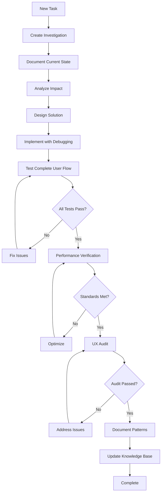

# Co-Pilot Instructions - Sunny Stack Portfolio Trinity Method v7.0

## 🔥 CRITICAL: INVESTIGATION-FIRST DEVELOPMENT FOR NEXT.JS/REACT

**This document contains the MANDATORY Trinity Method v7.0 implementation protocols for the Sunny Stack Portfolio project. All development MUST follow these instructions without exception.**

---

## PROJECT CONTEXT: SUNNY STACK PORTFOLIO

### Technology Stack
- **Framework**: Next.js 15.0.0 (App Router)
- **UI Library**: React 19.0.0
- **Language**: TypeScript 5.5.0
- **Styling**: Tailwind CSS 3.4.0
- **Animation**: Framer Motion 11.0.0
- **Email**: Resend 6.0.3
- **PDF Generation**: jspdf 3.0.2 & html2canvas 1.4.1
- **Icons**: Lucide React 0.400.0
- **Build Tool**: Next.js Build System
- **Package Manager**: npm

### Project Architecture
- **Routing**: App Router with file-based routing
- **Components**: Modular React components with TypeScript
- **Styling**: Utility-first CSS with Tailwind
- **State Management**: React hooks and context
- **API Routes**: Next.js API routes in app/api
- **Performance**: Static site generation with dynamic elements

---

## ⚠️ CLAUDE CODE MANDATORY ENFORCEMENT PROTOCOLS

### 🔴 MANDATORY FULL SYSTEM TESTING

**EVERY Claude Code implementation MUST include:**

#### 1. Complete User Journey Testing
```typescript
// MANDATORY: Test entire portfolio workflow
async function testCompletePortfolioJourney() {
    console.log('[TEST] Starting complete user journey test');
    
    // Test homepage load and interactions
    await testHomepageLoad();
    await testHeroAnimations();
    await testNavigationMenu();
    
    // Test portfolio section
    await testPortfolioNavigation();
    await testProjectCards();
    await testProjectModals();
    
    // Test contact form
    await testContactFormValidation();
    await testContactFormSubmission();
    await testEmailDelivery();
    
    // Test resume section
    await testResumeDisplay();
    await testPDFGeneration();
    await testDownloadFunctionality();
    
    // Test quote calculator
    await testQuoteFormInputs();
    await testQuoteCalculation();
    await testQuoteSubmission();
    
    console.log('[TEST] Complete user journey test finished');
}
```

#### 2. React Component Verification
```typescript
// MANDATORY: Verify all React components
function verifyAllComponents() {
    console.log('[VERIFY] Component verification starting');
    
    // Test component rendering
    testComponentRender();
    testPropsHandling();
    testStateManagement();
    
    // Test hooks
    testUseEffectBehavior();
    testCustomHooks();
    testContextProviders();
    
    // Test event handlers
    testClickHandlers();
    testFormHandlers();
    testScrollHandlers();
    
    // Test responsive behavior
    testMobileLayout();
    testTabletLayout();
    testDesktopLayout();
    
    console.log('[VERIFY] Component verification complete');
}
```

#### 3. Next.js Specific Testing
```typescript
// MANDATORY: Test Next.js specific features
async function testNextJsFeatures() {
    console.log('[NEXTJS] Testing Next.js features');
    
    // Test routing
    await testAppRouterNavigation();
    await testDynamicRoutes();
    await testRouteTransitions();
    
    // Test API routes
    await testAPIEndpoints();
    await testServerActions();
    await testDataFetching();
    
    // Test optimization
    await testImageOptimization();
    await testCodeSplitting();
    await testStaticGeneration();
    
    console.log('[NEXTJS] Next.js features test complete');
}
```

### 🔴 MANDATORY DEBUGGING IMPLEMENTATION

**EVERY React component and function MUST include:**

```typescript
// MANDATORY: React Component Debugging Pattern
'use client';

import { useEffect, useState } from 'react';

export function PortfolioComponent({ 
    projects, 
    filter 
}: { 
    projects: Project[]; 
    filter: string; 
}) {
    // MANDATORY: State debugging
    const [selectedProject, setSelectedProject] = useState<Project | null>(null);
    console.log('[STATE] PortfolioComponent initial state', { 
        projectsCount: projects.length, 
        filter,
        selectedProject 
    });
    
    // MANDATORY: Effect debugging
    useEffect(() => {
        console.log('[MOUNT] PortfolioComponent mounted', {
            projects: projects.length,
            filter
        });
        
        return () => {
            console.log('[UNMOUNT] PortfolioComponent unmounting');
        };
    }, []);
    
    useEffect(() => {
        console.log('[EFFECT] Filter changed', { 
            newFilter: filter,
            projectsCount: projects.length 
        });
    }, [filter, projects.length]);
    
    // MANDATORY: Event handler debugging
    const handleProjectClick = (project: Project) => {
        console.log('[EVENT] Project clicked', {
            projectId: project.id,
            projectTitle: project.title,
            previousSelection: selectedProject?.id
        });
        
        const startTime = performance.now();
        
        try {
            setSelectedProject(project);
            
            const executionTime = performance.now() - startTime;
            console.log('[PERFORMANCE] Project selection time:', executionTime, 'ms');
            
        } catch (error) {
            console.error('[ERROR] Failed to select project', {
                error,
                project,
                timestamp: new Date().toISOString()
            });
        }
    };
    
    // MANDATORY: Render debugging
    console.log('[RENDER] PortfolioComponent rendering', {
        projectsCount: projects.length,
        filter,
        hasSelection: !!selectedProject
    });
    
    return (
        <div className="portfolio-container">
            {/* Component JSX */}
        </div>
    );
}
```

### 🔴 MANDATORY API ROUTE DEBUGGING

```typescript
// app/api/contact/route.ts
import { NextRequest, NextResponse } from 'next/server';

export async function POST(request: NextRequest) {
    // MANDATORY: Request logging
    console.log('[API] POST /api/contact - Request received', {
        timestamp: new Date().toISOString(),
        headers: Object.fromEntries(request.headers.entries()),
        url: request.url
    });
    
    const startTime = performance.now();
    
    try {
        // MANDATORY: Input validation logging
        const body = await request.json();
        console.log('[VALIDATION] Contact form data', {
            hasName: !!body.name,
            hasEmail: !!body.email,
            hasMessage: !!body.message,
            dataSize: JSON.stringify(body).length
        });
        
        // Process contact form
        const result = await processContactForm(body);
        
        // MANDATORY: Success logging
        const executionTime = performance.now() - startTime;
        console.log('[SUCCESS] Contact form processed', {
            executionTime: `${executionTime}ms`,
            emailSent: result.emailSent,
            timestamp: new Date().toISOString()
        });
        
        return NextResponse.json(result, { status: 200 });
        
    } catch (error) {
        // MANDATORY: Error logging
        console.error('[ERROR] Contact form failed', {
            error: error instanceof Error ? error.message : 'Unknown error',
            stack: error instanceof Error ? error.stack : undefined,
            executionTime: `${performance.now() - startTime}ms`
        });
        
        return NextResponse.json(
            { error: 'Internal server error' },
            { status: 500 }
        );
    }
}
```

### 🔴 USER EXPERIENCE AUDIT REQUIREMENTS

**Post-implementation audit MUST verify:**

```markdown
## USER EXPERIENCE AUDIT CHECKLIST

### Portfolio Navigation
- [ ] Homepage loads in <3 seconds
- [ ] All navigation links functional
- [ ] Smooth scroll animations working
- [ ] Mobile menu responsive
- [ ] Footer links operational

### Portfolio Section
- [ ] Project cards display correctly
- [ ] Filter functionality working
- [ ] Project modals open/close properly
- [ ] Images optimized and loading
- [ ] Links to live projects functional

### Contact Form
- [ ] Form validation working
- [ ] Error messages display correctly
- [ ] Success message appears
- [ ] Email delivery confirmed
- [ ] Form reset after submission

### Resume Section
- [ ] Resume content displays properly
- [ ] PDF generation functional
- [ ] Download button working
- [ ] Print styles applied correctly
- [ ] Responsive layout maintained

### Quote Calculator
- [ ] All form inputs functional
- [ ] Calculation logic accurate
- [ ] Validation messages clear
- [ ] Submission process smooth
- [ ] Confirmation email sent

### Performance Standards
- [ ] First Contentful Paint <1.5s
- [ ] Time to Interactive <3.5s
- [ ] Cumulative Layout Shift <0.1
- [ ] No console errors in production
- [ ] All API responses <200ms
```

---

## UNIVERSAL INVESTIGATION PROTOCOL FOR NEXT.JS

### PRE-IMPLEMENTATION INVESTIGATION (MANDATORY)

Before ANY code modification in this Next.js project:

#### 1. Component Impact Analysis
```typescript
// MANDATORY: Analyze component dependencies
function analyzeComponentImpact(componentPath: string) {
    console.log('[INVESTIGATION] Analyzing component impact');
    
    const analysis = {
        // Direct dependencies
        imports: analyzeImports(componentPath),
        exports: analyzeExports(componentPath),
        
        // Component tree
        parentComponents: findParentComponents(componentPath),
        childComponents: findChildComponents(componentPath),
        
        // State impact
        contextUsage: analyzeContextUsage(componentPath),
        stateManagement: analyzeStateManagement(componentPath),
        
        // Performance impact
        renderCount: measureRenderCount(componentPath),
        bundleSize: calculateBundleImpact(componentPath)
    };
    
    console.log('[INVESTIGATION] Impact analysis complete', analysis);
    return analysis;
}
```

#### 2. Route Impact Assessment
```typescript
// MANDATORY: Assess route changes
async function assessRouteImpact(routePath: string) {
    console.log('[INVESTIGATION] Assessing route impact');
    
    const assessment = {
        // Route analysis
        routeType: identifyRouteType(routePath), // static, dynamic, api
        dataFetching: analyzeDataFetching(routePath),
        
        // SEO impact
        metadata: analyzeMetadata(routePath),
        ogTags: analyzeOpenGraph(routePath),
        
        // Performance impact
        loadTime: await measureRouteLoadTime(routePath),
        cacheStrategy: analyzeCacheStrategy(routePath),
        
        // Dependencies
        apiDependencies: findAPIDependencies(routePath),
        componentDependencies: findComponentDependencies(routePath)
    };
    
    console.log('[INVESTIGATION] Route assessment complete', assessment);
    return assessment;
}
```

#### 3. Performance Baseline Measurement
```typescript
// MANDATORY: Measure performance before changes
async function measurePerformanceBaseline() {
    console.log('[PERFORMANCE] Measuring baseline metrics');
    
    const metrics = {
        // Core Web Vitals
        lcp: await measureLCP(), // Largest Contentful Paint
        fid: await measureFID(), // First Input Delay
        cls: await measureCLS(), // Cumulative Layout Shift
        
        // Next.js metrics
        ttfb: await measureTTFB(), // Time to First Byte
        fcp: await measureFCP(), // First Contentful Paint
        tti: await measureTTI(), // Time to Interactive
        
        // Custom metrics
        apiResponseTime: await measureAPIResponseTime(),
        bundleSize: await measureBundleSize(),
        memoryUsage: await measureMemoryUsage()
    };
    
    console.log('[PERFORMANCE] Baseline metrics captured', metrics);
    return metrics;
}
```

### INVESTIGATION DOCUMENTATION TEMPLATE

```markdown
# INVESTIGATION: [Feature/Bug/Enhancement Name]
**Date**: [Current Date]
**Investigator**: Claude Code
**Project**: Sunny Stack Portfolio
**Technology**: Next.js 15 / React 19 / TypeScript

## 1. CURRENT STATE ANALYSIS

### Component Architecture
- Affected components: [List components]
- Current implementation: [Describe current state]
- Performance metrics: [Current measurements]

### Route Structure
- Affected routes: [List routes]
- Data fetching strategy: [SSG/SSR/CSR]
- Current load time: [Measurements]

## 2. PROBLEM DEFINITION
[Clear problem statement with evidence from investigation]

## 3. INVESTIGATION FINDINGS

### Technical Analysis
- Root cause: [Identified cause]
- Impact scope: [Components, routes, APIs affected]
- Performance impact: [Projected changes]

### User Experience Impact
- Affected user flows: [List flows]
- Accessibility impact: [Any a11y concerns]
- SEO impact: [Any SEO changes]

## 4. PROPOSED SOLUTION

### Implementation Approach
- Strategy: [Technical approach]
- New dependencies: [If any]
- Breaking changes: [If any]

### Code Changes
- Components to modify: [List]
- New components needed: [List]
- API changes required: [List]

## 5. RISK ASSESSMENT

### Technical Risks
- [ ] Bundle size increase
- [ ] Performance regression
- [ ] Browser compatibility
- [ ] SEO impact

### Mitigation Strategies
- [Risk mitigation plans]

## 6. IMPLEMENTATION PLAN

### Phase 1: Preparation
- [ ] Create feature branch
- [ ] Set up test environment
- [ ] Capture performance baseline

### Phase 2: Implementation
- [ ] Implement core functionality
- [ ] Add comprehensive debugging
- [ ] Write unit tests
- [ ] Implement error handling

### Phase 3: Verification
- [ ] Run complete test suite
- [ ] Verify performance standards
- [ ] Conduct UX audit
- [ ] Check accessibility

## 7. SUCCESS METRICS
- [ ] All tests passing
- [ ] Performance within baseline ±5%
- [ ] Zero console errors
- [ ] Accessibility score maintained
- [ ] SEO metrics unchanged
```

---

## NEXT.JS SPECIFIC PROTOCOLS

### APP ROUTER REQUIREMENTS

#### 1. Route Organization
```typescript
// MANDATORY: Route structure standards
/*
app/
├── layout.tsx          // Root layout with providers
├── page.tsx           // Homepage
├── not-found.tsx      // 404 page
├── error.tsx          // Error boundary
├── loading.tsx        // Loading state
├── (routes)/          // Route groups
│   ├── portfolio/
│   │   ├── page.tsx
│   │   └── [id]/
│   │       └── page.tsx
│   ├── about/
│   │   └── page.tsx
│   └── contact/
│       └── page.tsx
└── api/               // API routes
    ├── contact/
    │   └── route.ts
    └── quote/
        └── route.ts
*/
```

#### 2. Server Component Standards
```typescript
// MANDATORY: Server Component pattern
import { Metadata } from 'next';

export const metadata: Metadata = {
    title: 'Portfolio | Sunny Stack',
    description: 'Professional web development portfolio',
    openGraph: {
        title: 'Portfolio | Sunny Stack',
        description: 'Professional web development portfolio',
        type: 'website',
    },
};

export default async function PortfolioPage() {
    // MANDATORY: Server-side data fetching
    console.log('[SERVER] Fetching portfolio data');
    const projects = await fetchProjects();
    
    return (
        <div className="portfolio-page">
            {/* Pass to client components */}
            <PortfolioGrid projects={projects} />
        </div>
    );
}
```

#### 3. Client Component Standards
```typescript
// MANDATORY: Client Component pattern
'use client';

import { useState, useEffect } from 'react';

export function InteractiveComponent({ data }: { data: any }) {
    // MANDATORY: Hydration-safe state
    const [mounted, setMounted] = useState(false);
    
    useEffect(() => {
        setMounted(true);
        console.log('[HYDRATION] Component mounted on client');
    }, []);
    
    if (!mounted) {
        return <div>Loading...</div>; // Prevent hydration mismatch
    }
    
    return (
        <div>
            {/* Interactive content */}
        </div>
    );
}
```

### TAILWIND CSS REQUIREMENTS

#### 1. Utility Class Standards
```typescript
// MANDATORY: Consistent Tailwind patterns
const componentStyles = {
    container: 'max-w-7xl mx-auto px-4 sm:px-6 lg:px-8',
    section: 'py-12 md:py-16 lg:py-20',
    grid: 'grid grid-cols-1 md:grid-cols-2 lg:grid-cols-3 gap-6',
    card: 'bg-white dark:bg-gray-800 rounded-lg shadow-lg p-6',
    button: 'px-4 py-2 bg-blue-600 text-white rounded-md hover:bg-blue-700 transition-colors',
    heading: 'text-3xl md:text-4xl lg:text-5xl font-bold',
};
```

#### 2. Responsive Design Requirements
```typescript
// MANDATORY: Mobile-first responsive design
export function ResponsiveComponent() {
    return (
        <div className="
            /* Mobile (default) */
            text-sm p-4
            
            /* Tablet (md: 768px+) */
            md:text-base md:p-6
            
            /* Desktop (lg: 1024px+) */
            lg:text-lg lg:p-8
            
            /* Wide (xl: 1280px+) */
            xl:text-xl xl:p-10
        ">
            {/* Content */}
        </div>
    );
}
```

### FRAMER MOTION REQUIREMENTS

#### 1. Animation Standards
```typescript
// MANDATORY: Framer Motion patterns
'use client';

import { motion, AnimatePresence } from 'framer-motion';

export function AnimatedComponent() {
    // MANDATORY: Animation debugging
    console.log('[ANIMATION] Component animation starting');
    
    const variants = {
        hidden: { opacity: 0, y: 20 },
        visible: { 
            opacity: 1, 
            y: 0,
            transition: { duration: 0.5, ease: 'easeOut' }
        },
        exit: { 
            opacity: 0, 
            y: -20,
            transition: { duration: 0.3 }
        }
    };
    
    return (
        <AnimatePresence mode="wait">
            <motion.div
                initial="hidden"
                animate="visible"
                exit="exit"
                variants={variants}
                onAnimationStart={() => console.log('[ANIMATION] Started')}
                onAnimationComplete={() => console.log('[ANIMATION] Completed')}
            >
                {/* Animated content */}
            </motion.div>
        </AnimatePresence>
    );
}
```

---

## CRISIS MANAGEMENT PROTOCOLS

### CONSOLE ERROR CRISIS PROTOCOL

When encountering console errors in production:

```markdown
## IMMEDIATE ACTION PLAN

### Phase 1: Assessment (0-5 minutes)
1. **Stop all development**
   - Save current work
   - Create error-fix branch
   - Document error state

2. **Error categorization**
   - Runtime errors (Critical)
   - Hydration errors (High)
   - Warning messages (Medium)
   - Development-only warnings (Low)

### Phase 2: Systematic Resolution (5-30 minutes)
1. **Fix critical errors first**
   - Server-side rendering errors
   - Client-side crashes
   - API failures

2. **Address hydration issues**
   - Identify mismatch source
   - Implement proper mounting checks
   - Verify server/client consistency

3. **Resolve warnings**
   - React key warnings
   - Deprecated API usage
   - TypeScript errors

### Phase 3: Verification (30-45 minutes)
1. **Complete testing**
   - Run full test suite
   - Manual user journey test
   - Cross-browser verification

2. **Performance check**
   - Verify no regression
   - Check bundle size
   - Measure load times
```

### PERFORMANCE DEGRADATION PROTOCOL

```typescript
// MANDATORY: Performance recovery procedure
async function performanceRecoveryProtocol() {
    console.log('[CRISIS] Initiating performance recovery');
    
    // Step 1: Measure current state
    const currentMetrics = await measureAllMetrics();
    
    // Step 2: Identify bottlenecks
    const bottlenecks = await identifyBottlenecks();
    
    // Step 3: Apply optimizations
    const optimizations = {
        components: optimizeComponents(),
        images: optimizeImages(),
        bundles: optimizeBundles(),
        api: optimizeAPIRoutes()
    };
    
    // Step 4: Verify improvements
    const newMetrics = await measureAllMetrics();
    
    console.log('[CRISIS] Performance recovery complete', {
        before: currentMetrics,
        after: newMetrics,
        improvement: calculateImprovement(currentMetrics, newMetrics)
    });
}
```

---

## DEPLOYMENT REQUIREMENTS

### PRE-DEPLOYMENT CHECKLIST

```markdown
## MANDATORY PRE-DEPLOYMENT VERIFICATION

### Code Quality
- [ ] All TypeScript errors resolved
- [ ] ESLint warnings addressed
- [ ] No console.log in production code
- [ ] Error boundaries implemented
- [ ] Loading states for all async operations

### Testing
- [ ] Unit tests passing (>80% coverage)
- [ ] Integration tests passing
- [ ] E2E tests passing
- [ ] Manual testing completed
- [ ] Cross-browser testing done

### Performance
- [ ] Lighthouse score >90
- [ ] Bundle size optimized
- [ ] Images optimized
- [ ] Fonts optimized
- [ ] Critical CSS inlined

### SEO & Accessibility
- [ ] Meta tags present
- [ ] OG tags configured
- [ ] Sitemap generated
- [ ] Robots.txt configured
- [ ] ARIA labels present
- [ ] Keyboard navigation working

### Security
- [ ] Environment variables secured
- [ ] API rate limiting configured
- [ ] CORS properly configured
- [ ] Input validation implemented
- [ ] XSS protection enabled
```

### BUILD VERIFICATION

```bash
# MANDATORY: Build verification commands
npm run build        # Build production bundle
npm run type-check   # Verify TypeScript
npm run lint        # Check linting
npm run test        # Run test suite
npm start          # Test production build locally
```

---

## CONTINUOUS IMPROVEMENT REQUIREMENTS

### SESSION DOCUMENTATION

Every development session MUST produce:

```markdown
# CHAT LOG: Sunny Stack Portfolio - [Date] - [Session ID]

## SESSION SUMMARY
**Duration**: [Start time - End time]
**Objectives**: [List session goals]
**Completed**: [What was accomplished]

## INVESTIGATIONS CONDUCTED
1. [Investigation name]: [Key findings]
2. [Investigation name]: [Key findings]

## IMPLEMENTATIONS
1. [Feature/Fix]: [Technical details]
2. [Feature/Fix]: [Technical details]

## PATTERNS DISCOVERED
- [Pattern]: [Description and use case]
- [Pattern]: [Description and use case]

## ISSUES ENCOUNTERED
- [Issue]: [Resolution or workaround]
- [Issue]: [Resolution or workaround]

## PERFORMANCE METRICS
- Before: [Baseline metrics]
- After: [Post-implementation metrics]
- Delta: [Changes observed]

## NEXT SESSION REQUIREMENTS
- [ ] [Task or investigation needed]
- [ ] [Task or investigation needed]

## KNOWLEDGE GAINED
- [Learning]: [How to apply in future]
- [Learning]: [How to apply in future]
```

### PATTERN LIBRARY DEVELOPMENT

```typescript
// MANDATORY: Document successful patterns
interface SuccessPattern {
    name: string;
    category: 'performance' | 'ux' | 'architecture' | 'testing';
    problem: string;
    solution: string;
    implementation: string;
    metrics: {
        before: any;
        after: any;
        improvement: string;
    };
    reusability: 'high' | 'medium' | 'low';
    relatedPatterns: string[];
}

// Example pattern documentation
const optimizedImagePattern: SuccessPattern = {
    name: 'Next.js Image Optimization Pattern',
    category: 'performance',
    problem: 'Large images causing slow page loads',
    solution: 'Use Next.js Image component with proper sizing',
    implementation: `
        import Image from 'next/image';
        
        <Image
            src="/image.jpg"
            alt="Description"
            width={800}
            height={600}
            placeholder="blur"
            blurDataURL={blurDataUrl}
            sizes="(max-width: 768px) 100vw, (max-width: 1200px) 50vw, 33vw"
            priority={isAboveFold}
        />
    `,
    metrics: {
        before: { lcp: '4.2s', imageSize: '500KB' },
        after: { lcp: '1.8s', imageSize: '45KB' },
        improvement: '57% LCP improvement, 91% size reduction'
    },
    reusability: 'high',
    relatedPatterns: ['responsive-images', 'lazy-loading']
};
```

---

## ENFORCEMENT AND COMPLIANCE

### MANDATORY DEVELOPMENT FLOW



### VERIFICATION COMMANDS

```bash
# MANDATORY: Use these commands to verify compliance

# Check for debugging implementation
grep -r "console.log\(\'\[" --include="*.tsx" --include="*.ts" src/

# Verify no console errors
npm run dev
# Open browser console and verify zero errors

# Check TypeScript compliance
npm run type-check

# Verify performance
npm run build && npm run analyze

# Test complete user journey
npm run test:e2e

# Audit accessibility
npm run audit:a11y

# Check bundle size
npm run analyze:bundle
```

---

## CRITICAL REMINDERS

### ⚠️ NEVER SKIP THESE STEPS

1. **ALWAYS conduct investigation before implementation**
2. **ALWAYS add comprehensive debugging to every function**
3. **ALWAYS test the complete user journey, not just your changes**
4. **ALWAYS verify zero console errors after implementation**
5. **ALWAYS document patterns for future reference**
6. **ALWAYS measure performance impact**
7. **ALWAYS consider mobile-first responsive design**
8. **ALWAYS implement proper error boundaries**
9. **ALWAYS use TypeScript types properly**
10. **ALWAYS follow Next.js best practices**

### 🚫 COMMON PITFALLS TO AVOID

1. **DON'T modify without investigation**
2. **DON'T skip debugging implementation**
3. **DON'T test only the happy path**
4. **DON'T ignore console warnings**
5. **DON'T forget mobile testing**
6. **DON'T skip performance verification**
7. **DON'T use 'any' type in TypeScript**
8. **DON'T mix server and client components incorrectly**
9. **DON'T forget to handle loading and error states**
10. **DON'T deploy without full verification**

---

**Trinity Method v7.0 - Sunny Stack Portfolio Implementation**

**Remember: No updates without investigation. No changes without Trinity consensus. No shortcuts without consequences.**

**This is the way. This is Trinity Method. This is professional development.**