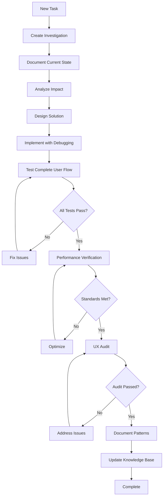

<<<<<<< HEAD
<<<<<<< HEAD
# Co-Pilot Instructions - Sunny Stack Trinity Method v7.0

## 🔥 INVESTIGATION-FIRST DEVELOPMENT METHODOLOGY

**Core Principle**: No updates without investigation. No changes without Trinity consensus. No shortcuts without consequences.

This document provides comprehensive instructions for AI assistants (Claude Code, GitHub Copilot, other AI tools) working on the Sunny Stack platform. Following these instructions ensures professional, systematic, and high-quality development.

---

## 🚨 CRITICAL ENFORCEMENT PROTOCOLS

### ⚠️ MANDATORY FULL SYSTEM TESTING

**EVERY implementation MUST include:**

```markdown
MANDATORY PROTOCOL: After ANY code modification:
1. Test ENTIRE affected user workflow end-to-end
2. Verify ALL component interactions function correctly
3. Confirm ALL data flows operate as expected
4. Validate ALL error scenarios handle gracefully
5. Check performance metrics remain within baselines
```

### ⚠️ MANDATORY DEBUGGING IMPLEMENTATION

**EVERY function/component MUST include:**

```javascript
// React Component Example
const MyComponent: React.FC<Props> = ({ props }) => {
  console.log('🔧 [MyComponent] Rendering:', { props, timestamp: Date.now() })
  
  useEffect(() => {
    console.log('🔧 [MyComponent] Mounted')
    return () => console.log('🔧 [MyComponent] Unmounted')
  }, [])
  
  const handleAction = (event) => {
    console.log('⚡ [MyComponent] Action triggered:', event)
    const startTime = performance.now()
    
    try {
      // Action logic
      const duration = performance.now() - startTime
      console.log(`✅ [MyComponent] Action completed (${duration.toFixed(2)}ms)`)
    } catch (error) {
      console.error('🚨 [MyComponent] Action failed:', error)
      throw error
    }
  }
  
  return <div onClick={handleAction}>{/* Component JSX */}</div>
}
```

```python
# FastAPI Endpoint Example
@router.post("/api/endpoint")
async def endpoint_handler(request: RequestSchema):
    print(f"⚡ [API] Request received: {request.dict()}")
    start_time = time.time()
    
    try:
        # Endpoint logic
        result = await process_request(request)
        duration = time.time() - start_time
        print(f"✅ [API] Request completed ({duration:.3f}s)")
        return result
    except Exception as e:
        print(f"🚨 [API] Request failed: {e}")
        raise HTTPException(status_code=500, detail=str(e))
```

### ⚠️ USER EXPERIENCE AUDIT REQUIREMENTS

**Post-implementation audit MUST verify:**

- ✅ **Full Workflow Testing**: Complete user journey from start to finish
- ✅ **Component Verification**: All UI elements respond correctly
- ✅ **Data Persistence**: Information correctly saved and retrieved
- ✅ **Error Recovery**: Graceful handling of all error conditions
- ✅ **Performance Standards**: Sub-100ms response for all operations
- ✅ **Cross-Browser Testing**: Chrome, Firefox, Safari, Edge compatibility
- ✅ **Mobile Responsiveness**: Full functionality on mobile devices
- ✅ **Accessibility**: WCAG 2.1 AA compliance

---

## 📋 SUNNY STACK SPECIFIC PROTOCOLS

### Project Technology Stack
- **Frontend**: Next.js 15.0 + React 19.0 + TypeScript
- **Backend**: FastAPI 0.104.1 + Python 3.11+
- **State**: Zustand 5.0
- **Auth**: NextAuth.js 5.0 + JWT
- **Styling**: Tailwind CSS 3.4
- **Infrastructure**: Cloudflare Tunnel
- **Real-time**: Socket.io

### NEVER START SERVERS IN CLAUDE CODE
```bash
# ❌ PROHIBITED COMMANDS (kills Claude session):
./startup-sunny.sh
npm run dev
npm start
uvicorn main:app
python -m uvicorn
next dev

# ✅ ALLOWED COMMANDS:
git status
git add/commit/push
grep/find/ls
cat/head/tail (for reading)
npm run build (without start)
=======
# Sunny Stack Co-Pilot Instructions - Trinity Method v7.0 Implementation
=======
# Co-Pilot Instructions - Sunny Stack Portfolio Trinity Method v7.0
>>>>>>> dev

## 🔥 CRITICAL: INVESTIGATION-FIRST DEVELOPMENT FOR NEXT.JS/REACT

**This document contains the MANDATORY Trinity Method v7.0 implementation protocols for the Sunny Stack Portfolio project. All development MUST follow these instructions without exception.**

---

## PROJECT CONTEXT: SUNNY STACK PORTFOLIO

### Technology Stack
- **Framework**: Next.js 15.0.0 (App Router)
- **UI Library**: React 19.0.0
- **Language**: TypeScript 5.5.0
- **Styling**: Tailwind CSS 3.4.0
- **Animation**: Framer Motion 11.0.0
- **Email**: Resend 6.0.3
- **PDF Generation**: jspdf 3.0.2 & html2canvas 1.4.1
- **Icons**: Lucide React 0.400.0
- **Build Tool**: Next.js Build System
- **Package Manager**: npm

### Project Architecture
- **Routing**: App Router with file-based routing
- **Components**: Modular React components with TypeScript
- **Styling**: Utility-first CSS with Tailwind
- **State Management**: React hooks and context
- **API Routes**: Next.js API routes in app/api
- **Performance**: Static site generation with dynamic elements

---

## ⚠️ CLAUDE CODE MANDATORY ENFORCEMENT PROTOCOLS

### 🔴 MANDATORY FULL SYSTEM TESTING

**EVERY Claude Code implementation MUST include:**

<<<<<<< HEAD
```
MANDATORY: After implementation, conduct FULL USER EXPERIENCE AUDIT of entire affected workflow. Test ALL user interactions across frontend/backend, verify ALL data flows through FastAPI endpoints, confirm ALL cross-component integrations between React and Python services. This is not optional.
```

#### MANDATORY DEBUGGING IMPLEMENTATION
**EVERY implementation MUST include:**

```
MANDATORY: Add comprehensive debugging to ALL modified functions in both TypeScript/React components AND Python/FastAPI endpoints with entry/exit logging, parameter capture, error handling, and performance timing. Verify debug output during testing across the full stack.
```

#### USER EXPERIENCE AUDIT REQUIREMENTS
**Post-implementation audit MUST verify:**
- ✅ Full user workflow testing from React UI to FastAPI backend
- ✅ All Next.js component interaction verification
- ✅ FastAPI endpoint response validation
- ✅ Data persistence across SQLAlchemy models
- ✅ WebSocket real-time functionality through Socket.IO
- ✅ Error handling in both frontend and backend scenarios

---

## SUNNY STACK PROJECT ARCHITECTURE CONTEXT

### TECHNOLOGY STACK IDENTIFICATION
```javascript
// Sunny Stack Technology Profile
const sunnyStackArchitecture = {
    frontend: {
        framework: 'Next.js 15.0',
        language: 'TypeScript',
        styling: 'Tailwind CSS',
        state: 'Zustand',
        query: '@tanstack/react-query',
        animations: 'Framer Motion',
        realtime: 'Socket.IO Client'
    },
    backend: {
        framework: 'FastAPI 0.104.1',
        language: 'Python 3.11+',
        server: 'Uvicorn',
        auth: 'PassLib + JWT',
        database: 'SQLAlchemy',
        ai: 'Anthropic API',
        realtime: 'Python-SocketIO'
    },
    infrastructure: {
        edge: 'Cloudflare Workers',
        tunnel: 'Cloudflare Tunnel',
        database: 'D1 (SQLite edge)',
        deployment: 'Wrangler',
        domain: 'sunny-stack.com'
    }
};
```

### PROJECT-SPECIFIC DEVELOPMENT CONSTRAINTS
```markdown
## Critical Development Rules
1. NEVER start servers in Claude Code (kills sessions)
2. Server management is Luke's responsibility exclusively
3. Claude Code focuses on file creation/modification only
4. Always validate Cloudflare tunnel ingress after changes
5. Maintain separate frontend (3000) and backend (8000) ports
```

### PERFORMANCE BASELINES FOR SUNNY STACK
```javascript
// Sunny Stack Performance Requirements
const performanceStandards = {
    frontend: {
        renderTime: '<16ms for 60fps',
        interactionResponse: '<100ms',
        pageLoad: '<3s initial load',
        bundleSize: '<500KB gzipped'
    },
    backend: {
        apiResponse: '<200ms standard',
        aiResponse: '<5s for Claude API',
        websocketLatency: '<50ms',
        databaseQuery: '<100ms'
    },
    infrastructure: {
        edgeResponse: '<50ms globally',
        tunnelLatency: '<100ms',
        uptime: '99.9% SLA'
    }
};
>>>>>>> dev
```

---

<<<<<<< HEAD
## 🔍 UNIVERSAL INVESTIGATION PROTOCOL

### PRE-IMPLEMENTATION INVESTIGATION (MANDATORY)

Before writing ANY code, complete this investigation:

#### 1. SYSTEM STATE ANALYSIS
```markdown
## Current State Investigation
- [ ] Document current component/feature state
- [ ] Map all dependencies and relationships
- [ ] Measure current performance baseline
- [ ] Identify existing patterns and conventions
- [ ] Review related components for consistency
```

#### 2. CHANGE IMPACT ASSESSMENT
```markdown
## Impact Analysis
- [ ] List all components affected by change
- [ ] Assess performance impact (positive/negative)
- [ ] Identify potential breaking changes
- [ ] Evaluate security implications
- [ ] Consider backward compatibility
```

#### 3. IMPLEMENTATION PLANNING
```markdown
## Implementation Strategy
- [ ] Define evidence-based approach
- [ ] Create step-by-step implementation plan
- [ ] Establish success metrics
- [ ] Prepare rollback strategy
- [ ] Document testing approach
```

### INVESTIGATION DOCUMENTATION TEMPLATE
=======
## SUNNY STACK INVESTIGATION PROTOCOL

### PRE-IMPLEMENTATION INVESTIGATION (MANDATORY)

#### INVESTIGATION CHECKLIST FOR SUNNY STACK
Before ANY code modification:

- [ ] **Frontend Architecture Analysis**
  - Next.js component structure mapped
  - React component dependencies identified
  - Zustand store state flow documented
  - TanStack Query cache patterns understood

- [ ] **Backend Architecture Analysis**
  - FastAPI route structure documented
  - SQLAlchemy models relationships mapped
  - Authentication flow verified
  - WebSocket event handlers identified

- [ ] **Infrastructure Impact Assessment**
  - Cloudflare tunnel routing verified
  - Worker edge function impact assessed
  - D1 database operations reviewed
  - Cross-service communication validated

- [ ] **Full Stack Integration Planning**
  - Frontend-to-backend API contracts defined
  - State synchronization strategy established
  - Error propagation handling planned
  - Performance impact across stack measured

### INVESTIGATION DOCUMENTATION TEMPLATE FOR SUNNY STACK
>>>>>>> dev

```markdown
# INVESTIGATION: [Feature/Bug/Task Name]
**Date**: [Current Date]
**Investigator**: Claude Code
<<<<<<< HEAD
**Stack**: Next.js + FastAPI

## 1. CURRENT STATE ANALYSIS
### Component Location
- Frontend: `frontend/[path]`
- Backend: `backend/[path]`

### Dependencies
- React components: [list]
- API endpoints: [list]
- State management: [list]

### Performance Baseline
- Load time: [X]ms
- Render time: [X]ms
- API response: [X]ms

## 2. PROBLEM DEFINITION
[Clear problem statement with evidence]

## 3. INVESTIGATION FINDINGS
### Root Cause
[Evidence-based determination]

### Related Issues
[Connected problems or dependencies]

## 4. PROPOSED SOLUTION
### Approach
[Detailed implementation strategy]

### Justification
[Why this approach over alternatives]

## 5. IMPACT ASSESSMENT
### Components Affected
- Frontend: [list with specifics]
- Backend: [list with specifics]
- Database: [changes if any]

### Performance Impact
- Expected improvement/degradation: [metrics]
- Memory impact: [assessment]
- Network impact: [assessment]

## 6. IMPLEMENTATION PLAN
1. [Step with verification]
2. [Step with verification]
3. [Step with verification]

## 7. SUCCESS METRICS
- [ ] Metric 1: [measurable outcome]
- [ ] Metric 2: [measurable outcome]
- [ ] Metric 3: [measurable outcome]

## 8. RISK MITIGATION
### Identified Risks
1. Risk: [description]
   Mitigation: [strategy]
2. Risk: [description]
   Mitigation: [strategy]

### Rollback Plan
[Step-by-step rollback procedure]
=======
**Stack Layer**: [Frontend/Backend/Infrastructure/Full Stack]

## 1. CURRENT STATE ANALYSIS
### Frontend State
- React component: [Component name and location]
- Current behavior: [How it works now]
- State management: [Zustand store involvement]
- API integration: [Current endpoints used]

### Backend State
- FastAPI endpoint: [Route and method]
- Business logic: [Current implementation]
- Database operations: [SQLAlchemy queries]
- Authentication: [JWT/session handling]

### Infrastructure State
- Cloudflare routing: [Current ingress rules]
- Edge function: [Worker involvement]
- Tunnel configuration: [Current setup]

## 2. PROBLEM DEFINITION
[Clear problem statement with evidence from both frontend and backend]

## 3. INVESTIGATION FINDINGS
### Frontend Analysis
[React component investigation results]

### Backend Analysis
[FastAPI endpoint investigation results]

### Infrastructure Analysis
[Cloudflare/tunnel investigation results]

## 4. PROPOSED SOLUTION
### Frontend Changes
[React/Next.js modifications with justification]

### Backend Changes
[FastAPI/Python modifications with justification]

### Infrastructure Changes
[Cloudflare configuration updates if needed]

## 5. IMPACT ASSESSMENT
### Cross-Stack Impact
- Frontend components affected: [List]
- Backend endpoints affected: [List]
- Database schema changes: [If any]
- Infrastructure routing changes: [If any]

### Performance Impact
- Frontend render performance: [Measurement]
- API response time: [Measurement]
- Database query impact: [Analysis]
- Edge latency: [Projection]

## 6. IMPLEMENTATION PLAN
### Phase 1: Backend Implementation
1. [Step-by-step FastAPI changes]
2. [Database migration if needed]
3. [API contract updates]

### Phase 2: Frontend Implementation
1. [Step-by-step React changes]
2. [State management updates]
3. [UI/UX modifications]

### Phase 3: Integration Testing
1. [Full stack testing plan]
2. [Performance verification]
3. [Error scenario validation]

## 7. SUCCESS METRICS
- [ ] All API endpoints respond < 200ms
- [ ] Frontend interactions respond < 100ms
- [ ] Zero console errors in production
- [ ] All tests passing
- [ ] User workflow functions end-to-end

## 8. RISK MITIGATION
### Identified Risks
- [Risk 1]: [Mitigation strategy]
- [Risk 2]: [Mitigation strategy]

### Rollback Plan
[Step-by-step rollback procedure if needed]
>>>>>>> dev
```

---

<<<<<<< HEAD
## 🛠️ SUNNY STACK DEVELOPMENT PATTERNS

### React Component Pattern (Next.js)
```typescript
'use client'

import React, { useState, useEffect, useCallback, useMemo } from 'react'
import { useStore } from '@/lib/store'
import { api } from '@/lib/api'
import type { ComponentProps } from '@/types'

interface MyComponentProps extends ComponentProps {
  data: DataType
  onAction?: (result: ResultType) => void
}

/**
 * MyComponent - Description of component purpose
 * 
 * @param data - Input data for component
 * @param onAction - Callback for action completion
 */
export const MyComponent: React.FC<MyComponentProps> = ({ 
  data, 
  onAction 
}) => {
  // Debug logging for development
  console.log('🔧 [MyComponent] Rendering:', { data })
  
  // Local state
  const [localState, setLocalState] = useState<StateType>(initialState)
  const [isLoading, setIsLoading] = useState(false)
  const [error, setError] = useState<string | null>(null)
  
  // Global state from Zustand
  const { user, projects, updateProject } = useStore()
  
  // Memoized values for performance
  const computedValue = useMemo(() => {
    console.log('📊 [MyComponent] Computing value')
    return expensiveComputation(data)
  }, [data])
  
  // Lifecycle logging
  useEffect(() => {
    console.log('🔧 [MyComponent] Component mounted')
    
    // Setup logic
    const initialize = async () => {
      try {
        setIsLoading(true)
        const result = await api.get('/endpoint')
        console.log('✅ [MyComponent] Data loaded:', result)
        setLocalState(result)
      } catch (err) {
        console.error('🚨 [MyComponent] Failed to load:', err)
        setError(err.message)
      } finally {
        setIsLoading(false)
      }
    }
    
    initialize()
    
    // Cleanup
    return () => {
      console.log('🔧 [MyComponent] Component unmounting')
      // Cleanup logic
    }
  }, [])
  
  // Callbacks with performance tracking
  const handleAction = useCallback(async (event: React.MouseEvent) => {
    console.log('⚡ [MyComponent] Action triggered')
    const startTime = performance.now()
    
    try {
      setIsLoading(true)
      setError(null)
      
      const result = await api.post('/endpoint', {
        data: localState
      })
      
      const duration = performance.now() - startTime
      console.log(`✅ [MyComponent] Action completed (${duration.toFixed(2)}ms)`)
      
      // Update global state
      updateProject(result)
      
      // Call parent callback
      onAction?.(result)
      
    } catch (err) {
      console.error('🚨 [MyComponent] Action failed:', err)
      setError(err.message)
    } finally {
      setIsLoading(false)
    }
  }, [localState, updateProject, onAction])
  
  // Error boundary
  if (error) {
    return (
      <div className="error-container p-4 bg-red-50 border border-red-200 rounded">
        <p className="text-red-600">🚨 Error: {error}</p>
        <button 
          onClick={() => setError(null)}
          className="mt-2 px-4 py-2 bg-red-600 text-white rounded"
        >
          Retry
        </button>
      </div>
    )
  }
  
  // Loading state
  if (isLoading) {
    return (
      <div className="loading-container flex items-center justify-center p-8">
        <div className="animate-spin rounded-full h-8 w-8 border-b-2 border-blue-600"></div>
        <span className="ml-2">Loading...</span>
      </div>
    )
  }
  
  // Main render
  return (
    <div className="component-container">
      <h2 className="text-2xl font-bold mb-4">Component Title</h2>
      
      <div className="content-area">
        {computedValue && (
          <div className="computed-display">
            {computedValue}
          </div>
        )}
      </div>
      
      <button
        onClick={handleAction}
        disabled={isLoading}
        className="mt-4 px-6 py-2 bg-blue-600 text-white rounded hover:bg-blue-700 disabled:opacity-50"
      >
        Perform Action
      </button>
    </div>
  )
}

// Default export for lazy loading
export default MyComponent
```

### FastAPI Endpoint Pattern
```python
from fastapi import APIRouter, Depends, HTTPException, status, Request
from typing import List, Optional
from datetime import datetime
import time

from app.models import ResourceSchema, CreateResourceSchema, UpdateResourceSchema
from app.services import resource_service
from app.auth import get_current_user
from app.utils import logger

router = APIRouter(
    prefix="/api/resources",
    tags=["resources"]
)

@router.get(
    "/",
    response_model=List[ResourceSchema],
    summary="Get all resources",
    description="Retrieve all resources with optional filtering and pagination"
)
async def get_resources(
    skip: int = 0,
    limit: int = 100,
    search: Optional[str] = None,
    current_user: User = Depends(get_current_user),
    request: Request = None
):
    """
    Get all resources with pagination and filtering.
    
    - **skip**: Number of records to skip
    - **limit**: Maximum number of records to return
    - **search**: Optional search term
    """
    # Debug logging
    print(f"⚡ [API] GET /resources - User: {current_user.email}")
    print(f"📊 [API] Parameters: skip={skip}, limit={limit}, search={search}")
    
    start_time = time.time()
    
    try:
        # Business logic with service layer
        resources = await resource_service.get_all(
            skip=skip,
            limit=limit,
            search=search,
            user_id=current_user.id
        )
        
        # Performance logging
        duration = time.time() - start_time
        print(f"✅ [API] Retrieved {len(resources)} resources in {duration:.3f}s")
        
        # Add performance header
        if request:
            request.state.performance_time = duration
        
        return resources
        
    except Exception as e:
        print(f"🚨 [API] Error retrieving resources: {e}")
        logger.error(f"Failed to get resources for user {current_user.id}: {e}")
        raise HTTPException(
            status_code=status.HTTP_500_INTERNAL_SERVER_ERROR,
            detail="Failed to retrieve resources"
        )

@router.post(
    "/",
    response_model=ResourceSchema,
    status_code=status.HTTP_201_CREATED,
    summary="Create new resource",
    description="Create a new resource for the authenticated user"
)
async def create_resource(
    resource_data: CreateResourceSchema,
    current_user: User = Depends(get_current_user),
    background_tasks: BackgroundTasks = None
):
    """
    Create a new resource.
    
    Returns the created resource with generated ID and timestamps.
    """
    print(f"⚡ [API] POST /resources - User: {current_user.email}")
    print(f"📊 [API] Creating resource: {resource_data.name}")
    
    start_time = time.time()
    
    try:
        # Validate input
        if not resource_data.name or len(resource_data.name) < 3:
            raise ValueError("Resource name must be at least 3 characters")
        
        # Create resource
        new_resource = await resource_service.create(
            resource_data=resource_data,
            user_id=current_user.id
        )
        
        # Add background task if needed
        if background_tasks:
            background_tasks.add_task(
                notify_resource_created,
                resource_id=new_resource.id,
                user_email=current_user.email
            )
        
        duration = time.time() - start_time
        print(f"✅ [API] Resource created: {new_resource.id} in {duration:.3f}s")
        
        return new_resource
        
    except ValueError as e:
        print(f"⚠️ [API] Validation error: {e}")
        raise HTTPException(
            status_code=status.HTTP_400_BAD_REQUEST,
            detail=str(e)
        )
    except Exception as e:
        print(f"🚨 [API] Error creating resource: {e}")
        logger.error(f"Failed to create resource for user {current_user.id}: {e}")
        raise HTTPException(
            status_code=status.HTTP_500_INTERNAL_SERVER_ERROR,
            detail="Failed to create resource"
        )

@router.put(
    "/{resource_id}",
    response_model=ResourceSchema,
    summary="Update resource",
    description="Update an existing resource"
)
async def update_resource(
    resource_id: str,
    updates: UpdateResourceSchema,
    current_user: User = Depends(get_current_user)
):
    """Update an existing resource."""
    print(f"⚡ [API] PUT /resources/{resource_id} - User: {current_user.email}")
    
    try:
        # Check ownership
        existing = await resource_service.get_by_id(resource_id)
        if not existing or existing.user_id != current_user.id:
            raise HTTPException(
                status_code=status.HTTP_404_NOT_FOUND,
                detail="Resource not found"
            )
        
        # Update resource
        updated = await resource_service.update(
            resource_id=resource_id,
            updates=updates
        )
        
        print(f"✅ [API] Resource updated: {resource_id}")
        return updated
        
    except HTTPException:
        raise
    except Exception as e:
        print(f"🚨 [API] Error updating resource: {e}")
        raise HTTPException(
            status_code=status.HTTP_500_INTERNAL_SERVER_ERROR,
            detail="Failed to update resource"
        )

@router.delete(
    "/{resource_id}",
    status_code=status.HTTP_204_NO_CONTENT,
    summary="Delete resource",
    description="Delete a resource"
)
async def delete_resource(
    resource_id: str,
    current_user: User = Depends(get_current_user)
):
    """Delete a resource."""
    print(f"⚡ [API] DELETE /resources/{resource_id} - User: {current_user.email}")
    
    try:
        # Check ownership
        existing = await resource_service.get_by_id(resource_id)
        if not existing or existing.user_id != current_user.id:
            raise HTTPException(
                status_code=status.HTTP_404_NOT_FOUND,
                detail="Resource not found"
            )
        
        # Delete resource
        await resource_service.delete(resource_id)
        
        print(f"✅ [API] Resource deleted: {resource_id}")
        return None
        
    except HTTPException:
        raise
    except Exception as e:
        print(f"🚨 [API] Error deleting resource: {e}")
        raise HTTPException(
            status_code=status.HTTP_500_INTERNAL_SERVER_ERROR,
            detail="Failed to delete resource"
        )
```

### Zustand Store Pattern
```typescript
import { create } from 'zustand'
import { devtools, persist, subscribeWithSelector } from 'zustand/middleware'
import { immer } from 'zustand/middleware/immer'
import { api } from '@/lib/api'

// Types
interface User {
  id: string
  email: string
  name: string
  role: string
}

interface Project {
  id: string
  name: string
  description: string
  status: 'active' | 'archived'
  createdAt: string
  updatedAt: string
}

interface AppState {
  // Authentication State
  user: User | null
  isAuthenticated: boolean
  authToken: string | null
  
  // Application State
  projects: Project[]
  currentProject: Project | null
  
  // UI State
  sidebarOpen: boolean
  theme: 'light' | 'dark'
  notifications: Notification[]
  
  // Loading State
  isLoading: {
    auth: boolean
    projects: boolean
    [key: string]: boolean
  }
  
  // Error State
  errors: {
    auth: string | null
    projects: string | null
    [key: string]: string | null
  }
  
  // Actions
  // Auth Actions
  login: (email: string, password: string) => Promise<void>
  logout: () => void
  refreshAuth: () => Promise<void>
  
  // Project Actions
  loadProjects: () => Promise<void>
  createProject: (data: CreateProjectDto) => Promise<Project>
  updateProject: (id: string, updates: Partial<Project>) => Promise<void>
  deleteProject: (id: string) => Promise<void>
  selectProject: (project: Project | null) => void
  
  // UI Actions
  toggleSidebar: () => void
  setTheme: (theme: 'light' | 'dark') => void
  addNotification: (notification: Notification) => void
  removeNotification: (id: string) => void
  
  // Utility Actions
  setLoading: (key: string, value: boolean) => void
  setError: (key: string, error: string | null) => void
  clearErrors: () => void
}

export const useStore = create<AppState>()(
  devtools(
    persist(
      subscribeWithSelector(
        immer((set, get) => ({
          // Initial State
          user: null,
          isAuthenticated: false,
          authToken: null,
          projects: [],
          currentProject: null,
          sidebarOpen: true,
          theme: 'light',
          notifications: [],
          isLoading: {
            auth: false,
            projects: false
          },
          errors: {
            auth: null,
            projects: null
          },
          
          // Auth Actions
          login: async (email, password) => {
            console.log('🔐 [Store] Login attempt:', email)
            
            set(state => {
              state.isLoading.auth = true
              state.errors.auth = null
            })
            
            try {
              const response = await api.post('/auth/login', {
                email,
                password
              })
              
              console.log('✅ [Store] Login successful')
              
              set(state => {
                state.user = response.user
                state.authToken = response.token
                state.isAuthenticated = true
                state.isLoading.auth = false
              })
              
              // Load user data after login
              get().loadProjects()
              
            } catch (error) {
              console.error('🚨 [Store] Login failed:', error)
              
              set(state => {
                state.errors.auth = error.message
                state.isLoading.auth = false
              })
              
              throw error
            }
          },
          
          logout: () => {
            console.log('🔐 [Store] Logging out')
            
            set(state => {
              state.user = null
              state.authToken = null
              state.isAuthenticated = false
              state.projects = []
              state.currentProject = null
            })
            
            // Clear API token
            api.setToken(null)
          },
          
          refreshAuth: async () => {
            console.log('🔐 [Store] Refreshing authentication')
            
            try {
              const response = await api.post('/auth/refresh')
              
              set(state => {
                state.authToken = response.token
              })
              
              console.log('✅ [Store] Auth refreshed')
              
            } catch (error) {
              console.error('🚨 [Store] Auth refresh failed:', error)
              get().logout()
            }
          },
          
          // Project Actions
          loadProjects: async () => {
            console.log('📊 [Store] Loading projects')
            
            set(state => {
              state.isLoading.projects = true
              state.errors.projects = null
            })
            
            try {
              const projects = await api.get<Project[]>('/projects')
              
              console.log(`✅ [Store] Loaded ${projects.length} projects`)
              
              set(state => {
                state.projects = projects
                state.isLoading.projects = false
              })
              
            } catch (error) {
              console.error('🚨 [Store] Failed to load projects:', error)
              
              set(state => {
                state.errors.projects = error.message
                state.isLoading.projects = false
              })
            }
          },
          
          createProject: async (projectData) => {
            console.log('🎯 [Store] Creating project:', projectData.name)
            
            set(state => {
              state.isLoading.projects = true
              state.errors.projects = null
            })
            
            try {
              const newProject = await api.post<Project>('/projects', projectData)
              
              console.log('✅ [Store] Project created:', newProject.id)
              
              set(state => {
                state.projects.push(newProject)
                state.isLoading.projects = false
              })
              
              // Add success notification
              get().addNotification({
                id: Date.now().toString(),
                type: 'success',
                message: `Project "${newProject.name}" created successfully`
              })
              
              return newProject
              
            } catch (error) {
              console.error('🚨 [Store] Failed to create project:', error)
              
              set(state => {
                state.errors.projects = error.message
                state.isLoading.projects = false
              })
              
              throw error
            }
          },
          
          updateProject: async (id, updates) => {
            console.log('🔄 [Store] Updating project:', id)
            
            try {
              const updated = await api.put<Project>(`/projects/${id}`, updates)
              
              set(state => {
                const index = state.projects.findIndex(p => p.id === id)
                if (index !== -1) {
                  state.projects[index] = updated
                }
                
                if (state.currentProject?.id === id) {
                  state.currentProject = updated
                }
              })
              
              console.log('✅ [Store] Project updated')
              
            } catch (error) {
              console.error('🚨 [Store] Failed to update project:', error)
              throw error
            }
          },
          
          deleteProject: async (id) => {
            console.log('🗑️ [Store] Deleting project:', id)
            
            try {
              await api.delete(`/projects/${id}`)
              
              set(state => {
                state.projects = state.projects.filter(p => p.id !== id)
                
                if (state.currentProject?.id === id) {
                  state.currentProject = null
                }
              })
              
              console.log('✅ [Store] Project deleted')
              
            } catch (error) {
              console.error('🚨 [Store] Failed to delete project:', error)
              throw error
            }
          },
          
          selectProject: (project) => {
            console.log('📁 [Store] Selecting project:', project?.name || 'none')
            
            set(state => {
              state.currentProject = project
            })
          },
          
          // UI Actions
          toggleSidebar: () => {
            set(state => {
              state.sidebarOpen = !state.sidebarOpen
            })
          },
          
          setTheme: (theme) => {
            console.log('🎨 [Store] Setting theme:', theme)
            
            set(state => {
              state.theme = theme
            })
            
            // Apply theme to document
            document.documentElement.classList.toggle('dark', theme === 'dark')
          },
          
          addNotification: (notification) => {
            set(state => {
              state.notifications.push(notification)
            })
            
            // Auto-remove after 5 seconds
            setTimeout(() => {
              get().removeNotification(notification.id)
            }, 5000)
          },
          
          removeNotification: (id) => {
            set(state => {
              state.notifications = state.notifications.filter(n => n.id !== id)
            })
          },
          
          // Utility Actions
          setLoading: (key, value) => {
            set(state => {
              state.isLoading[key] = value
            })
          },
          
          setError: (key, error) => {
            set(state => {
              state.errors[key] = error
            })
          },
          
          clearErrors: () => {
            set(state => {
              state.errors = {
                auth: null,
                projects: null
              }
            })
          }
        }))
      ),
      {
        name: 'sunny-stack-storage',
        partialize: (state) => ({
          user: state.user,
          authToken: state.authToken,
          theme: state.theme,
          sidebarOpen: state.sidebarOpen
        })
      }
    ),
    {
      name: 'SunnyStackStore'
    }
  )
)

// Selectors for performance optimization
export const selectUser = (state: AppState) => state.user
export const selectProjects = (state: AppState) => state.projects
export const selectCurrentProject = (state: AppState) => state.currentProject
export const selectIsAuthenticated = (state: AppState) => state.isAuthenticated
export const selectTheme = (state: AppState) => state.theme
```

---

## 🚦 CRISIS MANAGEMENT PROTOCOLS

### Console Error Crisis Protocol
```markdown
## IMMEDIATE RESPONSE (0-5 MINUTES)
1. **STOP** - Cease all new development
2. **CAPTURE** - Document all error messages and stack traces
3. **COUNT** - Total number of console errors
4. **CATEGORIZE** - Critical vs non-critical errors

## SYSTEMATIC RECOVERY (5-30 MINUTES)
1. **PRIORITIZE** - Fix critical errors first
   - CRITICAL: Blocks functionality
   - HIGH: Degrades UX
   - MEDIUM: Cosmetic issues
   - LOW: Dev warnings

2. **FIX** - Component by component
   - Isolate each fix
   - Test individually
   - Verify no new errors

3. **VERIFY** - Full system check
   - Complete user journey test
   - Cross-browser verification
   - Performance impact check
   - Error-free console confirmation
```

### Performance Degradation Protocol
```markdown
## PERFORMANCE INVESTIGATION
1. **MEASURE** - Current performance metrics
   ```javascript
   const metrics = {
     renderTime: measureRenderTime(),
     responseTime: measureResponseTime(),
     memoryUsage: measureMemoryUsage()
   }
   ```

2. **IDENTIFY** - Bottlenecks
   - React DevTools Profiler
   - Chrome Performance tab
   - Network waterfall
   - Memory snapshots

3. **OPTIMIZE** - Targeted improvements
   - React.memo for expensive components
   - useMemo/useCallback for computations
   - Code splitting with dynamic imports
   - API response caching
   - Image optimization

4. **VERIFY** - Performance restored
   - Metrics within baselines
   - No regression in other areas
   - User experience smooth
```

### Dummy Data Elimination Protocol
```markdown
## AUDIT PROCEDURE
1. **SCAN** - Find all placeholder content
   ```bash
   grep -r "Lorem\|ipsum\|test\|dummy\|TODO" frontend/
   grep -r "example\.com\|foo\|bar\|123" backend/
   ```

2. **VERIFY** - Component by component
   - Check all UI text
   - Verify data sources
   - Confirm API connections
   - Validate assets

3. **REPLACE** - With real data
   - Connect to production APIs
   - Implement proper fetching
   - Add loading states
   - Handle errors gracefully
```

---

## 📈 QUALITY GATES AND CHECKPOINTS

### Pre-Implementation Checklist
```markdown
## Before Writing Code
- [ ] Investigation completed and documented
- [ ] Impact assessment reviewed
- [ ] Implementation plan approved
- [ ] Success metrics defined
- [ ] Rollback strategy prepared
```

### During Implementation Checklist
```markdown
## While Coding
- [ ] Following project conventions
- [ ] Debug logging implemented
- [ ] Error handling in place
- [ ] Performance monitored
- [ ] Tests written/updated
```

### Post-Implementation Checklist
```markdown
## After Coding
- [ ] Full workflow tested
- [ ] No console errors
- [ ] Performance within baselines
- [ ] Documentation updated
- [ ] Code reviewed
```

### Pre-Commit Checklist
```markdown
## Before Committing
- [ ] TypeScript: No errors
- [ ] ESLint: No warnings
- [ ] Tests: All passing
- [ ] Build: Successful
- [ ] Console: Error-free
- [ ] Performance: Within limits
```

---

## 📊 PERFORMANCE STANDARDS

### Frontend Performance Requirements
```typescript
const performanceRequirements = {
  // Core Web Vitals
  FCP: 1500,     // First Contentful Paint < 1.5s
  LCP: 2500,     // Largest Contentful Paint < 2.5s
  FID: 100,      // First Input Delay < 100ms
  CLS: 0.1,      // Cumulative Layout Shift < 0.1
  TTFB: 600,     // Time to First Byte < 600ms
  
  // Custom Metrics
  apiCall: 200,        // API response < 200ms
  stateUpdate: 16,     // State update < 16ms
  routeChange: 300,    // Route transition < 300ms
  searchResults: 500,  // Search results < 500ms
}
```

### Backend Performance Requirements
```python
performance_requirements = {
    "api_response_avg": 200,      # < 200ms average
    "api_response_p95": 500,      # < 500ms 95th percentile
    "api_response_p99": 1000,     # < 1000ms 99th percentile
    "database_query": 30,         # < 30ms per query
    "concurrent_requests": 100,   # Handle 100+ concurrent
    "requests_per_second": 1000,  # Handle 1000+ RPS
    "error_rate": 0.001,         # < 0.1% errors
    "cpu_usage": 70,             # < 70% CPU
    "memory_usage": 512,         # < 512MB RAM
}
=======
## SUNNY STACK DEBUGGING STANDARDS

### REACT/NEXT.JS COMPONENT DEBUGGING
=======
#### 1. Complete User Journey Testing
>>>>>>> dev
```typescript
// MANDATORY: Test entire portfolio workflow
async function testCompletePortfolioJourney() {
    console.log('[TEST] Starting complete user journey test');
    
    // Test homepage load and interactions
    await testHomepageLoad();
    await testHeroAnimations();
    await testNavigationMenu();
    
    // Test portfolio section
    await testPortfolioNavigation();
    await testProjectCards();
    await testProjectModals();
    
    // Test contact form
    await testContactFormValidation();
    await testContactFormSubmission();
    await testEmailDelivery();
    
    // Test resume section
    await testResumeDisplay();
    await testPDFGeneration();
    await testDownloadFunctionality();
    
    // Test quote calculator
    await testQuoteFormInputs();
    await testQuoteCalculation();
    await testQuoteSubmission();
    
    console.log('[TEST] Complete user journey test finished');
}
```

#### 2. React Component Verification
```typescript
// MANDATORY: Verify all React components
function verifyAllComponents() {
    console.log('[VERIFY] Component verification starting');
    
    // Test component rendering
    testComponentRender();
    testPropsHandling();
    testStateManagement();
    
    // Test hooks
    testUseEffectBehavior();
    testCustomHooks();
    testContextProviders();
    
    // Test event handlers
    testClickHandlers();
    testFormHandlers();
    testScrollHandlers();
    
    // Test responsive behavior
    testMobileLayout();
    testTabletLayout();
    testDesktopLayout();
    
    console.log('[VERIFY] Component verification complete');
}
```

#### 3. Next.js Specific Testing
```typescript
// MANDATORY: Test Next.js specific features
async function testNextJsFeatures() {
    console.log('[NEXTJS] Testing Next.js features');
    
    // Test routing
    await testAppRouterNavigation();
    await testDynamicRoutes();
    await testRouteTransitions();
    
    // Test API routes
    await testAPIEndpoints();
    await testServerActions();
    await testDataFetching();
    
    // Test optimization
    await testImageOptimization();
    await testCodeSplitting();
    await testStaticGeneration();
    
    console.log('[NEXTJS] Next.js features test complete');
}
```

### 🔴 MANDATORY DEBUGGING IMPLEMENTATION

**EVERY React component and function MUST include:**

```typescript
// MANDATORY: React Component Debugging Pattern
'use client';

import { useEffect, useState } from 'react';

export function PortfolioComponent({ 
    projects, 
    filter 
}: { 
    projects: Project[]; 
    filter: string; 
}) {
    // MANDATORY: State debugging
    const [selectedProject, setSelectedProject] = useState<Project | null>(null);
    console.log('[STATE] PortfolioComponent initial state', { 
        projectsCount: projects.length, 
        filter,
        selectedProject 
    });
    
    // MANDATORY: Effect debugging
    useEffect(() => {
        console.log('[MOUNT] PortfolioComponent mounted', {
            projects: projects.length,
            filter
        });
        
        return () => {
            console.log('[UNMOUNT] PortfolioComponent unmounting');
        };
    }, []);
    
    useEffect(() => {
        console.log('[EFFECT] Filter changed', { 
            newFilter: filter,
            projectsCount: projects.length 
        });
    }, [filter, projects.length]);
    
    // MANDATORY: Event handler debugging
    const handleProjectClick = (project: Project) => {
        console.log('[EVENT] Project clicked', {
            projectId: project.id,
            projectTitle: project.title,
            previousSelection: selectedProject?.id
        });
        
        const startTime = performance.now();
        
        try {
            setSelectedProject(project);
            
            const executionTime = performance.now() - startTime;
            console.log('[PERFORMANCE] Project selection time:', executionTime, 'ms');
            
        } catch (error) {
            console.error('[ERROR] Failed to select project', {
                error,
                project,
                timestamp: new Date().toISOString()
            });
        }
    };
    
    // MANDATORY: Render debugging
    console.log('[RENDER] PortfolioComponent rendering', {
        projectsCount: projects.length,
        filter,
        hasSelection: !!selectedProject
    });
    
    return (
        <div className="portfolio-container">
            {/* Component JSX */}
        </div>
    );
}
```

### 🔴 MANDATORY API ROUTE DEBUGGING

```typescript
// app/api/contact/route.ts
import { NextRequest, NextResponse } from 'next/server';

export async function POST(request: NextRequest) {
    // MANDATORY: Request logging
    console.log('[API] POST /api/contact - Request received', {
        timestamp: new Date().toISOString(),
        headers: Object.fromEntries(request.headers.entries()),
        url: request.url
    });
    
    const startTime = performance.now();
    
    try {
        // MANDATORY: Input validation logging
        const body = await request.json();
        console.log('[VALIDATION] Contact form data', {
            hasName: !!body.name,
            hasEmail: !!body.email,
            hasMessage: !!body.message,
            dataSize: JSON.stringify(body).length
        });
        
        // Process contact form
        const result = await processContactForm(body);
        
        // MANDATORY: Success logging
        const executionTime = performance.now() - startTime;
        console.log('[SUCCESS] Contact form processed', {
            executionTime: `${executionTime}ms`,
            emailSent: result.emailSent,
            timestamp: new Date().toISOString()
        });
        
        return NextResponse.json(result, { status: 200 });
        
    } catch (error) {
        // MANDATORY: Error logging
        console.error('[ERROR] Contact form failed', {
            error: error instanceof Error ? error.message : 'Unknown error',
            stack: error instanceof Error ? error.stack : undefined,
            executionTime: `${performance.now() - startTime}ms`
        });
        
        return NextResponse.json(
            { error: 'Internal server error' },
            { status: 500 }
        );
    }
}
```

### 🔴 USER EXPERIENCE AUDIT REQUIREMENTS

**Post-implementation audit MUST verify:**

```markdown
## USER EXPERIENCE AUDIT CHECKLIST

### Portfolio Navigation
- [ ] Homepage loads in <3 seconds
- [ ] All navigation links functional
- [ ] Smooth scroll animations working
- [ ] Mobile menu responsive
- [ ] Footer links operational

### Portfolio Section
- [ ] Project cards display correctly
- [ ] Filter functionality working
- [ ] Project modals open/close properly
- [ ] Images optimized and loading
- [ ] Links to live projects functional

### Contact Form
- [ ] Form validation working
- [ ] Error messages display correctly
- [ ] Success message appears
- [ ] Email delivery confirmed
- [ ] Form reset after submission

### Resume Section
- [ ] Resume content displays properly
- [ ] PDF generation functional
- [ ] Download button working
- [ ] Print styles applied correctly
- [ ] Responsive layout maintained

### Quote Calculator
- [ ] All form inputs functional
- [ ] Calculation logic accurate
- [ ] Validation messages clear
- [ ] Submission process smooth
- [ ] Confirmation email sent

### Performance Standards
- [ ] First Contentful Paint <1.5s
- [ ] Time to Interactive <3.5s
- [ ] Cumulative Layout Shift <0.1
- [ ] No console errors in production
- [ ] All API responses <200ms
```

---

## UNIVERSAL INVESTIGATION PROTOCOL FOR NEXT.JS

### PRE-IMPLEMENTATION INVESTIGATION (MANDATORY)

Before ANY code modification in this Next.js project:

#### 1. Component Impact Analysis
```typescript
// MANDATORY: Analyze component dependencies
function analyzeComponentImpact(componentPath: string) {
    console.log('[INVESTIGATION] Analyzing component impact');
    
    const analysis = {
        // Direct dependencies
        imports: analyzeImports(componentPath),
        exports: analyzeExports(componentPath),
        
        // Component tree
        parentComponents: findParentComponents(componentPath),
        childComponents: findChildComponents(componentPath),
        
        // State impact
        contextUsage: analyzeContextUsage(componentPath),
        stateManagement: analyzeStateManagement(componentPath),
        
        // Performance impact
        renderCount: measureRenderCount(componentPath),
        bundleSize: calculateBundleImpact(componentPath)
    };
    
    console.log('[INVESTIGATION] Impact analysis complete', analysis);
    return analysis;
}
```

#### 2. Route Impact Assessment
```typescript
// MANDATORY: Assess route changes
async function assessRouteImpact(routePath: string) {
    console.log('[INVESTIGATION] Assessing route impact');
    
    const assessment = {
        // Route analysis
        routeType: identifyRouteType(routePath), // static, dynamic, api
        dataFetching: analyzeDataFetching(routePath),
        
        // SEO impact
        metadata: analyzeMetadata(routePath),
        ogTags: analyzeOpenGraph(routePath),
        
        // Performance impact
        loadTime: await measureRouteLoadTime(routePath),
        cacheStrategy: analyzeCacheStrategy(routePath),
        
        // Dependencies
        apiDependencies: findAPIDependencies(routePath),
        componentDependencies: findComponentDependencies(routePath)
    };
    
    console.log('[INVESTIGATION] Route assessment complete', assessment);
    return assessment;
}
```

#### 3. Performance Baseline Measurement
```typescript
// MANDATORY: Measure performance before changes
async function measurePerformanceBaseline() {
    console.log('[PERFORMANCE] Measuring baseline metrics');
    
    const metrics = {
        // Core Web Vitals
        lcp: await measureLCP(), // Largest Contentful Paint
        fid: await measureFID(), // First Input Delay
        cls: await measureCLS(), // Cumulative Layout Shift
        
        // Next.js metrics
        ttfb: await measureTTFB(), // Time to First Byte
        fcp: await measureFCP(), // First Contentful Paint
        tti: await measureTTI(), // Time to Interactive
        
        // Custom metrics
        apiResponseTime: await measureAPIResponseTime(),
        bundleSize: await measureBundleSize(),
        memoryUsage: await measureMemoryUsage()
    };
    
    console.log('[PERFORMANCE] Baseline metrics captured', metrics);
    return metrics;
}
```

### INVESTIGATION DOCUMENTATION TEMPLATE

```markdown
# INVESTIGATION: [Feature/Bug/Enhancement Name]
**Date**: [Current Date]
**Investigator**: Claude Code
**Project**: Sunny Stack Portfolio
**Technology**: Next.js 15 / React 19 / TypeScript

## 1. CURRENT STATE ANALYSIS

### Component Architecture
- Affected components: [List components]
- Current implementation: [Describe current state]
- Performance metrics: [Current measurements]

### Route Structure
- Affected routes: [List routes]
- Data fetching strategy: [SSG/SSR/CSR]
- Current load time: [Measurements]

## 2. PROBLEM DEFINITION
[Clear problem statement with evidence from investigation]

## 3. INVESTIGATION FINDINGS

### Technical Analysis
- Root cause: [Identified cause]
- Impact scope: [Components, routes, APIs affected]
- Performance impact: [Projected changes]

### User Experience Impact
- Affected user flows: [List flows]
- Accessibility impact: [Any a11y concerns]
- SEO impact: [Any SEO changes]

## 4. PROPOSED SOLUTION

### Implementation Approach
- Strategy: [Technical approach]
- New dependencies: [If any]
- Breaking changes: [If any]

### Code Changes
- Components to modify: [List]
- New components needed: [List]
- API changes required: [List]

## 5. RISK ASSESSMENT

### Technical Risks
- [ ] Bundle size increase
- [ ] Performance regression
- [ ] Browser compatibility
- [ ] SEO impact

### Mitigation Strategies
- [Risk mitigation plans]

## 6. IMPLEMENTATION PLAN

### Phase 1: Preparation
- [ ] Create feature branch
- [ ] Set up test environment
- [ ] Capture performance baseline

### Phase 2: Implementation
- [ ] Implement core functionality
- [ ] Add comprehensive debugging
- [ ] Write unit tests
- [ ] Implement error handling

### Phase 3: Verification
- [ ] Run complete test suite
- [ ] Verify performance standards
- [ ] Conduct UX audit
- [ ] Check accessibility

## 7. SUCCESS METRICS
- [ ] All tests passing
- [ ] Performance within baseline ±5%
- [ ] Zero console errors
- [ ] Accessibility score maintained
- [ ] SEO metrics unchanged
```

---

## NEXT.JS SPECIFIC PROTOCOLS

### APP ROUTER REQUIREMENTS

#### 1. Route Organization
```typescript
// MANDATORY: Route structure standards
/*
app/
├── layout.tsx          // Root layout with providers
├── page.tsx           // Homepage
├── not-found.tsx      // 404 page
├── error.tsx          // Error boundary
├── loading.tsx        // Loading state
├── (routes)/          // Route groups
│   ├── portfolio/
│   │   ├── page.tsx
│   │   └── [id]/
│   │       └── page.tsx
│   ├── about/
│   │   └── page.tsx
│   └── contact/
│       └── page.tsx
└── api/               // API routes
    ├── contact/
    │   └── route.ts
    └── quote/
        └── route.ts
*/
```

#### 2. Server Component Standards
```typescript
// MANDATORY: Server Component pattern
import { Metadata } from 'next';

export const metadata: Metadata = {
    title: 'Portfolio | Sunny Stack',
    description: 'Professional web development portfolio',
    openGraph: {
        title: 'Portfolio | Sunny Stack',
        description: 'Professional web development portfolio',
        type: 'website',
    },
};

export default async function PortfolioPage() {
    // MANDATORY: Server-side data fetching
    console.log('[SERVER] Fetching portfolio data');
    const projects = await fetchProjects();
    
    return (
        <div className="portfolio-page">
            {/* Pass to client components */}
            <PortfolioGrid projects={projects} />
        </div>
    );
}
```

#### 3. Client Component Standards
```typescript
// MANDATORY: Client Component pattern
'use client';

import { useState, useEffect } from 'react';

export function InteractiveComponent({ data }: { data: any }) {
    // MANDATORY: Hydration-safe state
    const [mounted, setMounted] = useState(false);
    
    useEffect(() => {
        setMounted(true);
        console.log('[HYDRATION] Component mounted on client');
    }, []);
    
    if (!mounted) {
        return <div>Loading...</div>; // Prevent hydration mismatch
    }
    
    return (
        <div>
            {/* Interactive content */}
        </div>
    );
}
```

### TAILWIND CSS REQUIREMENTS

#### 1. Utility Class Standards
```typescript
// MANDATORY: Consistent Tailwind patterns
const componentStyles = {
    container: 'max-w-7xl mx-auto px-4 sm:px-6 lg:px-8',
    section: 'py-12 md:py-16 lg:py-20',
    grid: 'grid grid-cols-1 md:grid-cols-2 lg:grid-cols-3 gap-6',
    card: 'bg-white dark:bg-gray-800 rounded-lg shadow-lg p-6',
    button: 'px-4 py-2 bg-blue-600 text-white rounded-md hover:bg-blue-700 transition-colors',
    heading: 'text-3xl md:text-4xl lg:text-5xl font-bold',
};
```

#### 2. Responsive Design Requirements
```typescript
// MANDATORY: Mobile-first responsive design
export function ResponsiveComponent() {
    return (
        <div className="
            /* Mobile (default) */
            text-sm p-4
            
            /* Tablet (md: 768px+) */
            md:text-base md:p-6
            
            /* Desktop (lg: 1024px+) */
            lg:text-lg lg:p-8
            
            /* Wide (xl: 1280px+) */
            xl:text-xl xl:p-10
        ">
            {/* Content */}
        </div>
    );
}
```

### FRAMER MOTION REQUIREMENTS

#### 1. Animation Standards
```typescript
// MANDATORY: Framer Motion patterns
'use client';

import { motion, AnimatePresence } from 'framer-motion';

export function AnimatedComponent() {
    // MANDATORY: Animation debugging
    console.log('[ANIMATION] Component animation starting');
    
    const variants = {
        hidden: { opacity: 0, y: 20 },
        visible: { 
            opacity: 1, 
            y: 0,
            transition: { duration: 0.5, ease: 'easeOut' }
        },
        exit: { 
            opacity: 0, 
            y: -20,
            transition: { duration: 0.3 }
        }
    };
    
<<<<<<< HEAD
    logger.info(f"📨 [WEBSOCKET] Message received", extra={
        "sid": sid,
        "data": data,
        "timestamp": datetime.utcnow().isoformat()
    })
    
    try:
        result = await process_websocket_message(data)
        
        execution_time = (time.time() - start_time) * 1000
        logger.info(f"📤 [WEBSOCKET] Sending response", extra={
            "sid": sid,
            "execution_time_ms": execution_time,
            "response_size": len(str(result))
        })
        
        await sio.emit('response', result, to=sid)
        
    except Exception as e:
        logger.error(f"🚨 [WEBSOCKET] Error processing message", extra={
            "sid": sid,
            "error": str(e),
            "data": data
        })
>>>>>>> dev
=======
    return (
        <AnimatePresence mode="wait">
            <motion.div
                initial="hidden"
                animate="visible"
                exit="exit"
                variants={variants}
                onAnimationStart={() => console.log('[ANIMATION] Started')}
                onAnimationComplete={() => console.log('[ANIMATION] Completed')}
            >
                {/* Animated content */}
            </motion.div>
        </AnimatePresence>
    );
}
>>>>>>> dev
```

---

<<<<<<< HEAD
<<<<<<< HEAD
## 🔄 CONTINUOUS IMPROVEMENT

### Session Documentation Requirements
```markdown
# CHAT LOG: [Date] - Sunny Stack Development

## SESSION SUMMARY
- **Objectives**: [What was planned]
- **Completed**: [What was done]
- **Blockers**: [What prevented progress]
- **Next Steps**: [What needs to be done]

## INVESTIGATIONS CONDUCTED
[List all investigations with findings]

## CODE CHANGES
[List all files modified with purpose]

## PATTERNS DISCOVERED
[New patterns or approaches found useful]

## ISSUES ENCOUNTERED
[Problems faced and how they were resolved]

## PERFORMANCE IMPACT
[Metrics before and after changes]

## KNOWLEDGE GAINED
[Learnings to apply in future sessions]
```

### Pattern Extraction Template
```markdown
# PATTERN: [Pattern Name]

## PROBLEM
[What problem does this pattern solve?]

## SOLUTION
[How does the pattern solve it?]

## IMPLEMENTATION
```[language]
[Code example]
```

## WHEN TO USE
[Specific scenarios where this pattern applies]

## WHEN NOT TO USE
[Scenarios where this pattern should be avoided]

## BENEFITS
[Advantages of using this pattern]

## TRADE-OFFS
[Disadvantages or limitations]

## EXAMPLES IN CODEBASE
[Where this pattern is currently used]
=======
## CRISIS MANAGEMENT PROTOCOLS FOR SUNNY STACK
=======
## CRISIS MANAGEMENT PROTOCOLS
>>>>>>> dev

### CONSOLE ERROR CRISIS PROTOCOL

When encountering console errors in production:

```markdown
## IMMEDIATE ACTION PLAN

### Phase 1: Assessment (0-5 minutes)
1. **Stop all development**
   - Save current work
   - Create error-fix branch
   - Document error state

2. **Error categorization**
   - Runtime errors (Critical)
   - Hydration errors (High)
   - Warning messages (Medium)
   - Development-only warnings (Low)

### Phase 2: Systematic Resolution (5-30 minutes)
1. **Fix critical errors first**
   - Server-side rendering errors
   - Client-side crashes
   - API failures

2. **Address hydration issues**
   - Identify mismatch source
   - Implement proper mounting checks
   - Verify server/client consistency

3. **Resolve warnings**
   - React key warnings
   - Deprecated API usage
   - TypeScript errors

### Phase 3: Verification (30-45 minutes)
1. **Complete testing**
   - Run full test suite
   - Manual user journey test
   - Cross-browser verification

2. **Performance check**
   - Verify no regression
   - Check bundle size
   - Measure load times
```

### PERFORMANCE DEGRADATION PROTOCOL

```typescript
// MANDATORY: Performance recovery procedure
async function performanceRecoveryProtocol() {
    console.log('[CRISIS] Initiating performance recovery');
    
    // Step 1: Measure current state
    const currentMetrics = await measureAllMetrics();
    
    // Step 2: Identify bottlenecks
    const bottlenecks = await identifyBottlenecks();
    
    // Step 3: Apply optimizations
    const optimizations = {
        components: optimizeComponents(),
        images: optimizeImages(),
        bundles: optimizeBundles(),
        api: optimizeAPIRoutes()
    };
    
    // Step 4: Verify improvements
    const newMetrics = await measureAllMetrics();
    
    console.log('[CRISIS] Performance recovery complete', {
        before: currentMetrics,
        after: newMetrics,
        improvement: calculateImprovement(currentMetrics, newMetrics)
    });
}
```

---

## DEPLOYMENT REQUIREMENTS

### PRE-DEPLOYMENT CHECKLIST

```markdown
## MANDATORY PRE-DEPLOYMENT VERIFICATION

### Code Quality
- [ ] All TypeScript errors resolved
- [ ] ESLint warnings addressed
- [ ] No console.log in production code
- [ ] Error boundaries implemented
- [ ] Loading states for all async operations

### Testing
- [ ] Unit tests passing (>80% coverage)
- [ ] Integration tests passing
- [ ] E2E tests passing
- [ ] Manual testing completed
- [ ] Cross-browser testing done

### Performance
- [ ] Lighthouse score >90
- [ ] Bundle size optimized
- [ ] Images optimized
- [ ] Fonts optimized
- [ ] Critical CSS inlined

### SEO & Accessibility
- [ ] Meta tags present
- [ ] OG tags configured
- [ ] Sitemap generated
- [ ] Robots.txt configured
- [ ] ARIA labels present
- [ ] Keyboard navigation working

### Security
- [ ] Environment variables secured
- [ ] API rate limiting configured
- [ ] CORS properly configured
- [ ] Input validation implemented
- [ ] XSS protection enabled
```

### BUILD VERIFICATION

```bash
# MANDATORY: Build verification commands
npm run build        # Build production bundle
npm run type-check   # Verify TypeScript
npm run lint        # Check linting
npm run test        # Run test suite
npm start          # Test production build locally
```

---

## CONTINUOUS IMPROVEMENT REQUIREMENTS

### SESSION DOCUMENTATION

Every development session MUST produce:

```markdown
# CHAT LOG: Sunny Stack Portfolio - [Date] - [Session ID]

## SESSION SUMMARY
**Duration**: [Start time - End time]
**Objectives**: [List session goals]
**Completed**: [What was accomplished]

## INVESTIGATIONS CONDUCTED
1. [Investigation name]: [Key findings]
2. [Investigation name]: [Key findings]

## IMPLEMENTATIONS
1. [Feature/Fix]: [Technical details]
2. [Feature/Fix]: [Technical details]

## PATTERNS DISCOVERED
- [Pattern]: [Description and use case]
- [Pattern]: [Description and use case]

## ISSUES ENCOUNTERED
- [Issue]: [Resolution or workaround]
- [Issue]: [Resolution or workaround]

## PERFORMANCE METRICS
- Before: [Baseline metrics]
- After: [Post-implementation metrics]
- Delta: [Changes observed]

## NEXT SESSION REQUIREMENTS
- [ ] [Task or investigation needed]
- [ ] [Task or investigation needed]

## KNOWLEDGE GAINED
- [Learning]: [How to apply in future]
- [Learning]: [How to apply in future]
```

### PATTERN LIBRARY DEVELOPMENT

```typescript
// MANDATORY: Document successful patterns
interface SuccessPattern {
    name: string;
    category: 'performance' | 'ux' | 'architecture' | 'testing';
    problem: string;
    solution: string;
    implementation: string;
    metrics: {
        before: any;
        after: any;
        improvement: string;
    };
    reusability: 'high' | 'medium' | 'low';
    relatedPatterns: string[];
}

<<<<<<< HEAD
### Frontend Patterns
1. **Optimistic UI Updates**
   - Update UI immediately
   - Sync with backend async
   - Rollback on failure

2. **API Hook Pattern**
   ```typescript
   const useApiEndpoint = () => {
       return useMutation({
           mutationFn: async (data) => {
               const response = await fetch('/api/endpoint', {
                   method: 'POST',
                   body: JSON.stringify(data)
               });
               return response.json();
           },
           onSuccess: (data) => {
               queryClient.invalidateQueries(['endpoint']);
           }
       });
   };
   ```

### Backend Patterns
1. **Dependency Injection**
   ```python
   async def get_current_user(
       token: str = Depends(oauth2_scheme),
       db: Session = Depends(get_db)
   ) -> User:
       # Reusable authentication dependency
   ```

2. **Response Model Pattern**
   ```python
   class APIResponse(BaseModel):
       success: bool
       data: Optional[Any] = None
       error: Optional[str] = None
       timestamp: datetime = Field(default_factory=datetime.utcnow)
   ```

### Infrastructure Patterns
1. **Health Check Endpoints**
   - Frontend: /api/health
   - Backend: /health
   - Combined: /status

2. **Tunnel Routing Rules**
   - Static assets: Edge cached
   - API calls: Direct proxy
   - WebSocket: Persistent connection
>>>>>>> dev
=======
// Example pattern documentation
const optimizedImagePattern: SuccessPattern = {
    name: 'Next.js Image Optimization Pattern',
    category: 'performance',
    problem: 'Large images causing slow page loads',
    solution: 'Use Next.js Image component with proper sizing',
    implementation: `
        import Image from 'next/image';
        
        <Image
            src="/image.jpg"
            alt="Description"
            width={800}
            height={600}
            placeholder="blur"
            blurDataURL={blurDataUrl}
            sizes="(max-width: 768px) 100vw, (max-width: 1200px) 50vw, 33vw"
            priority={isAboveFold}
        />
    `,
    metrics: {
        before: { lcp: '4.2s', imageSize: '500KB' },
        after: { lcp: '1.8s', imageSize: '45KB' },
        improvement: '57% LCP improvement, 91% size reduction'
    },
    reusability: 'high',
    relatedPatterns: ['responsive-images', 'lazy-loading']
};
>>>>>>> dev
```

---

<<<<<<< HEAD
<<<<<<< HEAD
## 🎯 SUNNY STACK SPECIFIC REQUIREMENTS

### Trinity Layout System Requirements
```typescript
// All pages must use TrinityLayout
import { TrinityLayout } from '@/components/trinity/TrinityLayout'

export default function Page() {
  return (
    <TrinityLayout
      title="Page Title"
      showSidebar={true}
      showHeader={true}
    >
      {/* Page content */}
    </TrinityLayout>
  )
}
```

### Authentication Requirements
```typescript
// All protected routes must check authentication
import { useSession } from 'next-auth/react'
import { redirect } from 'next/navigation'

export default function ProtectedPage() {
  const { data: session, status } = useSession()
  
  if (status === 'loading') {
    return <LoadingSpinner />
  }
  
  if (!session) {
    redirect('/login')
  }
  
  return <PageContent user={session.user} />
}
```

### API Integration Requirements
```typescript
// All API calls must use the centralized client
import { api } from '@/lib/api'

// ✅ Correct
const data = await api.get('/endpoint')

// ❌ Wrong
const data = await fetch('/api/endpoint')
```

### Error Handling Requirements
```typescript
// All components must have error boundaries
import { ErrorBoundary } from '@/components/ErrorBoundary'

export default function Page() {
  return (
    <ErrorBoundary fallback={<ErrorFallback />}>
      <PageContent />
    </ErrorBoundary>
  )
}
```

---

## 📚 COMMAND REFERENCE

### Investigation Commands
```bash
# Start investigation
"Begin Trinity Method investigation for [feature]. Document current state, analyze impact, propose solution."

# Complete investigation
"Finalize investigation with implementation plan, success metrics, and risk mitigation."
```

### Implementation Commands
```bash
# Implement with full testing
"Implement [feature] with comprehensive debugging, full workflow testing, and performance verification."

# Fix with investigation
"Investigate and fix [issue]. Document root cause, implement solution, verify entire workflow."
```

### Crisis Commands
```bash
# Console errors
"Execute Console Error Crisis Protocol. Stop, assess, fix by priority, verify resolution."

# Performance issues
"Execute Performance Degradation Protocol. Measure, identify bottlenecks, optimize, verify."

# Dummy data
"Execute Dummy Data Elimination Protocol. Scan, verify, replace with real data."
```

### Quality Commands
```bash
# Full system test
"Conduct full system test. Verify all workflows, check performance, confirm zero errors."

# Performance audit
"Conduct performance audit. Measure all metrics, compare to baselines, identify optimizations."

# Security audit
"Conduct security audit. Check auth, validate inputs, verify CORS, test vulnerabilities."
```

---

## 🏁 FINAL CHECKLIST

### Before Completing ANY Task
```markdown
## MANDATORY VERIFICATION
- [ ] Investigation documented
- [ ] Code follows patterns
- [ ] Debug logging added
- [ ] Error handling complete
- [ ] Loading states implemented
- [ ] Full workflow tested
- [ ] Zero console errors
- [ ] Performance verified
- [ ] Documentation updated
- [ ] Success metrics met
=======
## QUALITY GATES FOR SUNNY STACK

### PRE-COMMIT CHECKLIST
Before ANY code commit:
- [ ] TypeScript compilation successful (frontend)
- [ ] Python type hints validated (backend)
- [ ] All tests passing (frontend + backend)
- [ ] Debugging implemented and verified
- [ ] Performance standards met
- [ ] Zero console errors
- [ ] Cloudflare tunnel validated
- [ ] User experience audit passed

### DEPLOYMENT VERIFICATION
Before deployment:
- [ ] Full stack integration tested
- [ ] Performance benchmarks met
  - Frontend: <100ms interactions
  - Backend: <200ms API responses
  - Edge: <50ms global response
- [ ] Error monitoring configured
- [ ] Rollback plan prepared
- [ ] Documentation updated

---

=======
>>>>>>> dev
## ENFORCEMENT AND COMPLIANCE

### MANDATORY DEVELOPMENT FLOW



### VERIFICATION COMMANDS

```bash
# MANDATORY: Use these commands to verify compliance

# Check for debugging implementation
grep -r "console.log\(\'\[" --include="*.tsx" --include="*.ts" src/

# Verify no console errors
npm run dev
# Open browser console and verify zero errors

<<<<<<< HEAD
# Full stack verification
./status-sunny.sh       # Check all services (Luke runs this)
>>>>>>> dev
=======
# Check TypeScript compliance
npm run type-check

# Verify performance
npm run build && npm run analyze

# Test complete user journey
npm run test:e2e

# Audit accessibility
npm run audit:a11y

# Check bundle size
npm run analyze:bundle
>>>>>>> dev
```

---

<<<<<<< HEAD
<<<<<<< HEAD
**Co-Pilot Instructions - Sunny Stack Trinity Method v7.0**
**Professional Development Through Systematic Excellence**

**Remember: No updates without investigation. No changes without Trinity consensus. No shortcuts without consequences.**
=======
## SUNNY STACK SPECIFIC COMMANDS
=======
## CRITICAL REMINDERS
>>>>>>> dev

### ⚠️ NEVER SKIP THESE STEPS

1. **ALWAYS conduct investigation before implementation**
2. **ALWAYS add comprehensive debugging to every function**
3. **ALWAYS test the complete user journey, not just your changes**
4. **ALWAYS verify zero console errors after implementation**
5. **ALWAYS document patterns for future reference**
6. **ALWAYS measure performance impact**
7. **ALWAYS consider mobile-first responsive design**
8. **ALWAYS implement proper error boundaries**
9. **ALWAYS use TypeScript types properly**
10. **ALWAYS follow Next.js best practices**

### 🚫 COMMON PITFALLS TO AVOID

1. **DON'T modify without investigation**
2. **DON'T skip debugging implementation**
3. **DON'T test only the happy path**
4. **DON'T ignore console warnings**
5. **DON'T forget mobile testing**
6. **DON'T skip performance verification**
7. **DON'T use 'any' type in TypeScript**
8. **DON'T mix server and client components incorrectly**
9. **DON'T forget to handle loading and error states**
10. **DON'T deploy without full verification**

---

**Trinity Method v7.0 - Sunny Stack Portfolio Implementation**

**Remember: No updates without investigation. No changes without Trinity consensus. No shortcuts without consequences.**

<<<<<<< HEAD
**Stack-Specific Rule: NEVER start servers in Claude Code. File operations only.**
>>>>>>> dev
=======
**This is the way. This is Trinity Method. This is professional development.**
>>>>>>> dev
