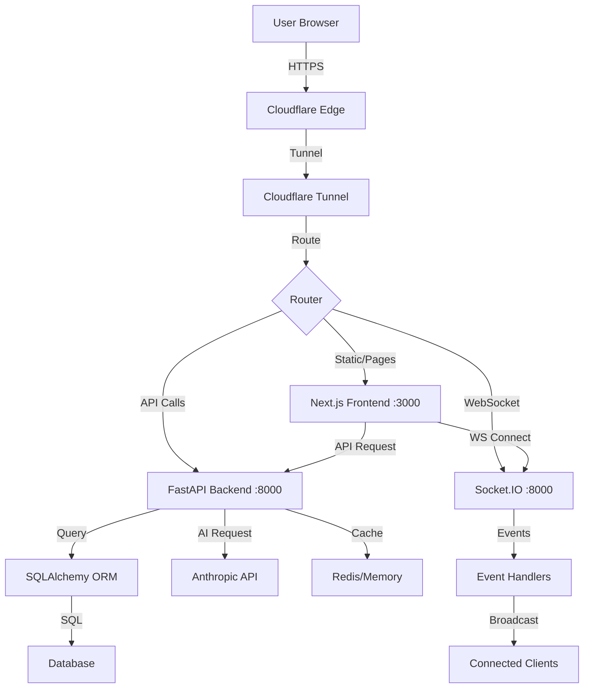

# ARCHITECTURE.md - Sunny Stack AI Platform System Architecture

## 🏗️ SYSTEM ARCHITECTURE OVERVIEW

**The Sunny Stack AI Platform is a full-stack web application built with modern technologies, featuring a Next.js frontend, FastAPI backend, and Cloudflare edge infrastructure.**

---

## 🎨 ARCHITECTURAL PRINCIPLES

### CORE DESIGN PRINCIPLES
```yaml
Separation of Concerns:
  - Clear frontend/backend separation
  - API-first design philosophy
  - Microservices-ready architecture
  - Domain-driven design patterns

Scalability:
  - Horizontal scaling capability
  - Edge computing with Cloudflare
  - Async processing with FastAPI
  - Optimistic UI updates

Security:
  - JWT-based authentication
  - Role-based access control
  - API rate limiting (planned)
  - Input validation at all layers

Performance:
  - Server-side rendering (Next.js)
  - API response caching
  - Database query optimization
  - CDN asset delivery

Developer Experience:
  - TypeScript for type safety
  - Comprehensive debugging
  - Hot module replacement
  - Automated testing
```

---

## 🔧 TECHNOLOGY STACK DETAILS

### FRONTEND ARCHITECTURE
```typescript
// Next.js 15.0 Application Structure
const frontendArchitecture = {
    // Core Framework
    framework: {
        name: "Next.js",
        version: "15.0.0",
        renderingStrategy: "Hybrid SSR/SSG/CSR",
        router: "App Router (app/)",
        features: [
            "Server Components",
            "Client Components",
            "API Routes",
            "Middleware",
            "Edge Runtime"
        ]
    },
    
    // State Management Architecture
    stateManagement: {
        global: {
            library: "Zustand 5.0",
            pattern: "Flux-inspired",
            features: ["DevTools", "Persistence", "Middleware"]
        },
        server: {
            library: "@tanstack/react-query 5.0",
            pattern: "Server State Cache",
            features: ["Caching", "Synchronization", "Mutations"]
        },
        local: {
            approach: "React State/Context",
            hooks: ["useState", "useReducer", "useContext"]
        }
    },
    
    // Component Architecture
    componentStructure: {
        pattern: "Atomic Design",
        levels: {
            atoms: "Basic UI elements (buttons, inputs)",
            molecules: "Simple components (forms, cards)",
            organisms: "Complex components (headers, sections)",
            templates: "Page layouts",
            pages: "Route components"
        },
        organization: {
            "/components/ui": "Reusable UI components",
            "/components/trinity": "Business logic components",
            "/components/layouts": "Layout wrappers",
            "/app": "Route pages and API routes"
        }
    },
    
    // Styling Architecture
    styling: {
        framework: "Tailwind CSS 3.4",
        approach: "Utility-first",
        customization: "tailwind.config.js",
        animations: "Framer Motion 11.0",
        themes: "CSS variables + Tailwind"
    },
    
    // Data Fetching Patterns
    dataFetching: {
        patterns: [
            "Server Components (RSC)",
            "Client-side with React Query",
            "API Routes for backend proxy",
            "WebSocket for real-time"
        ],
        caching: {
            static: "ISR (Incremental Static Regeneration)",
            dynamic: "React Query cache",
            cdn: "Cloudflare edge caching"
        }
    }
};
```

### BACKEND ARCHITECTURE
```python
# FastAPI Application Structure
backend_architecture = {
    # Core Framework
    "framework": {
        "name": "FastAPI",
        "version": "0.104.1",
        "server": "Uvicorn",
        "async": True,
        "features": [
            "Automatic API documentation",
            "Type validation with Pydantic",
            "Async/await support",
            "WebSocket support",
            "Dependency injection"
        ]
    },
    
    # Application Structure
    "structure": {
        "pattern": "Domain-Driven Design",
        "layers": {
            "routes": "API endpoint definitions",
            "services": "Business logic layer",
            "models": "Data models (SQLAlchemy)",
            "schemas": "API schemas (Pydantic)",
            "repositories": "Data access layer"
        },
        "organization": {
            "app/routes/": "HTTP endpoints",
            "app/services/": "Business logic",
            "app/models/": "Database models",
            "app/schemas/": "Request/Response schemas",
            "app/auth/": "Authentication logic",
            "app/websocket/": "Real-time handlers"
        }
    },
    
    # Database Architecture
    "database": {
        "orm": "SQLAlchemy 2.0",
        "pattern": "Repository Pattern",
        "migrations": "Alembic (planned)",
        "connections": {
            "development": "SQLite",
            "production": "PostgreSQL (planned)",
            "edge": "Cloudflare D1"
        },
        "optimization": [
            "Connection pooling",
            "Query optimization",
            "Eager loading",
            "Caching layer"
        ]
    },
    
    # Authentication Architecture
    "authentication": {
        "strategy": "JWT Bearer Tokens",
        "implementation": {
            "passwords": "Bcrypt hashing",
            "tokens": "python-jose",
            "validation": "OAuth2PasswordBearer",
            "refresh": "Refresh token rotation"
        },
        "flow": [
            "User provides credentials",
            "Validate against database",
            "Generate JWT token pair",
            "Return access + refresh tokens",
            "Validate on each request"
        ]
    },
    
    # API Design
    "api_design": {
        "style": "RESTful",
        "versioning": "URL path (/api/v1/)",
        "documentation": "OpenAPI/Swagger",
        "standards": {
            "naming": "snake_case",
            "http_methods": ["GET", "POST", "PUT", "DELETE", "PATCH"],
            "status_codes": "Standard HTTP codes",
            "pagination": "Limit/Offset pattern"
        }
    }
}
```

### INFRASTRUCTURE ARCHITECTURE
```yaml
# Cloudflare Edge Infrastructure
infrastructure:
  edge_computing:
    provider: "Cloudflare"
    services:
      workers:
        runtime: "V8 Isolates"
        language: "JavaScript/TypeScript"
        limits:
          cpu: "10ms per request"
          memory: "128MB"
          requests: "100k/day (free)"
      
      d1_database:
        type: "SQLite at the edge"
        replication: "Global"
        consistency: "Eventual"
        access: "Workers API"
      
      r2_storage:
        type: "Object storage"
        compatibility: "S3 API"
        pricing: "No egress fees"
        access: "Workers API"
      
      kv_storage:
        type: "Key-Value store"
        replication: "Global"
        consistency: "Eventual"
        ttl: "Configurable"
  
  networking:
    tunnel:
      name: "trinity"
      protocol: "HTTP/2"
      encryption: "TLS 1.3"
      routing:
        - hostname: "sunny-stack.com"
          service: "http://localhost:3000"
        - path: "/api/*"
          service: "http://localhost:8000"
        - path: "/ws/*"
          service: "ws://localhost:8000"
    
    dns:
      provider: "Cloudflare"
      records:
        - type: "CNAME"
          name: "sunny-stack.com"
          value: "trinity.cfargotunnel.com"
    
    cdn:
      caching_rules:
        - match: "*.js|*.css|*.png|*.jpg"
          cache: "1 year"
        - match: "/api/*"
          cache: "no-cache"
        - match: "/"
          cache: "5 minutes"
```

---

## 🔄 DATA FLOW ARCHITECTURE

### REQUEST LIFECYCLE


### STATE MANAGEMENT FLOW
```typescript
// Frontend State Management Architecture
const stateFlow = {
    // 1. User Action
    userInteraction: "Button Click / Form Submit",
    
    // 2. Local State Update (Optimistic)
    localUpdate: {
        store: "Zustand",
        action: "setOptimisticState",
        immediate: true
    },
    
    // 3. API Call
    apiCall: {
        client: "React Query",
        method: "mutation",
        endpoint: "/api/resource"
    },
    
    // 4. Backend Processing
    backendProcessing: {
        validation: "Pydantic",
        business: "Service Layer",
        database: "SQLAlchemy",
        response: "JSON"
    },
    
    // 5. State Reconciliation
    reconciliation: {
        success: "Confirm optimistic update",
        failure: "Rollback + show error",
        cache: "Invalidate React Query"
    },
    
    // 6. UI Update
    uiUpdate: {
        rerender: "React components",
        notifications: "Toast messages",
        navigation: "Router updates"
    }
};
```

### AUTHENTICATION FLOW
```python
# Authentication & Authorization Flow
auth_flow = {
    # 1. Login Request
    "login": {
        "endpoint": "POST /api/auth/login",
        "payload": {"email": "string", "password": "string"},
        "validation": "Pydantic schema"
    },
    
    # 2. Credential Verification
    "verification": {
        "fetch_user": "SELECT * FROM users WHERE email = ?",
        "verify_password": "bcrypt.checkpw(password, hashed)",
        "check_active": "user.is_active == True"
    },
    
    # 3. Token Generation
    "token_generation": {
        "access_token": {
            "payload": {"sub": "user_id", "exp": "15 minutes"},
            "algorithm": "HS256",
            "secret": "JWT_SECRET"
        },
        "refresh_token": {
            "payload": {"sub": "user_id", "exp": "7 days"},
            "algorithm": "HS256",
            "secret": "JWT_REFRESH_SECRET"
        }
    },
    
    # 4. Response
    "response": {
        "access_token": "eyJ...",
        "refresh_token": "eyJ...",
        "token_type": "bearer",
        "user": {"id": 1, "email": "user@example.com"}
    },
    
    # 5. Subsequent Requests
    "protected_request": {
        "header": "Authorization: Bearer <access_token>",
        "validation": "decode_jwt(token)",
        "user_loading": "get_current_user(token_payload)",
        "authorization": "check_permissions(user, resource)"
    }
}
```

---

## 📦 MODULE ARCHITECTURE

### FRONTEND MODULES
```typescript
// Module Organization and Dependencies
const moduleArchitecture = {
    // Core Modules
    core: {
        "/lib/api.ts": {
            purpose: "API client wrapper",
            dependencies: ["fetch", "react-query"],
            exports: ["apiClient", "useApi"]
        },
        "/lib/auth.ts": {
            purpose: "Authentication utilities",
            dependencies: ["next-auth", "jwt"],
            exports: ["useAuth", "requireAuth", "getSession"]
        },
        "/lib/utils.ts": {
            purpose: "Utility functions",
            dependencies: [],
            exports: ["cn", "formatDate", "debounce"]
        }
    },
    
    // Feature Modules
    features: {
        "/stores/user.ts": {
            purpose: "User state management",
            dependencies: ["zustand"],
            exports: ["useUserStore"]
        },
        "/stores/project.ts": {
            purpose: "Project state management",
            dependencies: ["zustand"],
            exports: ["useProjectStore"]
        },
        "/hooks/useWebSocket.ts": {
            purpose: "WebSocket connection hook",
            dependencies: ["socket.io-client"],
            exports: ["useWebSocket"]
        }
    },
    
    // Component Modules
    components: {
        "/components/ui/": {
            purpose: "Reusable UI components",
            pattern: "Presentational components",
            examples: ["Button", "Input", "Card", "Modal"]
        },
        "/components/trinity/": {
            purpose: "Business components",
            pattern: "Container components",
            examples: ["TrinityLayout", "Dashboard", "ProjectView"]
        }
    }
};
```

### BACKEND MODULES
```python
# Module Organization and Dependencies
module_architecture = {
    # Core Modules
    "core": {
        "app/config.py": {
            "purpose": "Configuration management",
            "dependencies": ["pydantic", "os"],
            "exports": ["Settings", "get_settings"]
        },
        "app/database.py": {
            "purpose": "Database connection",
            "dependencies": ["sqlalchemy"],
            "exports": ["engine", "SessionLocal", "get_db"]
        },
        "app/dependencies.py": {
            "purpose": "Shared dependencies",
            "dependencies": ["fastapi"],
            "exports": ["get_current_user", "require_admin"]
        }
    },
    
    # Feature Modules
    "features": {
        "app/auth/": {
            "jwt.py": "JWT token handling",
            "password.py": "Password hashing",
            "oauth2.py": "OAuth2 flow",
            "dependencies.py": "Auth dependencies"
        },
        "app/routes/": {
            "auth.py": "Authentication endpoints",
            "users.py": "User management",
            "projects.py": "Project endpoints",
            "admin.py": "Admin endpoints"
        },
        "app/services/": {
            "user_service.py": "User business logic",
            "project_service.py": "Project logic",
            "ai_service.py": "AI integration",
            "email_service.py": "Email handling"
        }
    },
    
    # Data Modules
    "data": {
        "app/models/": {
            "user.py": "User SQLAlchemy model",
            "project.py": "Project model",
            "session.py": "Session model",
            "base.py": "Base model class"
        },
        "app/schemas/": {
            "user.py": "User Pydantic schemas",
            "project.py": "Project schemas",
            "auth.py": "Auth schemas",
            "common.py": "Shared schemas"
        }
    }
}
```

---

## 🔌 INTEGRATION ARCHITECTURE

### EXTERNAL SERVICE INTEGRATIONS
```yaml
integrations:
  anthropic_api:
    purpose: "AI model integration"
    sdk: "anthropic-python"
    authentication: "API Key"
    endpoints:
      - "Messages API"
      - "Completions API"
    error_handling:
      - "Retry with exponential backoff"
      - "Fallback responses"
      - "Rate limit management"
  
  openai_api:
    purpose: "Alternative AI provider"
    sdk: "openai-python"
    authentication: "API Key"
    models:
      - "GPT-4"
      - "GPT-3.5-turbo"
    features:
      - "Function calling"
      - "Embeddings"
  
  email_service:
    purpose: "Transactional emails"
    provider: "SendGrid (planned)"
    authentication: "API Key"
    templates:
      - "Welcome email"
      - "Password reset"
      - "Notifications"
  
  payment_processor:
    purpose: "Subscription handling"
    provider: "Stripe (planned)"
    authentication: "Secret Key"
    features:
      - "Subscription management"
      - "Payment processing"
      - "Webhook handling"
```

### INTERNAL SERVICE COMMUNICATION
```typescript
// Service Communication Patterns
const communicationPatterns = {
    // REST API Communication
    rest: {
        pattern: "Request-Response",
        protocol: "HTTP/HTTPS",
        format: "JSON",
        authentication: "Bearer Token",
        example: {
            request: {
                method: "POST",
                url: "/api/projects",
                headers: {
                    "Authorization": "Bearer <token>",
                    "Content-Type": "application/json"
                },
                body: {
                    name: "New Project",
                    description: "Project description"
                }
            },
            response: {
                status: 201,
                body: {
                    id: 1,
                    name: "New Project",
                    created_at: "2024-01-01T00:00:00Z"
                }
            }
        }
    },
    
    // WebSocket Communication
    websocket: {
        pattern: "Pub-Sub",
        protocol: "WS/WSS",
        format: "JSON",
        library: "Socket.IO",
        events: {
            client_to_server: [
                "join_room",
                "leave_room",
                "send_message",
                "update_status"
            ],
            server_to_client: [
                "message_received",
                "user_joined",
                "user_left",
                "status_updated"
            ]
        }
    },
    
    // Event-Driven (Future)
    eventDriven: {
        pattern: "Event Sourcing",
        broker: "Redis/RabbitMQ (planned)",
        format: "JSON",
        topics: [
            "user.created",
            "project.updated",
            "payment.processed"
        ]
    }
};
```

---

## 🛡️ SECURITY ARCHITECTURE

### SECURITY LAYERS
```python
security_architecture = {
    # Application Security
    "application": {
        "authentication": {
            "method": "JWT Bearer",
            "storage": "httpOnly cookies + memory",
            "rotation": "Refresh token rotation",
            "expiry": "15min access, 7d refresh"
        },
        "authorization": {
            "model": "RBAC (Role-Based)",
            "roles": ["admin", "user", "viewer"],
            "permissions": "Resource-based",
            "enforcement": "Decorator pattern"
        },
        "validation": {
            "input": "Pydantic schemas",
            "output": "Response models",
            "sql": "Parameterized queries",
            "files": "Type/size validation"
        }
    },
    
    # Network Security
    "network": {
        "transport": "TLS 1.3",
        "tunnel": "Cloudflare encrypted",
        "cors": {
            "origins": ["https://sunny-stack.com"],
            "credentials": True,
            "methods": ["GET", "POST", "PUT", "DELETE"]
        },
        "headers": {
            "X-Content-Type-Options": "nosniff",
            "X-Frame-Options": "DENY",
            "X-XSS-Protection": "1; mode=block",
            "Strict-Transport-Security": "max-age=31536000"
        }
    },
    
    # Data Security
    "data": {
        "encryption": {
            "at_rest": "Database encryption",
            "in_transit": "TLS encryption",
            "passwords": "Bcrypt hashing",
            "sensitive": "AES-256 (planned)"
        },
        "privacy": {
            "pii": "Minimal collection",
            "gdpr": "Compliance planned",
            "retention": "Policy-based",
            "deletion": "Soft + hard delete"
        }
    },
    
    # Infrastructure Security
    "infrastructure": {
        "edge": "Cloudflare WAF",
        "ddos": "Cloudflare protection",
        "rate_limiting": "API throttling",
        "monitoring": {
            "logs": "Centralized logging",
            "alerts": "Security events",
            "audit": "Access trails"
        }
    }
}
```

---

## 🚀 DEPLOYMENT ARCHITECTURE

### DEPLOYMENT PIPELINE
```yaml
deployment:
  environments:
    development:
      frontend: "localhost:3000"
      backend: "localhost:8000"
      database: "SQLite local"
      tunnel: "Development tunnel"
    
    staging:
      frontend: "staging.sunny-stack.com"
      backend: "api-staging.sunny-stack.com"
      database: "PostgreSQL staging"
      tunnel: "Staging tunnel"
    
    production:
      frontend: "sunny-stack.com"
      backend: "api.sunny-stack.com"
      database: "PostgreSQL production"
      tunnel: "Production tunnel"
  
  ci_cd:
    version_control: "Git"
    branching:
      main: "Production branch"
      dev: "Development branch"
      feature: "Feature branches"
    
    pipeline:
      - step: "Code commit"
        action: "Git push"
      - step: "CI checks"
        action: "Linting, type checking"
      - step: "Testing"
        action: "Unit, integration tests"
      - step: "Build"
        action: "Production build"
      - step: "Deploy"
        action: "Cloudflare deployment"
  
  containerization:
    frontend:
      base: "node:20-alpine"
      build: "Next.js production"
      size: "~150MB"
    
    backend:
      base: "python:3.11-slim"
      build: "FastAPI + deps"
      size: "~200MB"
    
    orchestration:
      local: "Docker Compose"
      production: "Kubernetes (future)"
```

### SCALING ARCHITECTURE
```typescript
// Scaling Strategy
const scalingArchitecture = {
    // Horizontal Scaling
    horizontal: {
        frontend: {
            strategy: "CDN distribution",
            provider: "Cloudflare",
            locations: "Global edge nodes",
            caching: "Static asset caching"
        },
        backend: {
            strategy: "Load balancing",
            instances: "Multiple containers",
            distribution: "Round-robin",
            state: "Stateless design"
        },
        database: {
            strategy: "Read replicas",
            writes: "Primary instance",
            reads: "Replica pool",
            sharding: "Future consideration"
        }
    },
    
    // Vertical Scaling
    vertical: {
        compute: {
            cpu: "Auto-scaling",
            memory: "Dynamic allocation",
            storage: "Expandable volumes"
        }
    },
    
    // Performance Optimization
    optimization: {
        frontend: [
            "Code splitting",
            "Lazy loading",
            "Image optimization",
            "Bundle optimization"
        ],
        backend: [
            "Query optimization",
            "Connection pooling",
            "Caching layer",
            "Async processing"
        ],
        infrastructure: [
            "Edge caching",
            "Compression",
            "HTTP/2",
            "WebSocket pooling"
        ]
    }
};
```

---

## 📊 MONITORING ARCHITECTURE

### OBSERVABILITY STACK
```python
monitoring_architecture = {
    # Logging
    "logging": {
        "frontend": {
            "console": "Development",
            "sentry": "Production errors",
            "analytics": "User behavior"
        },
        "backend": {
            "structured": "JSON logging",
            "levels": ["DEBUG", "INFO", "WARNING", "ERROR"],
            "rotation": "Daily rotation",
            "retention": "30 days"
        }
    },
    
    # Metrics
    "metrics": {
        "application": {
            "response_time": "P50, P95, P99",
            "error_rate": "4xx, 5xx rates",
            "throughput": "Requests per second",
            "saturation": "CPU, memory usage"
        },
        "business": {
            "user_activity": "DAU, MAU",
            "feature_usage": "Adoption rates",
            "conversion": "Funnel metrics",
            "retention": "User retention"
        }
    },
    
    # Tracing
    "tracing": {
        "distributed": "Request correlation",
        "spans": "Operation timing",
        "context": "Propagation headers",
        "visualization": "Trace timeline"
    },
    
    # Alerting
    "alerting": {
        "channels": ["Email", "Slack", "PagerDuty"],
        "rules": {
            "critical": "Service down",
            "high": "Error rate spike",
            "medium": "Performance degradation",
            "low": "Capacity warnings"
        }
    }
}
```

---

## 🔄 EVOLUTION ROADMAP

### ARCHITECTURAL EVOLUTION
```markdown
## Current State (v2.0)
- Monolithic frontend (Next.js)
- Monolithic backend (FastAPI)
- SQLite database
- Basic authentication
- Cloudflare tunnel

## Short-term Goals (Q1 2025)
- [ ] Implement Redis caching
- [ ] Add email service integration
- [ ] Implement rate limiting
- [ ] Add comprehensive testing
- [ ] Set up CI/CD pipeline

## Medium-term Goals (Q2-Q3 2025)
- [ ] Migrate to PostgreSQL
- [ ] Implement microservices for specific domains
- [ ] Add message queue (RabbitMQ/Redis)
- [ ] Implement GraphQL API
- [ ] Add monitoring stack (Prometheus/Grafana)

## Long-term Vision (Q4 2025+)
- [ ] Kubernetes orchestration
- [ ] Service mesh (Istio)
- [ ] Event sourcing architecture
- [ ] CQRS pattern implementation
- [ ] Multi-region deployment
```

### TECHNICAL DEBT REGISTRY
```yaml
technical_debt:
  high_priority:
    - item: "Add comprehensive error handling"
      impact: "User experience"
      effort: "Medium"
      deadline: "Q1 2025"
    
    - item: "Implement proper logging"
      impact: "Debugging capability"
      effort: "Low"
      deadline: "Q1 2025"
  
  medium_priority:
    - item: "Refactor component structure"
      impact: "Maintainability"
      effort: "High"
      deadline: "Q2 2025"
    
    - item: "Add integration tests"
      impact: "Quality assurance"
      effort: "Medium"
      deadline: "Q2 2025"
  
  low_priority:
    - item: "Optimize bundle size"
      impact: "Performance"
      effort: "Medium"
      deadline: "Q3 2025"
    
    - item: "Standardize coding patterns"
      impact: "Developer experience"
      effort: "Low"
      deadline: "Q3 2025"
```

---

## 📐 DESIGN PATTERNS

### FRONTEND PATTERNS
```typescript
// Common Design Patterns Used
const designPatterns = {
    // Container/Presentational Pattern
    containerPattern: {
        container: "Handles logic and state",
        presentational: "Handles rendering",
        example: {
            container: "UserContainer.tsx",
            presentational: "UserView.tsx"
        }
    },
    
    // Custom Hook Pattern
    customHookPattern: {
        purpose: "Reusable logic extraction",
        naming: "use[Feature]",
        examples: ["useAuth", "useApi", "useWebSocket"]
    },
    
    // Compound Component Pattern
    compoundPattern: {
        purpose: "Flexible component APIs",
        example: {
            parent: "<Card>",
            children: ["<Card.Header>", "<Card.Body>", "<Card.Footer>"]
        }
    },
    
    // Provider Pattern
    providerPattern: {
        purpose: "Cross-component state sharing",
        implementation: "React Context",
        examples: ["AuthProvider", "ThemeProvider"]
    }
};
```

### BACKEND PATTERNS
```python
# Common Design Patterns Used
design_patterns = {
    # Repository Pattern
    "repository_pattern": {
        "purpose": "Abstract data access",
        "implementation": "Repository classes",
        "example": {
            "interface": "IUserRepository",
            "concrete": "SQLAlchemyUserRepository"
        }
    },
    
    # Service Layer Pattern
    "service_pattern": {
        "purpose": "Business logic encapsulation",
        "implementation": "Service classes",
        "example": "UserService, ProjectService"
    },
    
    # Dependency Injection
    "dependency_injection": {
        "purpose": "Loose coupling",
        "implementation": "FastAPI Depends",
        "example": "Depends(get_db), Depends(get_current_user)"
    },
    
    # Factory Pattern
    "factory_pattern": {
        "purpose": "Object creation abstraction",
        "implementation": "Factory functions",
        "example": "create_access_token, create_user"
    },
    
    # Strategy Pattern
    "strategy_pattern": {
        "purpose": "Algorithm selection",
        "implementation": "Strategy classes",
        "example": "AuthenticationStrategy, CacheStrategy"
    }
}
```

---

**Sunny Stack AI Platform - System Architecture Document**
**Version**: 2.0.0
**Last Updated**: 2025-09-09
**Trinity Method**: v7.0 Implementation

**Architecture Principle**: Build for today, design for tomorrow, architect for scale.