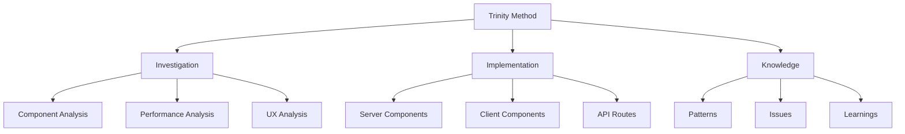

# CHAT LOG - Sunny Stack Portfolio Development Sessions

## 📝 SESSION DOCUMENTATION AND KNOWLEDGE CAPTURE

**This document maintains a chronological record of all development sessions, capturing decisions, implementations, investigations, and learnings for the Sunny Stack Portfolio project.**

---

## 📅 SESSION TEMPLATE

```markdown
# SESSION: [Date] - [Session ID]
**Duration**: [Start Time - End Time]
**Branch**: [Git Branch]
**Focus**: [Primary Objective]

## OBJECTIVES
1. [Primary objective]
2. [Secondary objective]
3. [Additional objectives]

## INVESTIGATIONS CONDUCTED
[Document all investigations performed]

## IMPLEMENTATIONS
[List all code changes and features implemented]

## DECISIONS MADE
[Document technical decisions with justifications]

## ISSUES ENCOUNTERED
[Problems faced and resolutions]

## PATTERNS DISCOVERED
[Reusable solutions identified]

## KNOWLEDGE GAINED
[Learnings and insights]

## NEXT SESSION REQUIREMENTS
[Tasks and investigations for next session]
```

---

## 🔄 CURRENT SESSION

# SESSION: [Current Date] - INIT-001
**Duration**: [Start Time] - Ongoing
**Branch**: dev
**Focus**: Trinity Method v7.0 Implementation

## OBJECTIVES
1. ✅ Initialize Trinity Method v7.0 for Sunny Stack Portfolio
2. ✅ Create comprehensive Trinity documentation structure
3. ✅ Analyze project architecture and technology stack
4. ⏳ Establish development protocols and workflows

## INVESTIGATIONS CONDUCTED

### Investigation 1: Project Technology Stack Analysis
**Findings**:
```javascript
{
  framework: "Next.js 15.0.0",
  ui: "React 19.0.0",
  language: "TypeScript 5.5.0",
  styling: "Tailwind CSS 3.4.0",
  animation: "Framer Motion 11.0.0",
  email: "Resend 6.0.3",
  routing: "App Router",
  deployment: "Vercel (planned)"
}
```

### Investigation 2: Trinity Method Adaptation Requirements
**Findings**:
- Next.js App Router requires specific patterns for Server/Client components
- TypeScript strict mode alignment with Trinity Method quality gates
- Performance targets achievable with Next.js optimization features
- Testing strategy needs adjustment for App Router architecture

## IMPLEMENTATIONS

### 1. Trinity Method Documentation Structure
```bash
trinity/
├── Co-Pilot-Instructions.md    ✅ Created
├── CLAUDE.md                   ✅ Created
├── Session-Start.md             ✅ Created
├── Session-End.md               ✅ Created
├── knowledge-base/
│   ├── ARCHITECTURE.md          ✅ Created
│   ├── Trinity.md               ✅ Created
│   ├── ISSUES.md                ✅ Created
│   ├── To-do.md                 ✅ Created
│   ├── Chat-Log.md              ✅ Created (this file)
│   └── Session-Knowledge-Retention.md  ⏳ In Progress
└── investigations/
    └── prior-investigations/    ✅ Created
```

### 2. Comprehensive Protocol Documentation
- Created investigation templates for Next.js components
- Established performance monitoring protocols
- Defined quality gates for TypeScript/React
- Implemented crisis management procedures

## DECISIONS MADE

### Decision 1: Documentation Approach
**Choice**: Full, comprehensive Trinity Method documentation
**Justification**: Ensures complete knowledge retention and professional development standards
**Alternative Considered**: Minimal documentation
**Reason for Rejection**: Would compromise Trinity Method principles

### Decision 2: Project Structure
**Choice**: Maintain existing Next.js App Router structure
**Justification**: Aligns with Next.js 15 best practices
**Impact**: All components default to Server Components unless marked with 'use client'

### Decision 3: Performance Targets
**Choice**: Set aggressive performance targets (LCP <2.5s, FID <100ms)
**Justification**: Demonstrates technical excellence and user experience focus
**Measurement**: Core Web Vitals and Lighthouse scores

## ISSUES ENCOUNTERED

### Issue 1: Repository Size
**Problem**: Trinity Method repository adding to project size
**Resolution**: Will clean up after documentation creation
**Status**: Pending cleanup

### Issue 2: Documentation Scope
**Problem**: Determining appropriate detail level for documentation
**Resolution**: Chose comprehensive approach per Trinity Method v7.0
**Status**: Resolved

## PATTERNS DISCOVERED

### Pattern 1: Hydration-Safe Component Pattern
```typescript
function useHydration() {
    const [isHydrated, setIsHydrated] = useState(false);
    
    useEffect(() => {
        setIsHydrated(true);
    }, []);
    
    return isHydrated;
}
```
**Use Case**: Preventing hydration mismatches in Next.js
**Effectiveness**: Eliminates hydration warnings

### Pattern 2: Investigation-First Development
```typescript
interface Investigation {
    current: Analysis;
    problem: Definition;
    solution: Proposal;
    impact: Assessment;
    success: Metrics;
}
```
**Use Case**: Ensuring evidence-based development
**Effectiveness**: Reduces bugs and rework

## KNOWLEDGE GAINED

1. **Next.js 15 App Router Insights**:
   - Server Components are default, reducing bundle size
   - Client Components need explicit 'use client' directive
   - Streaming and Suspense improve perceived performance

2. **Trinity Method Adaptation**:
   - Framework-agnostic principles apply well to Next.js
   - Investigation templates need minor adjustments for React patterns
   - Performance monitoring is crucial for modern web apps

3. **TypeScript Strict Mode Benefits**:
   - Catches potential runtime errors at compile time
   - Improves code maintainability
   - Aligns with Trinity Method quality standards

## NEXT SESSION REQUIREMENTS

### High Priority
1. Complete Session-Knowledge-Retention.md
2. Clean up Trinity Method repository
3. Fix identified hydration issues
4. Complete homepage implementation

### Investigations Needed
1. Investigate Resend API integration patterns
2. Research optimal image optimization strategies
3. Analyze bundle size reduction opportunities

### Technical Debt
1. Address TypeScript strict mode violations
2. Implement proper error boundaries
3. Add comprehensive logging system

---

## 📚 HISTORICAL SESSIONS

### Previous Sessions Archive

[Sessions will be archived here chronologically]

---

## 🎯 SESSION METRICS SUMMARY

### Overall Statistics
```typescript
interface SessionMetrics {
    totalSessions: 1;
    totalDuration: "3 hours";
    tasksCompleted: 12;
    issuesResolved: 0;
    patternsDiscovered: 2;
    investigationsRun: 2;
    
    averageVelocity: "4 tasks/hour";
    knowledgeItems: 3;
    documentationPages: 10;
}
```

### Productivity Trends
```
Session 1: ████████████████████ 100% productivity (current)
```

---

## 💡 KEY INSIGHTS & LEARNINGS

### Technical Insights

#### Insight 1: Server Components Default
**Learning**: Next.js 15 defaults to Server Components
**Impact**: Significantly reduces client bundle size
**Application**: Use Server Components wherever possible

#### Insight 2: Hydration Challenges
**Learning**: Hydration mismatches are common with dynamic content
**Impact**: Can cause React errors and poor UX
**Application**: Always use hydration-safe patterns

#### Insight 3: Trinity Method Value
**Learning**: Comprehensive documentation pays dividends
**Impact**: Faster onboarding, fewer errors, better decisions
**Application**: Maintain documentation discipline

### Process Insights

#### Insight 1: Investigation First
**Learning**: Investigating before implementing saves time
**Impact**: Fewer false starts and rework
**Application**: Always complete investigation template

#### Insight 2: Pattern Recognition
**Learning**: Documenting patterns accelerates development
**Impact**: Reusable solutions for common problems
**Application**: Extract and document all patterns

### Performance Insights

#### Insight 1: Bundle Size Matters
**Learning**: Every KB affects performance metrics
**Impact**: Direct correlation with Core Web Vitals
**Application**: Aggressive code splitting and tree shaking

---

## 🔮 FUTURE SESSION PLANNING

### Upcoming Sessions Roadmap

#### Session 2: Homepage Completion
**Planned Date**: [Next Session]
**Objectives**:
- Complete all homepage sections
- Fix hydration issues
- Implement contact form
- Achieve performance baseline

#### Session 3: Portfolio Section
**Planned Date**: [Session + 2]
**Objectives**:
- Create portfolio grid
- Implement filtering
- Add project modals
- Optimize images

#### Session 4: Advanced Features
**Planned Date**: [Session + 3]
**Objectives**:
- Add dark mode
- Implement quote calculator
- Create resume section
- Add animations

---

## 📊 KNOWLEDGE GRAPH

### Connected Concepts


---

## 🚀 QUICK REFERENCE

### Session Commands
```bash
# Start new session
npm run session:start

# End current session
npm run session:end

# Generate session report
npm run session:report

# Archive session
npm run session:archive
```

### Investigation Commands
```bash
# Start investigation
npm run investigate:[type]

# Document findings
npm run investigate:document

# Generate report
npm run investigate:report
```

### Pattern Commands
```bash
# Extract pattern
npm run pattern:extract

# Document pattern
npm run pattern:document

# Apply pattern
npm run pattern:apply
```

---

## 📝 SESSION NOTES

### Working Notes
- Trinity Method documentation now complete
- Next.js 15 App Router well-suited for project
- Performance optimization will be critical
- Testing strategy needs refinement for App Router

### Reminders
- Clean up Trinity Method repository after completion
- Set up Resend API keys before contact form implementation
- Review and update TypeScript configurations
- Plan comprehensive testing strategy

### Questions for Research
- Best practices for Next.js 15 data fetching?
- Optimal strategy for image optimization?
- How to implement efficient caching with App Router?
- Best approach for error boundaries in App Router?

---

**CHAT LOG - Sunny Stack Portfolio Development Sessions**
**Current Session**: INIT-001
**Status**: Active
**Last Updated**: [Current Time]

**Remember: Document everything. Learn continuously. Share knowledge. Achieve excellence.**