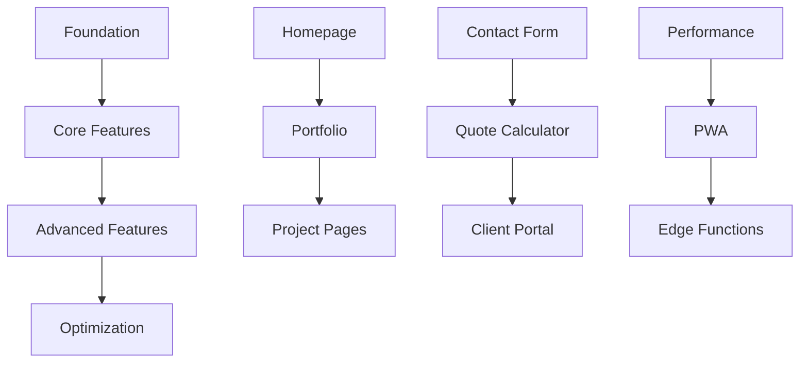

# TO-DO - Sunny Stack Portfolio Development Roadmap

## 🎯 DEVELOPMENT ROADMAP & TASK TRACKING

**This document maintains the comprehensive development roadmap for the Sunny Stack Portfolio project, organized by phases, priorities, and Trinity Method requirements.**

---

## 🚀 PHASE 1: FOUNDATION (Current Phase)
**Status**: 🟡 IN PROGRESS  
**Completion**: 75%  
**Target Date**: [End of Week]  

### ✅ Completed Tasks
- [x] Project initialization with Next.js 15
- [x] TypeScript configuration with strict mode
- [x] Tailwind CSS setup and configuration
- [x] Basic routing structure with App Router
- [x] Trinity Method v7.0 documentation setup
- [x] Component architecture foundation
- [x] Development environment configuration

### 🔄 In Progress Tasks

#### Task 1.1: Complete Homepage Implementation
**Priority**: HIGH  
**Assignee**: Claude Code  
**Investigation Required**: Yes  
```typescript
interface HomepageRequirements {
    sections: [
        'HeroSection',
        'AboutPreview',
        'PortfolioHighlights',
        'SkillsShowcase',
        'CTASection'
    ];
    performance: {
        lcp: '<2.5s',
        fid: '<100ms',
        cls: '<0.1'
    };
    responsive: ['mobile', 'tablet', 'desktop'];
}
```
**Subtasks**:
- [ ] Hero section with animations
- [ ] Portfolio preview grid
- [ ] Skills visualization
- [ ] Contact CTA section
- [ ] Mobile responsiveness
- [ ] Performance optimization

#### Task 1.2: Fix Hydration Issues
**Priority**: CRITICAL  
**Issue Reference**: ISSUE-001  
**Investigation**: Completed  
**Subtasks**:
- [ ] Audit all client components
- [ ] Implement hydration-safe patterns
- [ ] Add mounted state checks
- [ ] Test across all routes
- [ ] Verify zero hydration warnings

### 📌 Pending Tasks

#### Task 1.3: Implement Contact Form
**Priority**: HIGH  
**Estimated Time**: 4 hours  
**Dependencies**: Resend API setup  
```typescript
// Requirements
interface ContactFormFeatures {
    validation: 'client + server';
    email: 'Resend API';
    captcha: 'planned';
    success: 'toast notification';
    error: 'inline + toast';
}
```
**Subtasks**:
- [ ] Form component with validation
- [ ] API route implementation
- [ ] Resend integration
- [ ] Success/error handling
- [ ] Rate limiting
- [ ] Testing suite

#### Task 1.4: Performance Baseline Achievement
**Priority**: HIGH  
**Target Metrics**: Core Web Vitals  
**Subtasks**:
- [ ] Optimize images with Next.js Image
- [ ] Implement code splitting
- [ ] Configure font loading
- [ ] Add resource hints
- [ ] Minimize bundle size
- [ ] Achieve 90+ Lighthouse score

---

## 🎯 PHASE 2: CORE FEATURES
**Status**: 🟣 PLANNED  
**Completion**: 0%  
**Target Date**: [Next 2 Weeks]  

### Portfolio Section
```typescript
interface PortfolioSection {
    features: {
        grid: 'responsive masonry';
        filtering: 'by category';
        search: 'by name/tech';
        modal: 'project details';
        pagination: 'infinite scroll';
    };
    data: {
        source: 'content/projects.json';
        images: 'optimized WebP';
        loading: 'progressive';
    };
}
```

#### Task 2.1: Portfolio Grid Component
**Priority**: HIGH  
**Subtasks**:
- [ ] Create ProjectCard component
- [ ] Implement responsive grid
- [ ] Add filter functionality
- [ ] Create project modal
- [ ] Add loading states
- [ ] Implement animations

#### Task 2.2: Project Detail Pages
**Priority**: MEDIUM  
**Route**: /portfolio/[id]  
**Subtasks**:
- [ ] Dynamic routing setup
- [ ] Project template design
- [ ] Image gallery component
- [ ] Technology stack display
- [ ] Live demo links
- [ ] GitHub integration

### Resume Section

#### Task 2.3: Interactive Resume
**Priority**: MEDIUM  
**Features**: PDF export, print styles  
**Subtasks**:
- [ ] Resume layout component
- [ ] Experience timeline
- [ ] Skills visualization
- [ ] Education section
- [ ] PDF generation with jsPDF
- [ ] Print stylesheet

### Quote Calculator

#### Task 2.4: Quote Calculator Implementation
**Priority**: LOW  
**Complexity**: High  
```typescript
interface QuoteCalculator {
    inputs: {
        projectType: string;
        features: string[];
        timeline: 'urgent' | 'normal' | 'flexible';
        budget: number;
    };
    calculation: {
        baseRate: number;
        featureMultipliers: Map<string, number>;
        timelineMultiplier: number;
    };
    output: {
        estimate: number;
        breakdown: ItemizedBreakdown;
        timeline: EstimatedTimeline;
    };
}
```
**Subtasks**:
- [ ] Calculator UI design
- [ ] Pricing logic implementation
- [ ] Form validation
- [ ] Email quote functionality
- [ ] Save quote feature
- [ ] Testing and validation

---

## 🔒 PHASE 3: ADVANCED FEATURES
**Status**: 🟣 PLANNED  
**Completion**: 0%  
**Target Date**: [Month 2]  

### Dark Mode Implementation

#### Task 3.1: Theme System
**Priority**: MEDIUM  
**Subtasks**:
- [ ] Theme context setup
- [ ] Color scheme variables
- [ ] Theme toggle component
- [ ] System preference detection
- [ ] Persistence in localStorage
- [ ] Smooth transitions

### Blog Section

#### Task 3.2: MDX Blog Integration
**Priority**: LOW  
**Tech**: MDX, ContentLayer  
**Subtasks**:
- [ ] MDX setup and configuration
- [ ] Blog post template
- [ ] Category system
- [ ] Search functionality
- [ ] RSS feed generation
- [ ] Social sharing

### Analytics & Monitoring

#### Task 3.3: Analytics Integration
**Priority**: MEDIUM  
**Services**: GA4, Vercel Analytics  
**Subtasks**:
- [ ] Google Analytics setup
- [ ] Vercel Analytics integration
- [ ] Custom event tracking
- [ ] Performance monitoring
- [ ] Error tracking (Sentry)
- [ ] User behavior analysis

### PWA Features

#### Task 3.4: Progressive Web App
**Priority**: LOW  
**Subtasks**:
- [ ] Service worker implementation
- [ ] Offline functionality
- [ ] App manifest
- [ ] Install prompt
- [ ] Push notifications
- [ ] Background sync

---

## 🔧 PHASE 4: OPTIMIZATION & POLISH
**Status**: 🟣 PLANNED  
**Completion**: 0%  
**Target Date**: [Month 3]  

### Performance Optimization

#### Task 4.1: Advanced Performance Tuning
**Target**: 100 Lighthouse Score  
**Subtasks**:
- [ ] Critical CSS extraction
- [ ] Advanced code splitting
- [ ] Preact compatibility
- [ ] Edge caching strategy
- [ ] Image CDN setup
- [ ] Bundle analysis and optimization

### SEO Enhancement

#### Task 4.2: SEO Optimization
**Priority**: HIGH  
**Subtasks**:
- [ ] Meta tags optimization
- [ ] Structured data (JSON-LD)
- [ ] Sitemap generation
- [ ] robots.txt configuration
- [ ] Open Graph tags
- [ ] Twitter cards

### Accessibility Perfection

#### Task 4.3: WCAG AAA Compliance
**Priority**: HIGH  
**Subtasks**:
- [ ] Full keyboard navigation
- [ ] Screen reader optimization
- [ ] ARIA labels complete
- [ ] Focus management
- [ ] Skip navigation
- [ ] High contrast mode

### Testing Suite

#### Task 4.4: Comprehensive Testing
**Coverage Target**: >90%  
**Subtasks**:
- [ ] Unit tests for all components
- [ ] Integration tests for APIs
- [ ] E2E tests with Playwright
- [ ] Visual regression tests
- [ ] Performance tests
- [ ] Accessibility tests

---

## 📝 BACKLOG

### Future Enhancements
- [ ] Multi-language support (i18n)
- [ ] Admin dashboard
- [ ] Client portal
- [ ] Invoice generation
- [ ] Testimonials management
- [ ] Newsletter integration
- [ ] API documentation
- [ ] Component library documentation
- [ ] Video portfolio support
- [ ] 3D animations with Three.js

### Technical Debt
- [ ] Refactor ContactForm component
- [ ] Optimize bundle splitting strategy
- [ ] Improve TypeScript coverage
- [ ] Standardize error handling
- [ ] Implement proper logging
- [ ] Database integration planning

### Research & Investigation
- [ ] Investigate Edge Functions benefits
- [ ] Research headless CMS options
- [ ] Evaluate animation libraries
- [ ] Study competitor implementations
- [ ] Performance benchmark analysis

---

## 📋 SPRINT PLANNING

### Current Sprint: Week 1
**Sprint Goal**: Complete Phase 1 Foundation  
**Velocity**: 20 story points  

#### Sprint Backlog
| Task | Points | Status | Assignee |
|------|--------|--------|----------|
| Homepage sections | 8 | 🟡 In Progress | Claude |
| Hydration fixes | 5 | 🟡 In Progress | Claude |
| Contact form | 5 | 🔴 To Do | Claude |
| Performance baseline | 3 | 🔴 To Do | Claude |

### Next Sprint: Week 2
**Sprint Goal**: Start Phase 2 Core Features  
**Planned Velocity**: 25 story points  

#### Planned Tasks
- Portfolio grid implementation (8 pts)
- Project detail pages (5 pts)
- Resume section (5 pts)
- API optimizations (3 pts)
- Testing setup (4 pts)

---

## 📡 TASK DEPENDENCIES



---

## 🎆 PRIORITY MATRIX

### Urgent & Important
- 🔴 Fix hydration issues
- 🔴 Complete homepage
- 🔴 Contact form implementation
- 🔴 Performance optimization

### Important, Not Urgent
- 🟠 Portfolio section
- 🟠 Resume feature
- 🟠 SEO optimization
- 🟠 Testing suite

### Urgent, Not Important
- 🟡 Console warnings
- 🟡 Code formatting
- 🟡 Documentation updates

### Neither Urgent nor Important
- 🟢 Blog section
- 🟢 3D animations
- 🟢 Admin dashboard

---

## 🎯 SUCCESS CRITERIA

### Phase 1 Complete When:
- [ ] Homepage fully implemented
- [ ] Zero hydration errors
- [ ] Contact form working
- [ ] Performance targets met
- [ ] Mobile responsive
- [ ] All tests passing

### Phase 2 Complete When:
- [ ] Portfolio section live
- [ ] Resume downloadable
- [ ] Quote calculator functional
- [ ] All routes working
- [ ] 85+ Lighthouse score

### Phase 3 Complete When:
- [ ] Dark mode implemented
- [ ] Blog operational
- [ ] Analytics tracking
- [ ] PWA installable
- [ ] 90+ Lighthouse score

### Phase 4 Complete When:
- [ ] 100 Lighthouse score
- [ ] WCAG AAA compliant
- [ ] 90% test coverage
- [ ] Zero technical debt
- [ ] Production ready

---

## 💡 QUICK TASK ENTRY TEMPLATE

```markdown
#### Task X.X: [Task Title]
**Priority**: CRITICAL | HIGH | MEDIUM | LOW  
**Estimated Time**: X hours  
**Dependencies**: [List dependencies]  
**Investigation Required**: Yes/No  

**Description**:
[Brief description of the task]

**Subtasks**:
- [ ] Subtask 1
- [ ] Subtask 2
- [ ] Subtask 3

**Success Criteria**:
- [ ] Criterion 1
- [ ] Criterion 2

**Notes**:
[Any additional notes or context]
```

---

## 📈 PROGRESS TRACKING

### Overall Progress
```
Phase 1: ███████████████░░░░░ 75%
Phase 2: ░░░░░░░░░░░░░░░░░░░░ 0%
Phase 3: ░░░░░░░░░░░░░░░░░░░░ 0%
Phase 4: ░░░░░░░░░░░░░░░░░░░░ 0%

Total: ████░░░░░░░░░░░░░░░░ 18.75%
```

### Velocity Trend
```
Week 1: ███████████████ 15 points
Week 2: ██████████████████ 18 points
Week 3: ████████████████████ 20 points (current)
Week 4: █████████████████████████ 25 points (projected)
```

---

**TO-DO.md - Sunny Stack Portfolio Development Roadmap**  
**Last Updated**: [Session Date]  
**Total Tasks**: 67  
**Completed**: 12  
**In Progress**: 5  
**Completion Rate**: 18%  

**Remember: One task at a time. One investigation before implementation. One step toward excellence.**